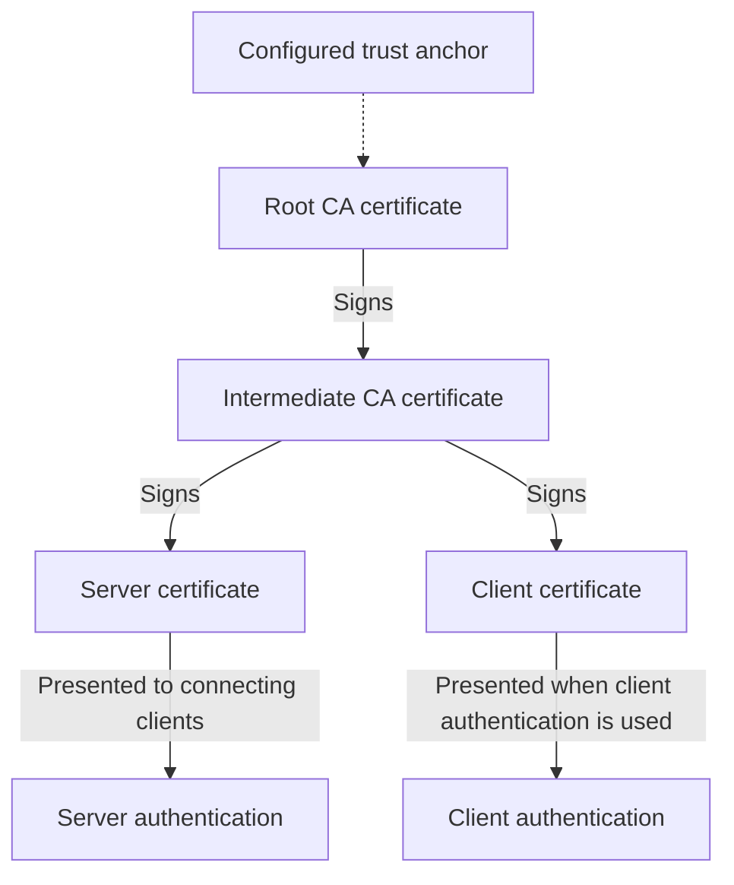
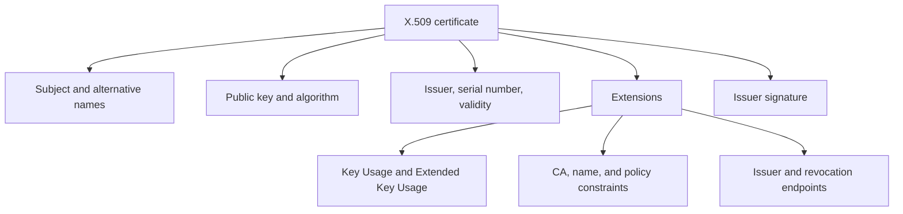
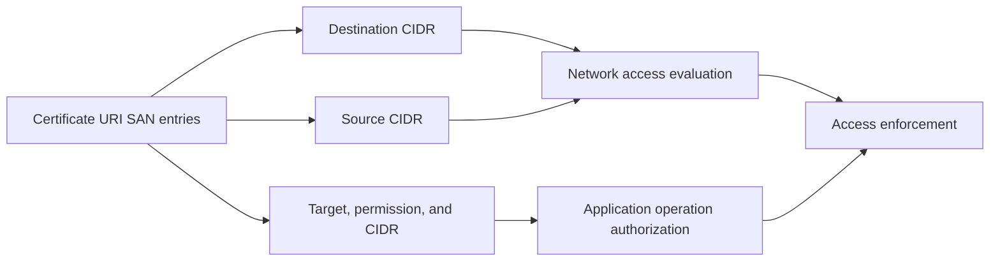

# Certificate information

This reference describes information carried by X.509 certificates, issuance requests, and certificate management records for Autobricks PKI Server 1.0. The field catalog describes certificate capabilities, not implemented CLI options or support for every certificate profile.

## RFC references

| RFC | Specification | Relevant information |
| --- | --- | --- |
| [RFC 5280](https://www.rfc-editor.org/rfc/rfc5280.html) | X.509 certificates and CRLs | Basic fields, SAN, Key Usage, EKU, CA constraints, and extensions |
| [RFC 9525](https://www.rfc-editor.org/rfc/rfc9525.html) | Service Identity in TLS | SAN-based service identity and wildcard matching |
| [RFC 2986](https://www.rfc-editor.org/rfc/rfc2986.html) | PKCS #10 certification requests | CSR fields and request signatures |
| [RFC 2985](https://www.rfc-editor.org/rfc/rfc2985.html) | PKCS #9 attributes | Extension requests and challenge passwords |
| [RFC 4514](https://www.rfc-editor.org/rfc/rfc4514.html) | LDAP distinguished-name string representation | DN text structure and escaping |
| [RFC 4519](https://www.rfc-editor.org/rfc/rfc4519.html) | LDAP schema for user applications | Subject attribute definitions |
| [RFC 3279](https://www.rfc-editor.org/rfc/rfc3279.html) | PKIX algorithms and identifiers | RSA and certificate algorithm structures; historical algorithm catalog, not a current security baseline |
| [RFC 5480](https://www.rfc-editor.org/rfc/rfc5480.html) | Elliptic Curve Subject Public Key Information | EC public keys and usage constraints |
| [RFC 8410](https://www.rfc-editor.org/rfc/rfc8410.html) | Edwards and Montgomery algorithms for X.509 | Ed25519, Ed448, X25519, and X448 |
| [RFC 8446](https://www.rfc-editor.org/rfc/rfc8446.html) | TLS 1.3 | Certificate authentication requirements |
| [RFC 3161](https://www.rfc-editor.org/rfc/rfc3161.html) | Time-Stamp Protocol | Dedicated timestamping certificate requirements |
| [RFC 6960](https://www.rfc-editor.org/rfc/rfc6960.html) | Online Certificate Status Protocol | Status semantics and delegated responder authorization |
| [RFC 4945](https://www.rfc-editor.org/rfc/rfc4945.html) | PKI profile for IKE/IPsec | IKE certificate purposes |
| [RFC 3739](https://www.rfc-editor.org/rfc/rfc3739.html) | Qualified Certificates Profile | Subject attributes and qualified certificate statements |
| [RFC 7633](https://www.rfc-editor.org/rfc/rfc7633.html) | TLS Feature Extension | Certificate-bound TLS feature requirements |
| [RFC 7468](https://www.rfc-editor.org/rfc/rfc7468.html) | Textual Encodings of Security Structures | PEM certificate and key encodings |

## Certificate types and purposes

| Type | Purpose | Issuer in the Autobricks hierarchy | Principal use |
| --- | --- | --- | --- |
| Root CA | Establish the trust anchor | Self-signed root | Sign Intermediate CA certificates |
| Intermediate CA | Issue certificates under delegated CA authority | Root CA | Sign server and client certificates |
| Server certificate | Identify a service to connecting clients | Intermediate CA | TLS server authentication |
| Client certificate | Identify a connecting user, device, or application | Intermediate CA | Certificate-based client authentication |



### Root CA certificate

The Root CA anchors the hierarchy. Its public certificate is distributed to relying parties as trusted configuration; self-signing alone does not make it trusted. Its signing private key remains separate from the distributed certificate.

CA fields include critical `basicConstraints` with `CA:TRUE`, `keyCertSign`, and `cRLSign` when signing CRLs. Path constraints describe subordinate CA depth. [RFC 5280, Sections 3.2 and 4.2.1.9](https://www.rfc-editor.org/rfc/rfc5280.html#section-3.2).

`abpki-cli root` downloads the public certificate as `root.crt` in PEM format.

### Intermediate CA certificate

An Intermediate CA delegates issuance below the root. Separating issuers allows distinct certificate populations under a shared trust anchor. The parent CA signs its certificate.

Its CA flag and certificate-signing usage identify its issuing role. A leaf-only issuer uses `pathLenConstraint=0`; name and policy constraints can narrow its scope. Its certificate accompanies end-entity certificates during chain construction. [RFC 5280, Sections 4.2.1.9–4.2.1.11](https://www.rfc-editor.org/rfc/rfc5280.html#section-4.2.1.9).

`abpki-cli create-ca` requires an authorized user. `list-ca` lists issuers; `chain` downloads the Intermediate and Root CA certificates together as `trust-chain`.

### Server certificate

A server certificate identifies a TLS endpoint. The server demonstrates possession of its matching private key; clients check the chain and service identity.

Typical fields are `CA:FALSE`, `serverAuth`, appropriate Key Usage, and DNS/IP SAN entries matching the connection identity. The subject's organization and display name do not replace SAN matching. [RFC 9525, Sections 4 and 6](https://www.rfc-editor.org/rfc/rfc9525.html#section-4), [RFC 8446, Section 4.4.2.2](https://www.rfc-editor.org/rfc/rfc8446.html#section-4.4.2.2).

Every server certificate issued by Autobricks PKI must also contain a nonempty `urn:autobricks:purpose:<purpose>` URI SAN identifying its service purpose. The requirement also applies to certificates combining server and client roles.

For Autobricks VPN, its server SAN identifies the address clients connect to. For `abpkid`, server authentication remains necessary even when connecting clients have no client certificate.

### Client certificate

A client certificate identifies a user, device, or application to a service that requests certificate-based client authentication. Typical fields are `CA:FALSE`, `clientAuth`, and signing-compatible Key Usage. Identity attributes depend on the consuming application's profile.

The receiving service verifies the certificate and proof of private-key possession, then applies its authorization rules. Certificate authentication does not itself define application permissions. [RFC 8446, Sections 4.3.2 and 4.4](https://www.rfc-editor.org/rfc/rfc8446.html#section-4.3.2).

Autobricks VPN uses the assigned VPN IP in the client SAN. Autobricks PKI accepts connections without client certificates; possessing an issued client certificate does not grant CA creation or revocation permission.

### Combined server and client roles

A single end-entity certificate can contain both `serverAuth` and `clientAuth` when its key usage and consumer profiles allow both. The roles remain distinct from CA authority. [Extended Key Usage](#extended-key-usage-application-purposes).

## Certificate structure

A certificate binds a subject and public key to issuer-signed information. Extensions describe identities, permitted uses, constraints, and discovery endpoints. Multiple identities and purposes can coexist in one certificate.



Product validity defaults and renewal windows are defined in [Validity and renewal](VALIDATION.md).

## Basic fields

| Field | Information | Source of value |
| --- | --- | --- |
| Version | X.509 version; extensions use v3 | Certificate profile |
| Serial number | Certificate identifier within an issuer | Issuing CA |
| Issuer | Signing CA distinguished name | Issuing CA |
| Subject | Holder distinguished name | Request, validated by issuer |
| Validity | `notBefore` and `notAfter` timestamps | Issuance policy and requested lifetime |
| Subject Public Key Info | Public key, algorithm identifier, parameters | CSR or generated key pair |
| Signature algorithm | Algorithm and parameters used by the CA | Issuer signing configuration |
| Signature value | Signature covering the certificate body | Issuing CA |

A fingerprint is computed from the encoded certificate; it is not a signed field inside it. The certificate's public-key algorithm and the issuer's signature algorithm describe different keys. [OpenSSL certificate inspection](https://docs.openssl.org/3.5/man1/openssl-x509/), [RFC 3279, Section 2 — algorithm structures](https://www.rfc-editor.org/rfc/rfc3279.html#section-2).

Serial numbers are positive, issuer-unique integers, at most 20 octets. An empty subject requires a nonempty, critical SAN. Issuer and subject unique identifiers are legacy fields excluded by the Internet profile. [RFC 5280, Section 4.1](https://www.rfc-editor.org/rfc/rfc5280.html#section-4.1).

## Subject distinguished name

A distinguished name contains typed attributes, not an arbitrary JSON object. Attributes can repeat; preserving their types and structure matters.

| Attribute | Meaning | Example |
| --- | --- | --- |
| `CN` | Common name | `Autobricks Agent 01` |
| `O` | Organization | `Example Operations` |
| `OU` | Organizational unit | `Infrastructure` |
| `C` | Country code | `KR` |
| `ST` | State or province | `Seoul` |
| `L` | Locality | `Seoul` |
| `street` | Street address | `100 Example Road` |
| `postalCode` | Postal code | `00000` |
| `serialNumber` | Subject identifier, distinct from certificate serial | `DEVICE-001` |
| `givenName`, `surname` | Person's name attributes | Person-specific values |
| `pseudonym` | Alternative personal name | Account-specific value |

These are identity attributes, not proof of organizational membership or application permissions. Names and values require an applicable identity policy. [OpenSSL request fields](https://docs.openssl.org/3.5/man1/openssl-req/#distinguished-name-and-attribute-section-format), [RFC 3739, Section 3.1.2 — subject attributes](https://www.rfc-editor.org/rfc/rfc3739.html#section-3.1.2).

### Additional subject attributes

| Attribute | OID | Information |
| --- | --- | --- |
| `UID` / `userId` | `0.9.2342.19200300.100.1.1` | User identifier |
| `DC` / `domainComponent` | `0.9.2342.19200300.100.1.25` | Repeatable domain component |
| `GN` / `givenName` | `2.5.4.42` | Given name |
| `SN` / `surname` | `2.5.4.4` | Family name |
| `initials` | `2.5.4.43` | Personal initials |
| `title` | `2.5.4.12` | Position or designation |
| `description` | `2.5.4.13` | Descriptive text |
| `businessCategory` | `2.5.4.15` | Business classification |
| `organizationIdentifier` | `2.5.4.97` | Organization identifier |
| `dnQualifier` | `2.5.4.46` | DN disambiguation |
| `generationQualifier` | `2.5.4.44` | Generation suffix |
| `emailAddress` | `1.2.840.113549.1.9.1` | Subject email attribute |

Attribute definitions: [RFC 4519, Section 2](https://www.rfc-editor.org/rfc/rfc4519.html#section-2). Additional OIDs and OpenSSL aliases: [OpenSSL object definitions](https://github.com/openssl/openssl/blob/openssl-3.5/crypto/objects/objects.txt).

In OpenSSL, uppercase `UID` means `userId`; lowercase `uid` identifies `uniqueIdentifier` (`0.9.2342.19200300.100.1.44`). `SN` means surname, not the certificate serial. Subject `DC` and `emailAddress` do not replace DNS and email SAN entries.

DN text requires escaping delimiters and preserving multi-valued RDN structure. RFC 4514 comma-separated DN syntax and OpenSSL's slash-separated `-subj` syntax are different representations. [RFC 4514, Section 2](https://www.rfc-editor.org/rfc/rfc4514.html#section-2), [OpenSSL subject input](https://docs.openssl.org/3.5/man1/openssl-req/).

## Subject Alternative Name: multiple identities

| SAN type | Represents | Example |
| --- | --- | --- |
| `dNSName` | DNS identity | `pki.example.test` |
| `iPAddress` | IPv4 or IPv6 identity | `192.0.2.10`, `2001:db8::10` |
| `uniformResourceIdentifier` | URI identity | `urn:example:device:001` |
| `rfc822Name` | Email identity | `operator@example.test` |
| `directoryName` | Distinguished name | A structured DN |
| `registeredID` | Registered object identifier | An assigned OID |
| `otherName` | OID-defined typed identity | Application-specific ASN.1 value |

SAN can contain several entries and types. A URI identity needs application-defined matching rules; its presence does not grant permissions. [SAN configuration](https://docs.openssl.org/3.5/man5/x509v3_config/#subject-alternative-name).

TLS service identity matching uses SAN, not a subject CN fallback. DNS and IP entries are different types: an IP literal belongs in `iPAddress`. A DNS wildcard, when permitted, occupies the entire leftmost label and matches one label. A wildcard is not authorization to issue for an entire namespace. [RFC 9525, Section 4](https://www.rfc-editor.org/rfc/rfc9525.html#section-4).

## Key Usage: permitted cryptographic operations

| Bit | Meaning |
| --- | --- |
| `digitalSignature` | Authentication or other digital signatures |
| `contentCommitment` / `nonRepudiation` | Content commitment; naming varies by library |
| `keyEncipherment` | Encrypt or wrap key material |
| `dataEncipherment` | Directly encrypt data |
| `keyAgreement` | Establish shared key material |
| `keyCertSign` | Sign certificates |
| `cRLSign` | Sign certificate revocation lists |
| `encipherOnly` | Enciphering direction with key agreement |
| `decipherOnly` | Deciphering direction with key agreement |

Multiple bits can coexist. Direction-only bits require `keyAgreement`. `keyCertSign` requires CA status. [RFC 5280, Section 4.2.1.3 — Key Usage](https://www.rfc-editor.org/rfc/rfc5280.html#section-4.2.1.3).

Key type limits meaningful uses. RSA can support signatures or key transport; EC keys have algorithm-specific signing/agreement restrictions. TLS 1.3 certificate authentication uses signing, not RSA key transport: if Key Usage is present, it must permit `digitalSignature`. [RFC 3279, Section 2.3.1 — RSA key usage](https://www.rfc-editor.org/rfc/rfc3279.html#section-2.3.1), [RFC 5480, Section 3 — EC key usage](https://www.rfc-editor.org/rfc/rfc5480.html#section-3), [RFC 8446, Section 4.4.2.2 — TLS 1.3](https://www.rfc-editor.org/rfc/rfc8446.html#section-4.4.2.2).

## Extended Key Usage: application purposes

| Purpose | OID | Function |
| --- | --- | --- |
| `serverAuth` | `1.3.6.1.5.5.7.3.1` | TLS server authentication |
| `clientAuth` | `1.3.6.1.5.5.7.3.2` | TLS client authentication |
| `codeSigning` | `1.3.6.1.5.5.7.3.3` | Software signing |
| `emailProtection` | `1.3.6.1.5.5.7.3.4` | Email protection |
| `timeStamping` | `1.3.6.1.5.5.7.3.8` | Trusted timestamps |
| `OCSPSigning` | `1.3.6.1.5.5.7.3.9` | OCSP response signatures |
| `ipsecIKE` | `1.3.6.1.5.5.7.3.17` | IKE authentication |
| `anyExtendedKeyUsage` | `2.5.29.37.0` | No purpose restriction from this EKU value alone |
| Private purpose | Organization-assigned OID | Application-specific use |

Registered PKIX purposes are listed in the [IANA registry](https://www.iana.org/assignments/smi-numbers/smi-numbers.xhtml#smi-numbers-1.3.6.1.5.5.7.3). IKE has its own [RFC 4945, Section 5.1.3.12 — certificate profile](https://www.rfc-editor.org/rfc/rfc4945.html#section-5.1.3.12).

Key Usage and EKU both constrain use; neither overrides the other. An application can require an explicit EKU even when `anyExtendedKeyUsage` is present. [RFC 5280, Section 4.2.1.12 — EKU](https://www.rfc-editor.org/rfc/rfc5280.html#section-4.2.1.12).

### Multiple purposes

`serverAuth` and `clientAuth` can coexist in one EKU extension, for example for a service that both accepts and initiates authenticated TLS connections. Multiple DNS SANs can identify that service on several names. The relying application must accept the resulting combination. [OpenSSL EKU](https://docs.openssl.org/3.5/man5/x509v3_config/#extended-key-usage).

Purpose-specific exceptions remain significant:

- An RFC 3161 timestamping certificate contains only `timeStamping` in a critical EKU extension. It is not a general multipurpose certificate. [RFC 3161, Section 2.3 — Timestamping certificate requirements](https://www.rfc-editor.org/rfc/rfc3161.html#section-2.3).
- A delegated OCSP signer needs the appropriate issuer relationship and `OCSPSigning`; that EKU alone does not authorize signing responses for arbitrary CAs. [RFC 6960, Section 4.2.2.2 — OCSP authorization](https://www.rfc-editor.org/rfc/rfc6960.html#section-4.2.2.2).
- A TLS client certificate does not confer PKI administration or revocation privileges. Autobricks PKI permits certificate issuance without client-certificate authentication and restricts CA creation and revocation separately. [Service access](docs/certificate-services.md).

## CA, policy, and discovery extensions

| Extension | OID | Information |
| --- | --- | --- |
| Basic Constraints | `2.5.29.19` | CA flag and path length |
| Name Constraints | `2.5.29.30` | Permitted/excluded namespaces |
| Subject Key Identifier | `2.5.29.14` | Subject key identifier |
| Authority Key Identifier | `2.5.29.35` | Issuer key identification |
| Certificate Policies | `2.5.29.32` | Policy OIDs, CPS URI, notices |
| Policy Mappings | `2.5.29.33` | CA policy equivalence |
| Policy Constraints | `2.5.29.36` | Policy-processing limits |
| Inhibit Any Policy | `2.5.29.54` | Limits on anyPolicy processing |
| CRL Distribution Points | `2.5.29.31` | CRL locations |
| Freshest CRL | `2.5.29.46` | Delta CRL locations |
| Authority Information Access | `1.3.6.1.5.5.7.1.1` | Issuer certificate / OCSP endpoints |
| Subject Information Access | `1.3.6.1.5.5.7.1.11` | Subject-related services |
| Issuer Alternative Name | `2.5.29.18` | Alternative issuer identities |
| Subject Directory Attributes | `2.5.29.9` | Additional typed subject attributes |

See the [RFC 5280, Section 4.2 — extension definitions](https://www.rfc-editor.org/rfc/rfc5280.html#section-4.2) and [configuration reference](https://docs.openssl.org/3.5/man5/x509v3_config/).

CA Basic Constraints must be critical. `pathLenConstraint=0` excludes further non-self-issued intermediate certificates below that CA in a validation path; it does not limit end-entity issuance count. [RFC 5280, Section 4.2.1.9 — Basic Constraints](https://www.rfc-editor.org/rfc/rfc5280.html#section-4.2.1.9).

Each extension carries a critical flag. An unrecognized critical extension causes validation failure; duplicate extension OIDs are forbidden. Unknown noncritical extensions do not provide portable enforcement. [RFC 5280, Section 4.2 — Extension processing](https://www.rfc-editor.org/rfc/rfc5280.html#section-4.2).

### Specialized extensions

| Extension | Use and constraints |
| --- | --- |
| TLS Feature (`1.3.6.1.5.5.7.1.24`) | Requires specified TLS features, commonly OCSP stapling. Needs compatible servers and clients. |
| OCSP No Check (`1.3.6.1.5.5.7.48.1.5`) | Changes revocation checking for an OCSP responder certificate; not general revocation immunity. |
| Qualified certificate statements | Specialized identity/certificate claims under a defined ecosystem; not automatic legal recognition. |
| Private extension OID | Typed application data with defined ASN.1 encoding and relying-party semantics. |

Sources: [RFC 7633 — TLS Feature](https://www.rfc-editor.org/rfc/rfc7633.html), [RFC 6960, Section 4.2.2.2.1 — OCSP No Check](https://www.rfc-editor.org/rfc/rfc6960.html#section-4.2.2.2.1), [RFC 3739, Section 3.2.6 — qualified certificate statements](https://www.rfc-editor.org/rfc/rfc3739.html#section-3.2.6), [custom extension encoding](https://docs.openssl.org/3.5/man5/x509v3_config/#arbitrary-extensions).

## Keys and signatures

| Key family | Information carried or selected |
| --- | --- |
| RSA | Public modulus, exponent, modulus size; signing scheme parameters |
| EC | Named curve and public point; signing/agreement algorithm |
| Ed25519 / Ed448 | Algorithm-specific public key and signature encoding |
| X25519 / X448 | Key agreement, not certificate-signing keys |

The subject private key is not contained in its certificate. Algorithm availability depends on the cryptographic provider, TPM/HSM, and consuming applications. An algorithm listed in a format reference is not automatically enabled by a product profile. [RFC 3279, Section 2.3.1 — RSA](https://www.rfc-editor.org/rfc/rfc3279.html#section-2.3.1), [RFC 5480 — EC](https://www.rfc-editor.org/rfc/rfc5480.html), [RFC 8410 — Edwards and Montgomery algorithms](https://www.rfc-editor.org/rfc/rfc8410.html).

## Server purpose URI SAN

Server certificate issuance requires a URI SAN with the format `urn:autobricks:purpose:<purpose>`. A missing, empty, or unrecognized purpose is an issuance validation error. The purpose is included in the signed certificate, not only in external management records.

Purpose values are lowercase and must match one of the following tokens.

| Purpose token | Required URI SAN value | Meaning |
| --- | --- | --- |
| `mariadb` | `urn:autobricks:purpose:mariadb` | MariaDB database service |
| `mysql` | `urn:autobricks:purpose:mysql` | MySQL database service |
| `oracle` | `urn:autobricks:purpose:oracle` | Oracle database service |
| `db2` | `urn:autobricks:purpose:db2` | Db2 database service |
| `postgresql` | `urn:autobricks:purpose:postgresql` | PostgreSQL database service |
| `mongodb` | `urn:autobricks:purpose:mongodb` | MongoDB database service |
| `couchebase` | `urn:autobricks:purpose:couchebase` | Couchbase database service |
| `www` | `urn:autobricks:purpose:www` | Web service |
| `express` | `urn:autobricks:purpose:express` | Express application service |
| `fastapi` | `urn:autobricks:purpose:fastapi` | FastAPI application service |
| `caddy` | `urn:autobricks:purpose:caddy` | Caddy server |
| `nginx` | `urn:autobricks:purpose:nginx` | NGINX server |
| `gateway` | `urn:autobricks:purpose:gateway` | Gateway service |
| `proxy` | `urn:autobricks:purpose:proxy` | Proxy service |
| `file` | `urn:autobricks:purpose:file` | File service |
| `api` | `urn:autobricks:purpose:api` | API service |
| `router` | `urn:autobricks:purpose:router` | Router service |
| `vpn` | `urn:autobricks:purpose:vpn` | VPN service |
| `worm` | `urn:autobricks:purpose:worm` | WORM storage service |
| `redis` | `urn:autobricks:purpose:redis` | Redis cache and key-value service |
| `etcd` | `urn:autobricks:purpose:etcd` | Distributed configuration and coordination store |
| `elasticsearch` | `urn:autobricks:purpose:elasticsearch` | Search and analytics service |
| `rabbitmq` | `urn:autobricks:purpose:rabbitmq` | Message broker |
| `kafka` | `urn:autobricks:purpose:kafka` | Event streaming service |
| `dns` | `urn:autobricks:purpose:dns` | DNS service using TLS or HTTPS |
| `ldap` | `urn:autobricks:purpose:ldap` | Directory service |
| `keycloak` | `urn:autobricks:purpose:keycloak` | Identity and single sign-on service |
| `prometheus` | `urn:autobricks:purpose:prometheus` | Metrics collection and query service |
| `smtp` | `urn:autobricks:purpose:smtp` | Mail transfer service |
| `registry` | `urn:autobricks:purpose:registry` | Container image registry |
| `pki` | `urn:autobricks:purpose:pki` | PKI service |
| `kms` | `urn:autobricks:purpose:kms` | Key management service |
| `truelog` | `urn:autobricks:purpose:truelog` | TrueLog service |

Purpose describes what the server provides. Access-policy URNs describe what a certificate holder may access. For example, `purpose:mariadb` classifies the server; `database-server:r:192.0.2.0/24` expresses read access within a database destination scope. A purpose value contains neither a CIDR nor an `r`, `w`, or `rw` permission.

Purpose does not replace `serverAuth` EKU or DNS/IP SAN identity validation, and does not itself grant access. The Autobricks purpose namespace is application-specific; interpreting it requires a compatible consumer.

## Autobricks VPN certificate profile

The [Autobricks VPN certificate specification](https://github.com/pregene/autobricks-vpn/blob/main/CERTIFICATE.md) defines a consumer-specific profile:

| Certificate | Constraints and usage | Identity |
| --- | --- | --- |
| Root CA | CA; `pathlen:1`; certificate/CRL signing | Root subject |
| Intermediate CA | CA; `pathlen:0`; certificate/CRL signing | Intermediate subject |
| Server | Non-CA; digital signature; `serverAuth` | Server connection address in SAN |
| Client | Non-CA; digital signature; `clientAuth` | Assigned VPN IP in SAN |

The profile keeps subordinate validity within issuer validity, with earlier expiry; compare actual timestamps, not requested day counts.

Its optional client URI SAN carries an IPv4 source-network restriction:

```text
urn:autobricks:allowed-source-cidr:192.0.2.0/24
```

The VPN validates the registered SHA-256 fingerprint, assigned VPN IP, and observed source address after NAT. In that source-CIDR profile, an absent source-policy URI means no additional source restriction. Duplicate source-policy URIs, malformed CIDRs, host bits, and unknown Autobricks policy URIs cause rejection.

An IP SAN identifies an address, not a CIDR range. This URI policy requires VPN enforcement; generic X.509 validation does not implement it. These VPN rules are not universal PKI defaults.

`DID` is not a predefined OpenSSL DN attribute. Device identifiers and decentralized identifiers need distinct, explicitly defined representations.

### Application access policy URNs

Service access policies use `urn:autobricks:<target>:<permission>:<cidr>`. Network constraints use `urn:autobricks:allowed-source-cidr:<cidr>` and `urn:autobricks:destination-cidr:<cidr>` without a read/write permission. Each URN occupies a separate URI SAN entry.

| Access policy | URN format | Example |
| --- | --- | --- |
| Database server | `urn:autobricks:database-server:<permission>:<cidr>` | `urn:autobricks:database-server:r:192.0.2.0/24` |
| Web server | `urn:autobricks:web-server:<permission>:<cidr>` | `urn:autobricks:web-server:r:192.0.2.10/32` |
| API server | `urn:autobricks:api-server:<permission>:<cidr>` | `urn:autobricks:api-server:w:192.0.2.20/32` |
| File server | `urn:autobricks:file-server:<permission>:<cidr>` | `urn:autobricks:file-server:rw:192.0.2.30/32` |
| Resource | `urn:autobricks:resource:<permission>:<cidr>` | `urn:autobricks:resource:r:192.0.2.40/32` |
| Gateway | `urn:autobricks:gateway:<permission>:<cidr>` | `urn:autobricks:gateway:rw:192.0.2.1/32` |
| Connection source | `urn:autobricks:allowed-source-cidr:<cidr>` | `urn:autobricks:allowed-source-cidr:198.51.100.0/24` |
| Destination network or individual server | `urn:autobricks:destination-cidr:<cidr>` | `urn:autobricks:destination-cidr:192.0.2.10/32` |

#### Permissions

| Value | Meaning |
| --- | --- |
| `r` | Read |
| `w` | Write; does not include read |
| `rw` | Read and write |

Permissions describe application operations within the target category and CIDR. The consuming service maps read and write to its operations; network reachability alone cannot distinguish database queries, file reads, or modifications. A gateway needs application-aware enforcement to apply read/write permissions.

#### CIDR encoding

- The prefix, target names, and permission tokens are lowercase and exact. New policy names omit `allowed-`; the existing `allowed-source-cidr` name is preserved exactly.
- Every scope is a CIDR. Individual IPv4 servers use `/32`; individual IPv6 servers use `/128`. IDs, DNS names, bare IP addresses, ports, and URL paths are not scope values.
- Network CIDRs have host bits cleared. Destination scopes permit IPv4 or IPv6. The source restriction retains the referenced VPN profile's single IPv4 network scope.
- Each entry contains one CIDR. Multiple destinations use separate URI SAN entries.
- Parsers consume the target and, where applicable, permission token before interpreting the remaining text as a CIDR. IPv6 colons are preserved, for example `urn:autobricks:resource:r:2001:db8::/64`.

#### Policy enforcement

`allowed-source-cidr` limits the observed connection origin after NAT. `destination-cidr` describes reachable destinations, including individual servers. Neither carries read/write permissions or replaces the assigned VPN IP identity.

Service claims additionally express read/write access. A missing matching permission does not encode an allow-all grant. Values without a permission token must not be interpreted as implicit `rw` service claims.

Certificate signature verification protects the claims. The consuming service enforces their meaning; the certificate does not itself configure routing, firewalls, database accounts, or application permissions.

#### VPN format compatibility

The existing VPN policy `urn:autobricks:allowed-source-cidr:<ipv4-cidr>` retains its name and source-restriction semantics. It has no read/write token. The referenced VPN rejects unknown Autobricks policy URIs; support for the additional service policies and read/write permissions requires a compatible consumer.



## Request information and issuer-generated information

A PKCS#10 CSR contains the subject, public key, attributes, and a request signature. Signature verification demonstrates possession of the corresponding private key; it does not verify the requested organization or DNS identity. [RFC 2986, Section 4 — PKCS#10](https://www.rfc-editor.org/rfc/rfc2986.html#section-4).

Requested extensions can be carried through the `extensionRequest` attribute (`1.2.840.113549.1.9.14`). A request is not an issued certificate: issuer identity, certificate serial, lifetime, and final extensions belong to the issuer's output. A request's `challengePassword` is a separate attribute, not a certificate field or the CLI's administrative `--pass` credential. [RFC 2985, Section 5.4 — PKCS#9](https://www.rfc-editor.org/rfc/rfc2985.html#section-5.4).

For this service, open end-entity issuance must remain separate from privileged Intermediate CA creation. A requester-supplied CA flag or signing usage cannot substitute for the authorization required by `create-ca`. This reference does not define CSR import flags. [CLI functions](docs/cli.md).

## OCSP and CRL

[OCSP service](OCSP.md) defines HTTPS POST at `/ocsp/`, request-body certificate identification, and mandatory leaf AIA OCSP URLs.

[CRL distribution](CRL.md) defines the issuer CN/fingerprint HTTPS endpoints and mandatory leaf CRL Distribution Points.

OCSP and CRLs provide revocation information separately from the issued certificate. Revocation invalidates its use under the applicable validation policy; it does not delete the certificate file.

| Mechanism | How it works | Discovery and validation |
| --- | --- | --- |
| OCSP (Online Certificate Status Protocol) | A responder returns a signed status for a queried certificate: `good`, `revoked`, or `unknown`. | The certificate's AIA extension can identify the responder. Verify response authorization, signature, and freshness. |
| CRL (Certificate Revocation List) | A signed list identifies revoked certificates within its issuer and scope. Clients download and cache it for lookup. | The CRL Distribution Points extension can identify its location. Verify issuer, scope, signature, and update times. |

OCSP provides targeted status responses; CRLs distribute revocation lists. Both rely on sufficiently fresh information. Neither replaces certificate-chain, validity-period, or identity checks. An OCSP `unknown` response or a failed request does not establish that a certificate is valid.

Sources: [RFC 6960, Sections 2.2 and 3.2 — OCSP status and response verification](https://www.rfc-editor.org/rfc/rfc6960.html#section-2.2), [RFC 5280, Sections 5 and 6.3 — CRLs and validation](https://www.rfc-editor.org/rfc/rfc5280.html#section-5).

## Management information outside the certificate

| Information | Management purpose |
| --- | --- |
| Fingerprint and issuer/serial index | Lookup and download identity |
| Friendly name, product, environment, owner | Inventory and grouping |
| Issuance profile and request reference | Associate issued fields with their input |
| Renewal predecessor/successor references | Relate different certificate versions |
| Revocation time and reason | Track lifecycle changes |
| Audit event and storage references | Locate audit records and artifacts |
| Key reference and access policy | Locate and protect associated private material |

These records are distinct from signed certificate fields; they are not a database schema or extra CLI options. Private keys and administrative passwords are not certificate extensions. A changed identity, use, key, or validity period requires a newly signed certificate rather than editing the downloaded certificate.

A certificate does not contain its current `GOOD`, `REVOKED`, or `UNKNOWN` status. In OCSP, `good` alone does not establish issuance, current validity, identity matching, or complete trust. The CLI labels therefore must not be confused with full certificate validation. This does not specify that the CLI uses OCSP. [RFC 6960, Section 2.2 — OCSP status semantics](https://www.rfc-editor.org/rfc/rfc6960.html#section-2.2).

## PEM downloads

PEM represents encoded objects in labeled text blocks. Certificates use `CERTIFICATE`; private-key encodings have separate labels, including `PRIVATE KEY` and `ENCRYPTED PRIVATE KEY`. [RFC 7468 — Textual encodings](https://www.rfc-editor.org/rfc/rfc7468.html).

| Command | Output |
| --- | --- |
| `root` | `root.crt`: Root CA certificate in PEM |
| `chain` | `trust-chain`: Intermediate CA and Root CA PEM certificate blocks |
| `download {fingerprint} {target}` | `{target}.tar.gz`: exactly three PEM files containing the certificate, its private key, and its trust chain |

The archive packages objects together; it does not embed the private key or the issuer chain inside the end-entity certificate. [Download interface](docs/cli.md).
