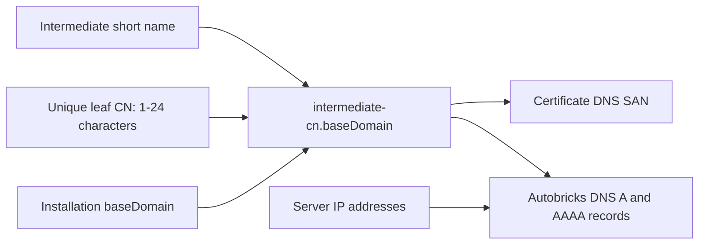

# Common Names and DNS registration

Autobricks PKI Server 1.0 uses certificate Common Names (CNs) to identify CAs and leaf subjects. DNS records resolve server names to addresses. A certificate fingerprint identifies one certificate generation, including when several generations share a CN through renewal.

## Names by certificate type

| Certificate type | CN | Example with baseDomain `autobricks.internal` |
| --- | --- | --- |
| Root CA | `pki.<baseDomain>` | `pki.autobricks.internal` |
| Intermediate CA | `<intermediate>.<baseDomain>`; Intermediate name is 1–16 characters | `database.autobricks.internal` |
| Server leaf | Short subject name, 1–24 characters | `db01` |
| Client leaf | Short subject name, 1–24 characters | `client01` |

The 24-character limit applies to leaf CNs, not the complete CA CN or generated DNS name. Leaf CNs contain ASCII letters, digits, and hyphens, without leading or trailing hyphens. Input is normalized to lowercase. Dots, spaces, underscores, wildcards, and non-ASCII characters are rejected. CNs are subject identifiers, not user accounts.

## Intermediate name length

The `<intermediate>` name accepts 1–16 ASCII letters, digits, or hyphens, with no leading or trailing hyphen. Letters are normalized to lowercase. The `.<baseDomain>` suffix is excluded from this limit. For example, `database.autobricks.internal` has the eight-character Intermediate name `database`.

With a 16-character Intermediate name and a 24-character base domain, the complete Intermediate CA CN is at most 41 characters. The generated `<intermediate>-<cn>` DNS label is at most 41 characters when the leaf CN uses its full 24 characters.

## Base domain length

`baseDomain` accepts 1–24 ASCII characters in total, including dots and hyphens. Leading and trailing input whitespace is trimmed, and letters are normalized to lowercase. DNS labels must contain letters, digits, or hyphens, with no empty labels or leading/trailing hyphens. IP address literals are rejected. The default is `autobricks.internal`.

The base domain and leaf CN each have their own 24-character limit; the generated full DNS name is not limited to 24 characters.

## CN uniqueness and renewal

| Operation or condition | CN behavior |
| --- | --- |
| New leaf issuance | Reject an existing leaf CN anywhere in the PKI database |
| Different Intermediate CA | Does not permit reuse of an existing leaf CN |
| Different server/client certificate kind | Does not permit reuse of an existing leaf CN |
| Letter-case difference | Counts as the same CN |
| Existing expired or revoked certificate | Retains its CN; new issuance cannot reuse it |
| Authorized leaf renewal | Preserve the CN and issue a new certificate with a new fingerprint |
| Intermediate CA renewal | Preserve the CA subject and signing key; create a new certificate generation |

The leaf CN check and certificate insertion occur in the same SQLite write transaction. Renewal uses the existing certificate's access token and the final seven-day renewal window. CN equality alone does not authorize renewal. Renewal generations remain distinguishable by certificate fingerprint, serial number, and validity period.

## Server DNS naming

Server and combined server/client leaf certificates register this name through Autobricks DNS:

```text
<intermediate>-<cn>.<baseDomain>
```

`intermediate` is the issuer's short name, such as `database`, without the `.<baseDomain>` suffix. A custom Intermediate CA may use a DNS-label CN or `<label>.<baseDomain>`; its short label forms the prefix. `cn` is the normalized leaf CN. `baseDomain` is the installation domain stored in SQLite.

| Intermediate CA CN | Leaf CN | Registered DNS name |
| --- | --- | --- |
| `database.autobricks.internal` | `db01` | `database-db01.autobricks.internal` |
| `www.autobricks.internal` | `web01` | `www-web01.autobricks.internal` |
| `vpn.autobricks.internal` | `vpn01` | `vpn-vpn01.autobricks.internal` |
| `worm.autobricks.internal` | `store01` | `worm-store01.autobricks.internal` |
| `app.autobricks.internal` | `backend01` | `app-backend01.autobricks.internal` |
| `truelog.autobricks.internal` | `audit01` | `truelog-audit01.autobricks.internal` |

The generated name is inserted into the certificate's DNS SAN. A creation request may omit `dns_names`; if supplied, it must contain exactly the generated name. IPv4 and IPv6 SAN addresses supply the A and AAAA records, respectively. The DNS integration supports at most one address of each family per name. Client-only issuance does not register DNS.

The PKI service's installation endpoint is registered separately as `pki.<baseDomain>` by default, with an optional `ABPKI_ORIGIN` override. Its internally managed TLS leaf uses CN `pki` and includes the endpoint hostname in DNS SAN. CA Common Names do not by themselves create DNS records.

## DNS collisions

A generated DNS name already assigned to another server leaf is rejected during new issuance, even if concatenating different Intermediate and CN labels produces the same name. For example, issuer `www-a` with CN `b` and issuer `www` with CN `a-b` both produce `www-a-b.<baseDomain>`.

Renewal preserves the existing DNS SAN and repeats the same registration. An existing identical DNS address record is idempotent. An external DNS record with a different address is a delivery conflict; PKI does not overwrite it. External registration failures remain pending for retry after certificate issuance. Revocation does not remove DNS records or release the CN for new issuance.

## TLS identity and DNS syntax

TLS server identity verification uses the generated `dNSName` SAN, not the leaf's short CN. DNS registration alone does not authenticate a server. See [RFC 9525](https://www.rfc-editor.org/rfc/rfc9525.html) and [RFC 5280 §4.2.1.6](https://www.rfc-editor.org/rfc/rfc5280.html#section-4.2.1.6).

The combined `<intermediate>-<cn>` label must fit within 63 characters; the complete textual DNS name must fit within 253 characters without a trailing dot. The 24-character leaf CN restriction is an Autobricks PKI policy. Hostname syntax follows [RFC 1035 §2.3.1](https://www.rfc-editor.org/rfc/rfc1035.html#section-2.3.1) and [RFC 1123 §2.1](https://www.rfc-editor.org/rfc/rfc1123.html#section-2.1).



[Default CAs](INTERMEDIATE.md) · [Validity and renewal](VALIDATION.md) · [Runtime configuration](docs/runtime.md)
