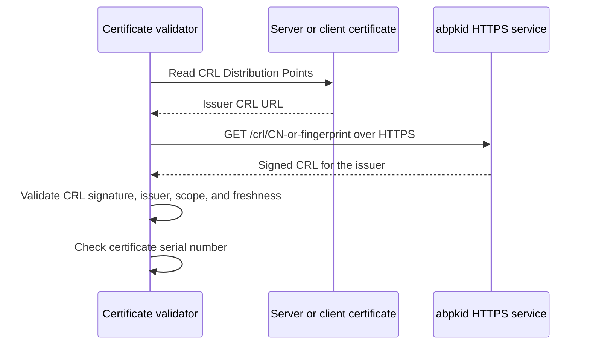

# CRL distribution

`abpkid` provides a simple HTTPS service for downloading Certificate Revocation Lists (CRLs). Each CRL describes revocation information for leaf certificates issued by its Intermediate CA.

## Download URLs

A CRL is accessible using either the issuing Intermediate CA's Common Name (CN) or its certificate fingerprint.

| Identifier | URL |
| --- | --- |
| Intermediate CA Common Name | `https://example.internal/crl/<cn>` |
| Intermediate CA certificate fingerprint | `https://example.internal/crl/<intermediate-ca-fingerprint>` |

Clients retrieve the PEM-encoded signed CRL with HTTPS `GET`. Both identifier forms resolve to the CRL associated with the identified issuing CA. The fingerprint identifies the Intermediate CA certificate, not the leaf certificate or the CRL itself.

`example.internal` represents the DNS record name registered through `autobricks-dns` during PKI installation. A CN is URL-encoded as one path segment. The CN value is taken from the Intermediate CA certificate; a logical CA name is not automatically its CN.

Clients can download CRLs without a client certificate. Download access does not grant permission to revoke certificates. Clients validate the HTTPS server's certificate and trust chain.

## Leaf certificate extension

Every issued server and client certificate must contain an HTTPS CRL URL for its issuing Intermediate CA in the **CRL Distribution Points** extension (`2.5.29.31`). The URL is encoded as a URI in a distribution point's `fullName`, rather than as a subject SAN.

At least one supported URL form is included. A certificate can contain both CN-based and fingerprint-based URLs for its issuer. Renewed leaf certificates also contain the applicable issuer's CRL distribution URL.

```text
CRL Distribution Points (2.5.29.31)
  Distribution Point
    Full Name
      URI: https://example.internal/crl/<cn>
  Distribution Point
    Full Name
      URI: https://example.internal/crl/<intermediate-ca-fingerprint>
```

The placeholders represent issuer-specific values, not literal certificate contents. The URLs are part of the signed leaf certificate. Existing certificates cannot have their URLs edited in place.

Extension definition: [RFC 5280, Section 4.2.1.13 — CRL Distribution Points](https://www.rfc-editor.org/rfc/rfc5280.html#section-4.2.1.13).

## Validity and publication

CRLs are stored under `ABPKI_WORM/crl/<issuer-fingerprint>/<number>-<sha256>.pem`. SQLite stores only `crl_path`, the issuer key, number, and update deadline. New files are written before publishing their paths; older files remain under WORM retention. Initial Intermediate CA creation publishes an empty CRL with number 1. Renewing an existing CA continues its lineage number sequence without resetting it. Scheduled expiration refresh and committed revocation publish replacement files.

Every CRL has a fixed validity period of **7 days (168 hours)**. This period is not configurable through creation parameters, CLI options, or server configuration.

| Field or event | Behavior |
| --- | --- |
| `thisUpdate` | The issuance time of the signed CRL. |
| `nextUpdate` | `thisUpdate + 7 days`. |
| Scheduled refresh | `abpkid` issues and publishes a replacement no later than the current CRL's `nextUpdate`, even when no new revocation has occurred. |
| Certificate revocation | `abpkid` immediately generates, signs, and publishes an updated CRL for the issuing Intermediate CA, including the revoked certificate. It does not wait for the scheduled refresh. |

Each replacement CRL receives its own issuance time and a new fixed seven-day validity period. Both the CN-based and fingerprint-based URLs for the same issuer serve the updated CRL. An update retains all revocation entries still required within that CRL's scope; it is not a list of only the latest revocation.

Revocation state and the pending CRL update are committed together before signing. CRL generation failure never reverses revocation. Pending publication is retried every 30 seconds, including after restart. Downloads only read the current published WORM file. Missing, expired, or pending CRLs produce an error without creating a CRL during the request.

Each renewal lineage is published once per revocation or expiry refresh. All linked CA generations use that publication. CRL retries are independent of DNS and TrueLog delivery.

Immediate publication updates the server's downloadable CRL. It does not push the replacement into validators that have already cached an earlier CRL.

The seven-day interval is an Autobricks PKI policy. Timestamp semantics and publication by `nextUpdate` follow [RFC 5280, Sections 5.1.2.4 and 5.1.2.5](https://www.rfc-editor.org/rfc/rfc5280.html#section-5.1.2.4).

## Retrieval and validation



The Intermediate CA signs its CRL using a key authorized for CRL signing. HTTPS protects retrieval; CRL signature validation establishes the revocation data's authenticity. Successful download alone is not a certificate validation result.

Validators check the CRL's issuer and scope, signature, and update timestamps before using its serial-number entries. A missing or unusable CRL is not evidence that a certificate is valid. [RFC 5280, Sections 5 and 6.3 — CRLs and validation](https://www.rfc-editor.org/rfc/rfc5280.html#section-6.3).

## Intermediate CA renewal

CRL URLs embedded in existing leaf certificates continue to identify their applicable issuer revocation information after Intermediate CA renewal. A fingerprint-based URL refers to a particular Intermediate CA certificate; it must not be silently rebound to an unrelated issuer.

[Certificate fields](CERTITFICATE.md) · [Intermediate CAs](INTERMEDIATE.md) · [Validity and renewal](VALIDATION.md)

Intermediate renewal retains its CA key and subject. CN lookup selects the newest issuer certificate; fingerprint lookup retains the specified generation. Publication includes revoked leaves from the entire linked lineage and advances one shared number sequence. Every generation points to the latest signed WORM CRL, so old fingerprint URLs and the CN URL retain revocation continuity. An unrelated certificate with the same CN is not included. Subject and public key equality are checked before sharing a CRL across generations.

## CA handover revocation scope

[Intermediate CA handover](INTERMEDIATE.md#intermediate-ca-renewal-handover) retires each old leaf seven days after its SUPERSEDED transition and the old CA 48 days after its transition, without checking renewal or download completion. Leaf CRLs are signed by the Intermediate CA; the old Intermediate CA's own revocation requires a Root-signed CRL. Forced retirement of a SUPERSEDED Intermediate CA queues a Root-signed CRL containing revoked Intermediate certificates. Its PEM is published on WORM and available through `/crl/<root-fingerprint>` or the Root CN. Failed publication remains pending and does not reverse the CA revocation. The handover deadline does not alter the fixed seven-day CRL validity period.
