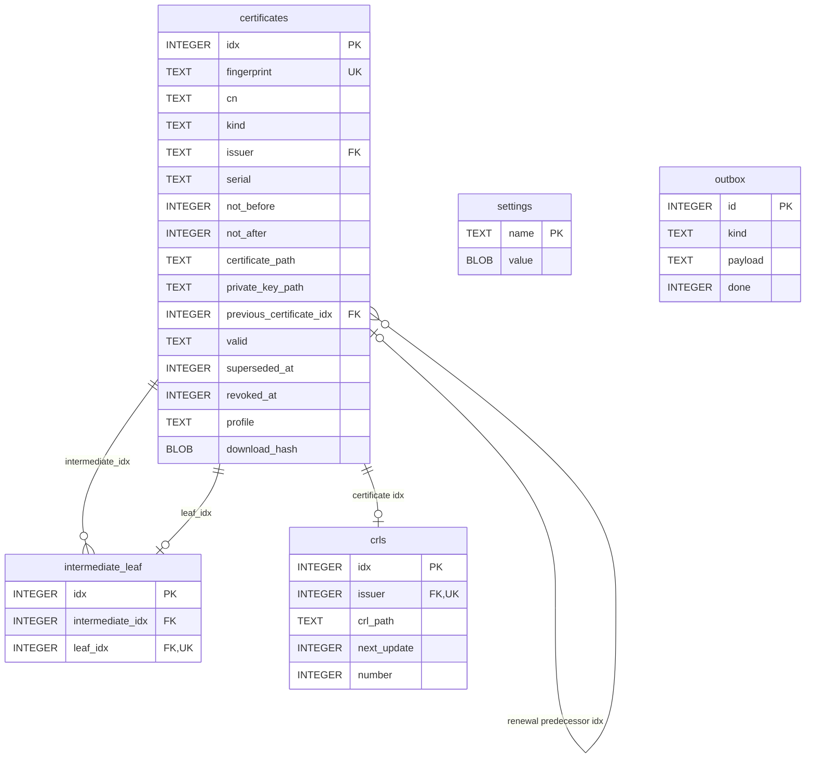
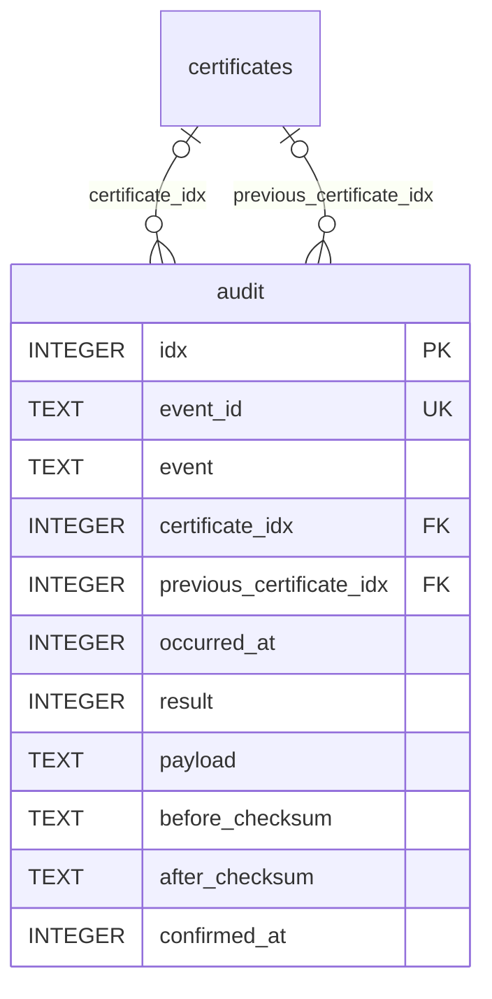

# SQLite schema

Autobricks PKI Server 1.0 stores operational state in SQLite. The installed service uses `/var/lib/autobricks-pki/abpki.sqlite`, configured through `ABPKI_DATABASE`. No SQLite table stores certificate, private-key, or CRL PEM contents, including settings and outbox payloads. The live database and its journal reside on mutable storage outside WORM. The database file requires owner-only permissions (`0600`).

Schema initialization is implemented in [database.rs](src/storage/database.rs); private-key encryption is implemented in [key_encryption.rs](src/storage/key_encryption.rs). The current database schema version is `PRAGMA user_version = 1`, independent of the product build version in `VERSION`.

## Connection configuration

```sql
PRAGMA foreign_keys = ON;
PRAGMA journal_mode = DELETE;
PRAGMA synchronous = FULL;
PRAGMA secure_delete = ON;
```

Each connection uses a five-second busy timeout. Application transactions use `BEGIN IMMEDIATE`, followed by `COMMIT` or `ROLLBACK`. DELETE journal mode uses a temporary `abpki.sqlite-journal` file during transactions.

## Table definitions

The following DDL specifies the storage design. Certificate and encrypted-key files are written directly to WORM before inserting their paths and metadata. The CA-to-leaf relation is populated during issuance. Lifecycle handover transitions remain outside the current runtime implementation. The audit table below is also a design contract.

```sql
CREATE TABLE IF NOT EXISTS settings (
    name TEXT PRIMARY KEY,
    value BLOB NOT NULL
);

CREATE TABLE IF NOT EXISTS certificates (
    idx INTEGER PRIMARY KEY AUTOINCREMENT,
    fingerprint TEXT NOT NULL UNIQUE,
    cn TEXT NOT NULL,
    kind TEXT NOT NULL,
    issuer TEXT REFERENCES certificates(fingerprint),
    serial TEXT NOT NULL,
    not_before INTEGER NOT NULL,
    not_after INTEGER NOT NULL,
    certificate_path TEXT NOT NULL,
    private_key_path TEXT NOT NULL,
    previous_certificate_idx INTEGER REFERENCES certificates(idx),
    valid TEXT NOT NULL DEFAULT 'VALID'
        CHECK (valid IN ('VALID', 'REVOKED', 'SUPERSEDED')),
    superseded_at INTEGER,
    revoked_at INTEGER,
    profile TEXT,
    download_hash BLOB,
    UNIQUE (issuer, serial)
);

CREATE TABLE IF NOT EXISTS intermediate_leaf (
    idx INTEGER PRIMARY KEY AUTOINCREMENT,
    intermediate_idx INTEGER NOT NULL REFERENCES certificates(idx),
    leaf_idx INTEGER NOT NULL UNIQUE REFERENCES certificates(idx),
    CHECK (intermediate_idx <> leaf_idx)
);

CREATE INDEX IF NOT EXISTS intermediate_leaf_issuer
    ON intermediate_leaf (intermediate_idx, leaf_idx);

CREATE INDEX IF NOT EXISTS certificates_kind_cn_expiry
    ON certificates (kind, cn, not_after DESC, idx DESC);
CREATE INDEX IF NOT EXISTS certificates_kind_expiry
    ON certificates (kind, not_after);
CREATE INDEX IF NOT EXISTS certificates_predecessor
    ON certificates (previous_certificate_idx);
CREATE INDEX IF NOT EXISTS certificates_lower_cn
    ON certificates (lower(cn));

CREATE INDEX IF NOT EXISTS certificates_dns_name
    ON certificates (json_extract(profile,'$.dns_names[0]') COLLATE NOCASE)
    WHERE kind IN ('server','server-and-client');
CREATE INDEX IF NOT EXISTS certificates_dns_aliases
    ON certificates (idx)
    WHERE kind IN ('server','server-and-client') AND json_array_length(profile,'$.dns_names')>1;
CREATE INDEX IF NOT EXISTS certificates_kind_idx ON certificates (kind, idx);
CREATE INDEX IF NOT EXISTS certificates_leaf_state_idx ON certificates (valid, idx)
    WHERE kind IN ('server','client','server-and-client');
CREATE INDEX IF NOT EXISTS certificates_intermediate_state_idx ON certificates (valid, idx)
    WHERE kind='intermediate';
CREATE INDEX IF NOT EXISTS certificates_superseded_deadline ON certificates (superseded_at, idx)
    WHERE valid='SUPERSEDED' AND revoked_at IS NULL;
CREATE INDEX IF NOT EXISTS certificates_leaf_renewal_due ON certificates (not_after, idx)
    WHERE kind IN ('server','client','server-and-client') AND valid='VALID' AND revoked_at IS NULL;


CREATE TABLE IF NOT EXISTS crls (
    idx INTEGER PRIMARY KEY AUTOINCREMENT,
    issuer INTEGER NOT NULL UNIQUE REFERENCES certificates(idx),
    crl_path TEXT NOT NULL,
    next_update INTEGER NOT NULL,
    number INTEGER NOT NULL
);

CREATE TABLE IF NOT EXISTS outbox (
    id INTEGER PRIMARY KEY,
    kind TEXT NOT NULL,
    payload TEXT NOT NULL,
    done INTEGER NOT NULL DEFAULT 0
);

CREATE INDEX IF NOT EXISTS outbox_pending_id
    ON outbox (id) WHERE done=0;
CREATE INDEX IF NOT EXISTS outbox_pending_kind_payload
    ON outbox (kind, payload) WHERE done=0;
```

These are ordinary SQLite rowid tables. The CA-to-leaf lookup uses the explicit composite index shown above, in addition to primary-key and unique indexes. There are no triggers, views, or cascading foreign-key actions. Certificate lifecycle values are restricted by a `CHECK` constraint. `outbox.id` aliases the rowid and does not use `AUTOINCREMENT`.

`certificates.idx` is the automatically incremented integer primary key. `fingerprint` is a required unique certificate identifier. The text primary key in `settings` does not explicitly declare `NOT NULL`; the application supplies non-null identifiers. Enumerated values, JSON structure, timestamp ranges, and cryptographic formats are validated by application code.

## Relationships



Root certificates have no issuer reference. Intermediate certificates reference their Root CA. Leaf certificates reference the exact issuing Intermediate CA certificate generation. Fingerprints embedded in settings and outbox payloads are application references, without SQL foreign keys.

## Settings

`settings` stores named binary values. Text and JSON values are encoded as UTF-8 bytes in the BLOB column. The service has one administrator password and no user, account, or role tables.

| Name | Stored representation | Purpose |
| --- | --- | --- |
| `administrator_password` | 64 bytes: 32-byte random salt followed by a 32-byte derived hash | Administrator verification using PBKDF2-HMAC-SHA256 with 600,000 iterations. |
| `private_key_password` | 64 hexadecimal ASCII characters representing 32 random bytes | Password for encrypting and decrypting stored private keys. This is a usable secret, not a password hash. |
| `base_domain` | UTF-8 normalized domain, at most 24 ASCII characters | Installation domain for CA names and generated DNS names. |
| `ca_validity_policy` | UTF-8 JSON containing `retention_days` and `intermediate_days` | Installation retention and Intermediate CA limit: `min(398, retention_days - 7)`. For 365 days of retention, the limit is 358 days. |
| `renewal_scheduler_last_attempt` | JSON integer, UTC Unix seconds | Start of the latest hourly renewal attempt; prevents duplicate runs across service restarts. |
| `tls_certificate` | UTF-8 certificate fingerprint | Current PKI service TLS certificate; updated during internal TLS certificate renewal. |

SQLite stores the encryption password; encrypted keys reside on WORM. Access to both the password and WORM key files permits decryption. See [key storage](docs/key-storage.md).

## Certificates

`certificates` contains Root CA, Intermediate CA, and leaf certificates, including earlier renewal generations.

| Column | Application representation and meaning |
| --- | --- |
| `idx` | Automatically assigned integer primary key using `AUTOINCREMENT`. Committed identifiers are not reused after deletion; gaps are possible. |
| `fingerprint` | Lowercase SHA-256 digest of certificate DER, encoded as 64 hexadecimal characters. Required unique identifier used by certificate APIs and issuer references. |
| `cn` | Certificate Common Name. Renewed certificates retain the same CN. |
| `kind` | `root`, `intermediate`, `server`, `client`, or `server-and-client`. |
| `issuer` | Issuer certificate fingerprint; `NULL` for a Root CA. |
| `serial` | Certificate serial number encoded as contiguous uppercase hexadecimal text, without separators. |
| `not_before` | Start of validity, as Unix UTC seconds. |
| `not_after` | End of validity, as Unix UTC seconds. The Root CA uses `253402300799` (9999-12-31 23:59:59 UTC) to represent its unrestricted lifetime. |
| `certificate_path` | Relative path to the certificate PEM under `ABPKI_WORM`. PEM contents are not stored in this table. |
| `private_key_path` | Relative path to the encrypted PKCS#8 private-key PEM under `ABPKI_WORM`. Applies to Root, Intermediate, and leaf keys; key contents are not stored in this table. |
| `previous_certificate_idx` | Previous certificate replaced by this renewal. Set from the existing certificate row during renewal; null for initial issuance. Identifies the exact predecessor while both generations retain independent lifecycle state. |
| `valid` | `VALID`, `REVOKED`, or `SUPERSEDED`. New certificates default to `VALID`; `SUPERSEDED` identifies an old certificate temporarily usable during renewal handover. |
| `superseded_at` | UTC Unix timestamp when the certificate enters `SUPERSEDED`. Written by the transition transaction. Defines a seven-day leaf or 48-day Intermediate CA retirement deadline; not reset by retries. Null before handover. |
| `revoked_at` | Revocation timestamp as Unix UTC seconds; `NULL` until revocation. Recorded together with the `REVOKED` state. |
| `profile` | Leaf issuance profile as JSON; `NULL` for CA certificates. Fields include `kind`, `common_name`, `dns_names`, `ip_addresses`, `uri_sans`, and `validity` with `not_before` and `not_after`. |
| `download_hash` | 32-byte SHA-256 digest used to verify the certificate access token for download and renewal; `NULL` for CA certificates. |

### Certificate lifecycle state

| State | Meaning |
| --- | --- |
| `VALID` | Issued certificate in normal use. Its validity interval must still be checked. |
| `SUPERSEDED` | Existing certificate in renewal handover. It remains temporarily usable while the holder obtains the new certificate. |
| `REVOKED` | Revoked certificate. Record `revoked_at` in the same transaction as the state change. |

An accepted renewal puts the existing certificate into `SUPERSEDED`; the replacement certificate is issued as `VALID`. The old certificate remains unrevoked during the handover, including while the replacement download is pending or has failed. The temporary state never extends `not_after` and does not override administrator revocation. A rejected renewal request does not change certificate state.

`SUPERSEDED` is a local PKI handover state. Entering it does not populate `revoked_at` or add the certificate to a CRL. For an otherwise unrevoked certificate, OCSP and `check` continue to report `GOOD`; OCSP does not expose `SUPERSEDED` as a wire status. Operation outcomes remain integer values in `audit.result`.

X.509 CRLs define `superseded (4)` as a **revocation reason** in [RFC 5280 Section 5.3.1](https://www.rfc-editor.org/rfc/rfc5280.html#section-5.3.1). That reason applies to an actual revocation. It does not give a revoked certificate permission to remain usable. The local temporary `SUPERSEDED` state must therefore remain separate from publishing a CRL entry with that reason.

Renewal links the new VALID certificate to its predecessor. The predecessor remains SUPERSEDED after renewal and download. ADMIN requests only mark the selected VALID certificate SUPERSEDED. Automatic CA replacement marks its dependent non-revoked leaves SUPERSEDED; the first transition timestamp is retained.

The scheduler marks unexpired VALID leaves SUPERSEDED when seven days remain, without issuing replacements. Indexed batches of at most 256 records handle readiness and retirement. Leaf retirement is `superseded_at + 604800`; Intermediate CA retirement is `superseded_at + 4147200`. Retirement does not depend on renewal or download completion and never resets deadlines. State, audit, and CRL tasks commit before signing. Missing transition timestamps are reported as invalid state.

### Fingerprint and serial encoding

Store fingerprints and serials as uninterrupted hexadecimal strings. Do not store colons, spaces, hyphens, line breaks, or a `0x` prefix. The same representation applies to certificate records, issuer fingerprint references, API values, and audit payloads.

| Value | Representation | Example |
| --- | --- | --- |
| SHA-256 fingerprint | Exactly 64 lowercase hexadecimal characters. Preserve all digest bytes, including leading zero bytes. | `76fea00123456789abcdef0123456789abcdef0123456789abcdef0123456789` |
| Certificate serial | Contiguous uppercase hexadecimal text produced by the existing serial encoder. | `76FEA01234` |

The certificate generator already concatenates fingerprint bytes without separators and obtains serial text without separators from OpenSSL. OCSP serial lookup uses the same serial encoding. No colon-formatted display string is persisted. This rule concerns hexadecimal text fields; certificate and OCSP protocol DER encoding is unchanged.

`UNIQUE (issuer, serial)` prevents duplicate serials under the same non-null issuer fingerprint. It does not enforce global serial uniqueness or uniqueness among Root CA rows with a null issuer.

CN uniqueness is enforced in the issuance transaction, not by a SQL unique constraint: new leaf issuance rejects an existing leaf CN across issuers and leaf kinds, including expired and revoked certificates. Authorized renewal retains the CN and creates a new fingerprint. See [Common Names and DNS](COMMON-NAME.md).

Validity limits, issuer kind, certificate profiles, and authorization are also enforced by the service. A foreign key alone does not enforce the Root/Intermediate/leaf hierarchy or prohibit issuer cycles.

## Intermediate CA and leaf relationship

`intermediate_leaf` connects an exact Intermediate CA generation to its issued leaves using integer keys. One Intermediate CA has many leaves; each leaf belongs to one issuer generation. `leaf_idx UNIQUE` prevents assigning one leaf to multiple issuers. The service verifies `kind=intermediate` on the issuer and a leaf kind on the target; foreign keys alone cannot enforce those types.

Insert the relation in the same transaction as the leaf metadata. Renewal inserts a new leaf and a new relation to its replacement issuer; preserve the old relation for history and handover. Revocation changes certificate state, not relation membership. The stored issuer fingerprint must agree with this relation and the signed certificate; it is not the handover lookup key.

List the old CA's leaves and their current state:

```sql
SELECT c.idx, c.fingerprint, c.cn, c.valid
FROM intermediate_leaf AS r
JOIN certificates AS c ON c.idx = r.leaf_idx
WHERE r.intermediate_idx = :old_ca_idx;
```

Check whether any old leaf still blocks early CA retirement:

```sql
SELECT EXISTS (
    SELECT 1
    FROM intermediate_leaf AS r
    JOIN certificates AS c ON c.idx = r.leaf_idx
    WHERE r.intermediate_idx = :old_ca_idx
      AND c.valid <> 'REVOKED'
) AS has_pending_leaf;
```

The composite index locates one CA's relationships; primary-key lookups retrieve each leaf. No CN matching, JSON parsing, or recursive hierarchy query is required. Deadline revocation uses the same member set in a transaction together with CRL updates and audit enqueueing. A raw state-only update does not complete revocation publication.

## Certificate and key source storage

WORM holds the original certificate PEM and encrypted private-key PEM. SQLite stores metadata, lifecycle state, issuer relationships, credentials, and the two relative paths. It does not duplicate either file's contents. `profile` remains issuance metadata needed for renewal; it is not a PEM copy.

Paths are generated by the existing archive naming rules using actual creation time and fingerprint. For example:

```text
certificate/2026-09-27/<fingerprint>/web01.pem
certificate/2026-09-27/<fingerprint>/web01.key.pem
```

Root and Intermediate certificates use their existing `root/` and `intermediate/` layouts. Resolve paths only through `ABPKI_WORM`, rejecting traversal and symlink escapes. Read certificate files for downloads and chain construction; read and decrypt private-key files in memory for signing, TLS, or authorized leaf download. Verify certificate fingerprint and key correspondence before use. A missing or unreadable referenced file is a server storage error, not an absent database certificate.

Issuance writes and synchronizes both WORM files before committing usable certificate metadata and returning success. Insert file paths, metadata, the CA-to-leaf relation, and pending audit/DNS operations in one SQLite transaction after those writes succeed. WORM failure must not yield an issued certificate whose only key was lost from memory. The outbox must not contain PEM bytes as a substitute duplicate store.

SQLite and WORM are not atomic together. Failure after a WORM write but before metadata commit can leave an unreferenced file, and a partial write can remain on appendable WORM. Such files remain subject to retention; do not overwrite or delete them to simulate rollback. Do not expose them as successfully issued certificates. No migration of older database contents is part of this initial schema design.

## CRLs

`crls` stores the WORM path and metadata of the current signed CRL for each issuing Intermediate CA, referenced by its numeric certificate key.

| Column | Application representation and meaning |
| --- | --- |
| `idx` | Automatically incremented integer primary key. |
| `issuer` | Required unique integer foreign key referencing `certificates.idx`. One current CRL per Intermediate CA certificate generation. |
| `crl_path` | Relative path to the signed CRL PEM under `ABPKI_WORM`; no CRL contents are stored in SQLite. |
| `next_update` | CRL expiration as Unix UTC seconds. CRL validity is fixed at seven days. |
| `number` | CRL sequence number. Generation takes the highest stored number across generations linked by `previous_certificate_idx` and increments it. |

Publication writes a new immutable WORM file before updating all issuer rows in the renewal lineage to its path and number. Revocation immediately regenerates the affected CRL. The signed CRL contains its `thisUpdate`; there is no separate database column for it. See [CRL distribution](CRL.md).

## Delivery outbox

`outbox` records pending external operations alongside database changes. Certificate files are written directly to WORM before issuance commits. The outbox queues CRL publication, TrueLog, and DNS operations; it does not queue certificate-file copies.

| Column | Application representation and meaning |
| --- | --- |
| `id` | Automatically assigned integer identifier; pending operations are processed in ascending order. |
| `kind` | `certificate`, `audit`, or `dns`. |
| `payload` | Operation data stored as JSON text, with legacy certificate payload support described below. |
| `done` | `0` for pending delivery; `1` after successful delivery. Completed rows are retained. |

| Kind | Payload fields | Delivery |
| --- | --- | --- |
| `audit` | `event`, `fingerprint`, `timestamp` (Unix UTC seconds) | Submits an audit event through `ab-truelog-cli`. Delivery adds `event_id` as `<root-fingerprint>:<outbox-id>`; this field is not stored in the payload. |
| `crl` | Issuer certificate fingerprint | Regenerates the issuer CRL after committed revocation; failure leaves the certificate revoked and publication pending. |
| `dns` | `name`, `type` (`A` or `AAAA`), `ip` | Registers a record through Autobricks DNS. |

Pending-work partial indexes exclude completed rows. The running server reads external operations in batches of at most 64 rows using an increasing ID cursor. Failed rows do not prevent later rows from being attempted; the cursor resets after reaching the end of a pass, with a 30-second pause before the next pass. Completed rows remain available and are not deleted.

DNS and TrueLog delivery run in a dedicated worker. The service lock is held only while preparing work or recording completion, not while waiting for either external service. CRL retries run separately in maintenance, so a slow external service does not delay their polling. A revocation queues one CRL task per CA renewal lineage; publication updates every generation and completes pending CRL tasks for that lineage in the same transaction.

Failed operations remain pending. External delivery and SQLite completion are not one atomic transaction; a committed external write followed by a lost acknowledgement can be retried. TrueLog manages audit files and retention. The outbox stores delivery state and does not replace TrueLog audit storage.

## Audit history schema

The `audit` table defines the certificate-operation history and its TrueLog write receipts. This section specifies the audit storage contract; the current runtime does not yet create or populate this table. The table definitions above describe existing runtime storage.

```sql
CREATE TABLE IF NOT EXISTS audit (
    idx INTEGER PRIMARY KEY AUTOINCREMENT,
    event_id TEXT NOT NULL UNIQUE,
    event TEXT NOT NULL CHECK (event IN ('CREATE', 'REVOKE', 'RENEW', 'OCSP')),
    certificate_idx INTEGER REFERENCES certificates(idx),
    previous_certificate_idx INTEGER REFERENCES certificates(idx),
    occurred_at INTEGER NOT NULL,
    result INTEGER NOT NULL,
    payload TEXT NOT NULL,
    before_checksum TEXT NOT NULL,
    after_checksum TEXT NOT NULL,
    confirmed_at INTEGER NOT NULL
);

CREATE INDEX IF NOT EXISTS audit_certificate_time
    ON audit (certificate_idx, occurred_at, idx);
CREATE INDEX IF NOT EXISTS audit_previous_certificate
    ON audit (previous_certificate_idx);
CREATE INDEX IF NOT EXISTS audit_event_time
    ON audit (event, occurred_at, idx);
```

`idx` is the internal automatically incremented primary key. Certificate relationships use integer keys, not fingerprints. `event_id` uses the existing value produced by the delivery worker in [delivery.rs](src/server/delivery.rs): `<root-certificate-fingerprint>:<outbox.id>`. Both inputs already exist when the queued event is submitted to TrueLog. The unique constraint identifies the corresponding confirmed event locally. There is no separate request identifier or request-grouping index.



### Event fields

| Column | Source and meaning |
| --- | --- |
| `idx` | SQLite-generated integer primary key. |
| `event_id` | Existing delivery identifier: Root CA fingerprint plus the persisted outbox row ID. Reused for delivery attempts of that row. |
| `event` | `CREATE`, `REVOKE`, `RENEW`, or `OCSP`. |
| `certificate_idx` | Numeric reference to the created, revoked, renewed, or queried certificate. Null when no certificate can be resolved, including an unknown OCSP target. |
| `previous_certificate_idx` | Original certificate for renewal; null for other operations. |
| `occurred_at` | PKI event time as Unix UTC seconds, preserved across retries. |
| `result` | Integer operation result from [ERROR.md](ERROR.md): `200` success, `400` invalid request, `403` forbidden, `404` certificate not found, `409` state conflict, `500` server error, or `501` not implemented. OCSP certificate status remains in the payload. |
| `payload` | Event details encoded as JSON. OCSP includes the observed requester IP, queried certificate identity, and response result as defined below. The same details are sent to TrueLog. |
| `confirmed_at` | PKI time when the validated receipt is stored, as Unix UTC seconds. This is not a timestamp returned by TrueLog. |

| Event | Certificate association | Recording boundary |
| --- | --- | --- |
| `CREATE` | Newly issued Root, Intermediate, or leaf certificate. | Certificate creation commits in SQLite. |
| `REVOKE` | The specific revoked leaf certificate. | Revocation and CRL changes commit. An already-revoked retry does not represent a new revocation transition. |
| `RENEW` | New certificate in `certificate_idx`; original certificate in `previous_certificate_idx`. | Replacement issuance commits. Renewal is distinct from new issuance and does not also generate a duplicate `CREATE` event for the same operation. Applies to internal CA/service renewal and holder-requested leaf renewal. |
| `OCSP` | Resolved certificate if available. | The responder determines each item's status. Each CertID has its own event and corresponding outbox entry. |

Rejected operations retain their operation type and the applicable integer result from [ERROR.md](ERROR.md); nullable certificate references allow failures before target resolution. An unparseable OCSP request produces one protocol-error event with null unparseable target fields. Recording a computed OCSP result does not prove that the requesting client received the network response. OCSP history is separate from the management `check` command.

### OCSP payload

An OCSP event records the requester address, target certificate, and computed response status. `requester_ip` is the IPv4 or IPv6 address observed on the accepted TLS connection, captured before request dispatch. It is not taken from caller-supplied HTTP headers. With a proxy or NAT, this is the observed peer address; it does not establish a person's identity. The service has no user accounts or mandatory client certificates.

The following illustrates the JSON shape; angle-bracket values stand for the actual hexadecimal values:

```json
{
  "requester_ip": "192.0.2.25",
  "certificate": {
    "fingerprint": "<resolved-certificate-sha256-hex>",
    "cn": "web01",
    "serial": "<requested-serial-hex>",
    "issuer_hash_algorithm": "sha256",
    "issuer_name_hash": "<requested-issuer-name-hash-hex>",
    "issuer_key_hash": "<requested-issuer-key-hash-hex>"
  },
  "response_status": "SUCCESSFUL",
  "certificate_status": "GOOD"
}
```

| Payload field | Meaning |
| --- | --- |
| `requester_ip` | Actual peer IP of the OCSP TLS connection. Required even for rejected or malformed OCSP requests that reach the responder. |
| `certificate.fingerprint` | SHA-256 fingerprint resolved from the local certificate database; null for an unresolved target. OCSP requests do not supply this fingerprint. |
| `certificate.cn` | CN resolved from the local certificate database; null for an unresolved target. |
| `certificate.serial` | Requested certificate serial number, represented as unsigned contiguous uppercase hexadecimal text, matching the stored serial format. |
| `certificate.issuer_hash_algorithm` | Digest algorithm named by the request's CertID, such as `sha1` or `sha256`. |
| `certificate.issuer_name_hash` | Requested issuer-name digest as lowercase hexadecimal text. |
| `certificate.issuer_key_hash` | Requested issuer-key digest as lowercase hexadecimal text. Together with the algorithm and serial, identifies the query even when no local certificate matches. |
| `response_status` | OCSP protocol response status, such as `SUCCESSFUL` or `MALFORMED_REQUEST`. |
| `certificate_status` | `GOOD`, `REVOKED`, or `UNKNOWN` for a successful item response; null when a protocol error prevents an item response. |

For `UNKNOWN`, preserve the requested issuer fields and serial, while unresolved `fingerprint`, `cn`, and `audit.certificate_idx` remain null. Do not invent a fingerprint for an unknown certificate. For malformed requests, retain the requester IP and protocol result; target fields that cannot be parsed are null.

Each item in a multi-certificate OCSP request has its own audit payload and event, with the requester IP captured for that connection. `audit.result` uses the integer operation code in [ERROR.md](ERROR.md#ocsp-protocol-and-audit-results). Known `GOOD` and `REVOKED` results use `200`; an unresolved certificate uses `404`. Protocol and certificate statuses remain in the payload and reflect the response actually produced. The JSON stores readable CertID components; no DER CertID BLOB is stored.

### TrueLog confirmation fields

| Audit column | TrueLog response field |
| --- | --- |
| `before_checksum` | `before.checksum` |
| `after_checksum` | `after.checksum` |

Checksums are preserved exactly as returned by TrueLog. PKI does not substitute a locally computed file digest. Receipt service identity and response structure are validated during submission; hostname, service, filenames, sizes, and the full receipt JSON are not persisted in `audit` or copied into its payload. The indexes above support certificate timelines, renewal predecessors, and event/time filtering.

### Field acquisition and runtime integration

| Data | Concrete source | Current runtime boundary |
| --- | --- | --- |
| Event identifier | Delivery preparation: Root CA fingerprint and the pending `outbox.id`. | Already added to the submitted TrueLog event. No request identifier exists. |
| Event type and time | Issuance/revocation/renewal operation and server `now()`. | Creation and revocation already enqueue events. Leaf renewal currently enqueues `certificate-created`; a distinct renewal event requires passing the operation type and original certificate from `Service::renew`. |
| Certificate references | `certificates.idx`, looked up using the certificate fingerprint held by the operation. | Available in SQLite. Renewal holds both the old and new certificates, so both references can be resolved. |
| OCSP peer IP | Socket address returned by `TcpListener::accept`, or `TcpStream::peer_addr()` before TLS wrapping. | `listener.rs` currently discards the accepted address and does not pass it to the route handler. The address must be carried from the listener to OCSP event creation. It is not available from the existing `Request` object. |
| Operation result | Classification at request validation, authorization, lookup, lifecycle, signing, or storage. | Current routes mostly collapse errors to `400`; the common typed result contract is specified in [ERROR.md](ERROR.md). |
| OCSP queried identity and result | Parsed `Query` fields and certificate matching/status calculation in `revocation/ocsp.rs`. | Available inside the responder. `respond` currently returns response bytes only; audit details must be returned alongside those bytes to the caller. |
| TrueLog checksums | Parsed `before.checksum` and `after.checksum` in `TrueLog::submit`. | The function validates the receipt but currently returns `Result<()>`. Returning the validated checksums enables reconciliation to insert the audit row. |
| Confirmation time | Server `now()` during audit insertion. | Captured at the SQLite write, not inferred from TrueLog. |

The audit persistence path carries these values from their sources into the outbox and confirmed row. Socket IP, OCSP item details, renewal associations, and receipt checksums are not currently passed through the full runtime path. The audit schema above describes that data flow; it does not imply that current binaries already record it. Missing target information is null, never replaced by fabricated values.

### Persistence and failure handling

1. Persist the event payload in the delivery outbox, which assigns its integer row ID. Successful certificate operations enqueue their event in the same transaction as the certificate or revocation change. OCSP and rejected-operation events use a separate transaction without changing certificate state.
2. Use the existing reconciliation path to derive `event_id` from the Root CA fingerprint and outbox row ID. Submit the event through `ab-truelog-cli write --service abpkid --data ...`. Include event type, certificate identifiers where known, original event time, result, and the JSON payload. OCSP payloads include the requester IP and parsed target fields. Exclude passwords, access tokens, and private keys.
3. Validate the successful TrueLog response and copy only its before/after checksums into the corresponding audit columns. Preserve the submitted event payload alongside them.
4. Insert the confirmed `audit` row and mark the corresponding outbox operation complete in one SQLite transaction. A repeated confirmation for the same `event_id` retains the existing audit row rather than overwriting its confirmation checksums.

A pending event remains in `outbox`; it does not appear as confirmed history in `audit` until a valid TrueLog receipt is available. Failed or timed-out submission must not fabricate receipt values or mark delivery complete. Pending audit delivery does not reverse a committed certificate operation or change a computed OCSP status.

TrueLog and SQLite do not share a transaction. A lost receipt can follow a committed TrueLog write, and retrying may create another TrueLog record. Stable event identifiers support correlation but do not provide remote deduplication. The local unique event identifier prevents duplicate audit rows, not duplicate TrueLog writes.

TrueLog owns the immutable audit log files and their retention. SQLite `audit` provides queryable history and TrueLog confirmation checksums; it does not independently prove log integrity or duplicate TrueLog's WORM storage.

## Schema initialization

New databases use schema version `1`. Initialization creates the tables and the private-key encryption password. Existing certificate records without their encryption password are rejected. Database opening does not convert older tables or rewrite stored keys.

CA hierarchy creation and installation settings are populated separately by service initialization. Executing the table DDL alone does not create an initialized PKI service.


## Indexed DNS and list access

The DNS-name expression index is non-unique. New issuance checks DNS collisions using the indexed first name; renewal retains the same CN and DNS SAN without invoking the new-issuance collision check. Multi-name profiles use a partial index to limit alias checks to certificates with additional names. No derived DNS table or duplicated profile data is stored.

Certificate lists use `idx > after AND idx <= through`, ordered by `idx`, with at most 256 returned rows. One additional row determines whether another page exists. The initial upper bound excludes later inserts; this is not a transaction snapshot of changing certificate status. No certificate or key file is read for list pages.
