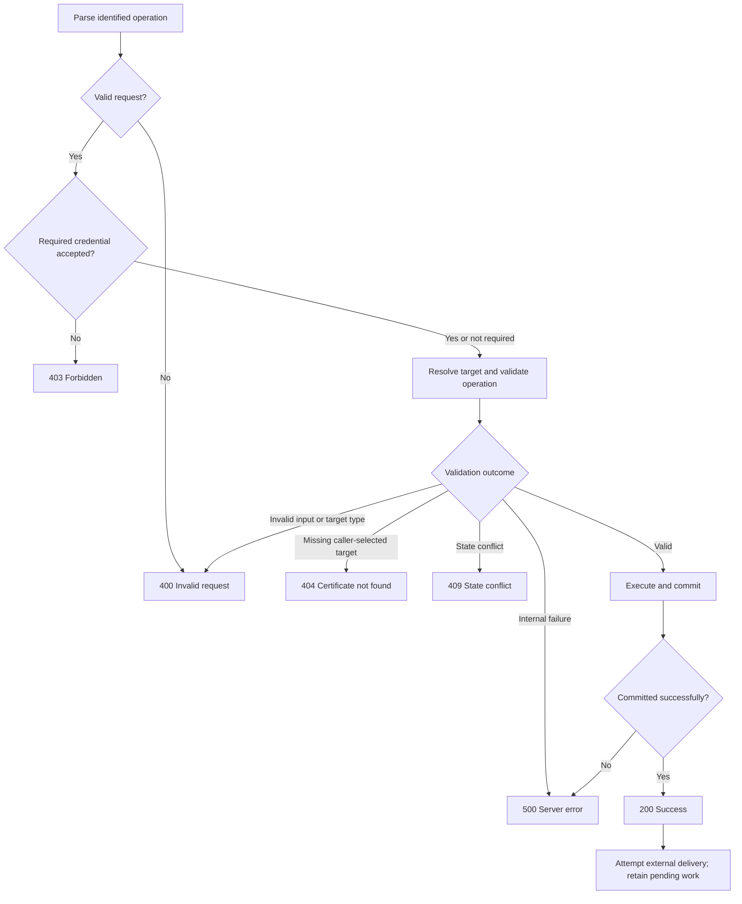

# Operation results and errors

Autobricks PKI Server 1.0 uses integer result codes for certificate operations and audit history. `audit.result` and the result submitted to TrueLog use this catalog. Certificate revocation status is a separate value from the operation result.

This document specifies the common result contract. Current route handling collapses most service errors into `400 Bad Request`; typed error classification and audit persistence are not yet implemented.

## Result codes

| Code | Name | Meaning | Examples |
| --- | --- | --- | --- |
| `200` | SUCCESS | The requested operation completed successfully. | Certificate issued, revocation committed, renewal committed, or a known certificate's OCSP status determined. |
| `400` | INVALID_REQUEST | Request data is malformed or violates input constraints. | Invalid JSON/DER, missing required field, invalid CN, unsupported purpose, or requested validity outside the issuer boundary. |
| `403` | FORBIDDEN | The requester lacks the required authorization. | Missing or incorrect administrator password for revocation; missing or incorrect certificate token for renewal/download. |
| `404` | CERTIFICATE_NOT_FOUND | The requested certificate or issuing CA cannot be found. | Unknown target fingerprint, unknown issuing CA, or an OCSP CertID that does not resolve to a stored certificate. |
| `409` | STATE_CONFLICT | The request conflicts with existing certificate state. | Duplicate new-issuance CN/DNS name, revoked certificate renewal, or renewal outside its permitted window. |
| `501` | NOT_IMPLEMENTED | The operation is unavailable in this version. | Additional Intermediate CA creation in version 1.0. |
| `500` | SERVER_ERROR | An internal failure prevents the operation from completing. | Database failure, certificate signing failure, or required server configuration unavailable. |

An already-revoked certificate returns `200` for an authorized repeat revocation request. A certificate whose OCSP state is `REVOKED` is not a permission error. A missing certificate is not a server failure.

Transport-level failures such as an unsupported HTTP method or media type retain their transport status. They do not imply a certificate result. A connection rejected before a request can be identified does not create a fabricated certificate audit event.

## Error classification

Errors are classified where their cause is known: request parsing, administrator/token verification, certificate lookup, lifecycle validation, signing, or storage. The response layer and audit submission use the same classified operation result. String matching against human-readable error messages is not the classification mechanism.

Privileged operations verify the required credential before reporting protected resource details where possible. In a token-protected lookup, an absent certificate yields `404`; a present certificate with an invalid token yields `403`. A rejected operation does not commit certificate changes. Responses exclude passwords, tokens, private keys, SQL statements, and internal exception details.

For management TLS operations, the response's existing status field carries the corresponding status line, such as `403 Forbidden`. It remains a TLS management frame, not an HTTP response. Successful command bodies retain their command-specific data. Public HTTP endpoints use their HTTP status semantics; OCSP has the separate mapping below.

## Unavailable operations

Version 1.0 returns `501 Not Implemented` for management POST `/api/create-ca` before credential checks or CA creation. The service-level creation method also returns Not implemented. The CLI reports Not implemented immediately, without reading a password, request body, or connection settings. No certificate, key, CRL, or issuance outbox entry is created by this operation. Retrying with different credentials cannot enable it.

Installation still creates the Root CA and six default Intermediate CAs. Internal renewal remains available. Additional user-requested CA creation is reserved for version 1.1.

## Operation-specific classification

### Creation

| Condition | Result | Persistence and client action |
| --- | --- | --- |
| Valid profile and available issuer; issuance commits | `200` | Retain the fingerprint and access token; download the issued certificate. |
| Malformed JSON, missing issuer/profile, invalid CN or SAN/purpose, nonpositive validity, or interval outside issuer validity | `400` | No certificate is committed. Correct the input. |
| Requested Intermediate CA is absent | `404` | Select an issuer from `list-ca`. A database read error is `500`, not absence. |
| CN already reserved or generated DNS name already assigned within PKI | `409` | Do not repeat identical creation. Renewal requires the existing certificate's token and eligibility. |
| Key generation, signing, encryption, or SQLite transaction fails | `500` | Roll back certificate changes and queued operations when the transaction has not committed. |
| DNS, WORM, or TrueLog delivery fails after issuance commits | `200` | Return the issued certificate with `integrations_pending=true`; retry delivery through the outbox. |

Open leaf issuance has no administrator authorization check. Missing administrator credentials are not a creation error. A conflict in the external DNS service after commit is a pending delivery failure; it does not retroactively become an issuance `409`.

### Revocation

| Condition | Result | Persistence and client action |
| --- | --- | --- |
| Missing or incorrect administrator credential | `403` | Stop before changing certificate state. |
| Correct credential, unknown target fingerprint | `404` | No revocation is created; verify the target fingerprint. |
| Root or Intermediate CA supplied to the leaf revocation operation | `400` | Wrong target type for this operation. |
| Leaf is already revoked | `200` | Preserve its original revocation timestamp; no duplicate state-transition event. |
| Leaf revocation and regenerated CRLs commit | `200` | OCSP reads the revoked state and CRL retrieval exposes the updated CRL. |
| Database or CRL signing/storage fails before commit | `500` | Roll back the revocation, CRLs, and queued audit event together. |
| Audit submission fails after commit | `200` | Revocation remains effective; pending delivery is retained. |

A leaf's expiration does not block administrator revocation. Revoking one fingerprint does not revoke other generations sharing the same CN.

### Renewal

| Condition | Result | Behavior |
| --- | --- | --- |
| Valid leaf token, VALID state | `200` | `renewed=false`; no certificate is created. |
| Valid leaf token, SUPERSEDED state | `200` | `renewed=true`; issue a new VALID certificate with the original duration. |
| REVOKED target with valid authorization | `409` | `renewed=false`, `status=REVOKED`; no replacement. |
| Incorrect leaf token or ADMIN password | `403` | Authorization is rejected; the current generic route mapping below still applies. |
| ADMIN transition of VALID | `200` | Mark SUPERSEDED; return the first transition time and fixed retirement deadline; do not issue a certificate. |
| Repeated ADMIN transition of SUPERSEDED | `200` | Return the same deadline without issuing or resetting time. |
| Expired/not-yet-valid certificate or invalid target type | `409` / `400` | No replacement; existing route rejection mapping applies. |
| Preserved duration exceeds issuer validity | `400` | Reject without shortening duration. |

Successful normal renewal returns a private download token on the wire; the CLI saves it and hides it from normal output. Old certificates remain SUPERSEDED until their fixed deadline. [Response examples](LEAF-RENEW.md#renewal-responses).

### Lookup and download operations

| Operation | Missing target | Other significant outcomes |
| --- | --- | --- |
| `download` | `404` for an absent certificate | `403` for a missing/wrong token or prohibited CA private-key download; `500` for archive generation failure. |
| `chain` | `404` for an unknown requested issuer | `500` if an existing hierarchy has broken internal references. |
| `root` | `500` if the initialized service cannot load its required Root CA | This is a required service resource, not a caller-selected target. |
| `list`, `list-ca` | An empty collection is `200` | Database failure is `500`; an empty result is not `404`. |
| `check` | Preserve its existing `200` response with `status=UNKNOWN` | `GOOD` and `REVOKED` are also certificate status values, not failure codes. `check` is not an OCSP audit event. |

These operations use the result catalog without adding new event types to the four-operation audit scope. A route that does not exist may return transport `404`; it does not create a certificate-not-found audit entry merely because the number matches.

## Validation order and result precedence

1. Parse and validate the transport frame, method, content type, and request fields. Malformed request data is `400`; no certificate operation can proceed.
2. Validate required credentials. Administrator-protected revocation verifies its password before target lookup. Token-protected operations reject a missing credential, then load the target to verify a supplied token.
3. Resolve caller-selected certificate/issuer identifiers. A successful lookup with no matching row is `404`. A failed database query is `500`.
4. Apply operation-specific type, profile, and lifecycle rules. Invalid inputs are `400`; conflicts with existing state are `409`.
5. Execute and commit the transaction. Classify a failure by its actual cause. A known uniqueness conflict is `409`; a storage fault is `500`.
6. Attempt external delivery after commit. Preserve the committed operation's result and record delivery state separately.

For example, revocation with both an incorrect password and an unknown fingerprint returns `403`, because credential verification comes first. A malformed request containing an incorrect password returns `400` at the parsing boundary. Validation stops at the first applicable failure; it does not accumulate speculative errors for stages that never ran.



The diagram summarizes the lifecycle; token verification includes the target lookup described above. Database constraint errors that identify a state conflict follow `409`, including conflicts detected while inserting.

## Management response representation

The existing management frame has `status`, `content_type`, and `body`. Codes map to status lines as follows:

| Result | Frame status |
| --- | --- |
| `200` | `200 OK` |
| `400` | `400 Bad Request` |
| `403` | `403 Forbidden` |
| `404` | `404 Not Found` |
| `409` | `409 Conflict` |
| `500` | `500 Internal Server Error` |
| `501` | `501 Not Implemented` |

For failures, the body retains the existing JSON `error` field. For example, a `404 Not Found` frame with `content_type=application/json` has decoded body:

```json
{"error":"Certificate not found."}
```

The actual frame transports body bytes as an array, as defined in [runtime configuration](docs/runtime.md#management-tls-interface-5545). No request identifier, new numeric subcode, or alternate response envelope is required. Clients branch on the result/status code, not on the text of `error`. Messages describe the cause without exposing credentials or internal implementation details.

Successful creation/renewal still returns `certificate`, `download_token`, and `integrations_pending`; successful revocation still returns `{"status":"REVOKED"}`. The response body schema is operation-specific and does not change merely to add the common result catalog.

## Audit mapping

```sql
result INTEGER NOT NULL
```

`audit.result` stores the numeric operation code defined here. The submitted TrueLog event carries the same integer. `payload` contains contextual details such as the requester IP, queried certificate identity, and OCSP status. It does not redefine operation codes.

| Event and outcome | `audit.result` | Additional information |
| --- | --- | --- |
| Certificate creation succeeds | `200` | Created certificate reference. |
| Revocation succeeds | `200` | Revoked certificate reference. |
| Renewal succeeds | `200` | New and previous certificate references. |
| Administrator/token verification fails | `403` | Operation type and available target context, without credentials. |
| Requested certificate is absent | `404` | Requested identity; unresolved certificate foreign key is null. |
| Certificate transaction fails internally | `500` | Operation and available context, without sensitive internal details. |
| OCSP finds an unrevoked certificate | `200` | `certificate_status=GOOD`. |
| OCSP finds a revoked certificate | `200` | `certificate_status=REVOKED`. |
| OCSP cannot find the queried certificate | `404` | Requested issuer/serial fields; `certificate_status=UNKNOWN` when returned in a successful signed response. |

## OCSP protocol and audit results

Three values describe different aspects of an OCSP operation:

| Value | Role |
| --- | --- |
| `audit.result` | PKI operation classification from this document, as an integer. |
| `payload.response_status` | Actual OCSP protocol response status, such as `SUCCESSFUL`, `MALFORMED_REQUEST`, `UNAUTHORIZED`, or `INTERNAL_ERROR`. |
| `payload.certificate_status` | Actual signed item status: `GOOD`, `REVOKED`, or `UNKNOWN`; null when no item response is produced. |

A signed `UNKNOWN` response can use HTTP `200` with an OCSP protocol status of `SUCCESSFUL`, while its audit row records `404` because the queried certificate was not found. Do not replace that DER response with an HTTP 404 error or JSON. If an unknown issuer prevents generating a signed item response, record the actual OCSP protocol status and leave `certificate_status` null; do not manufacture an `UNKNOWN` item that was never returned.

Malformed OCSP input maps to audit `400`; an internal responder failure maps to audit `500`. An OCSP `UNAUTHORIZED` response caused by an unsupported issuer does not establish that a client credential failed: certificate/issuer lookup determines the audit classification. Every query item is classified individually; one unknown certificate does not replace the results of other items with a request-wide code.

### OCSP outcome matrix

| Condition | HTTP when an OCSP body is returned | OCSP `response_status` | Item `certificate_status` | `audit.result` |
| --- | --- | --- | --- | --- |
| Known unrevoked certificate | `200` | `SUCCESSFUL` | `GOOD` | `200` |
| Known revoked certificate | `200` | `SUCCESSFUL` | `REVOKED` | `200` |
| Recognized issuer, unknown certificate serial | `200` | `SUCCESSFUL` | `UNKNOWN` | `404` |
| No issuer capable of answering the request | `200` | `UNAUTHORIZED` | null | `404` |
| Invalid DER or unsupported required request structure | `200` | `MALFORMED_REQUEST` | null | `400` |
| Mixed issuer signing identities unsupported by the responder | `200` | `UNAUTHORIZED` | null | `400` when all issuers are known; `404` when an issuer is absent |
| Internal responder/signing failure with a generated protocol error | `200` | `INTERNAL_ERROR` | null | `500` |

The mixed-issuer distinction requires classifying individual issuer lookups before returning the protocol error; the current responder only reports that it could not find one signing identity for all items. It does not yet expose that distinction to audit handling.

When the HTTP handler cannot produce an OCSP response body, an HTTP-level error such as `500` has no fabricated OCSP status or certificate status. Unsupported method (`405`) and media type (`415`) are rejected at the HTTP layer; they are not signed certificate answers. HTTP success alone never establishes a certificate's trust or revocation state.

The wire status values and DER response structure are defined in [RFC 6960 Section 4.2.1](https://www.rfc-editor.org/rfc/rfc6960.html#section-4.2.1), with HTTP carriage in [Appendix A.2](https://www.rfc-editor.org/rfc/rfc6960.html#appendix-A.2). The audit code mapping is the PKI application contract, not an OCSP enum.

### OCSP audit example

For a revoked certificate queried by `192.0.2.25`, the row has `event=OCSP`, the resolved numeric `certificate_idx`, and `result=200`. Its payload contains the actual peer address, resolved fingerprint/CN, requested issuer/serial details, `response_status=SUCCESSFUL`, and `certificate_status=REVOKED`.

For an unknown serial under a recognized issuer, the row has `event=OCSP`, `certificate_idx=NULL`, and `result=404`. The payload retains the peer address and requested issuer/serial details, sets unresolved fingerprint/CN to null, and records `response_status=SUCCESSFUL` and `certificate_status=UNKNOWN`.

A multi-item response records one audit event per item, with the same observed peer IP and each item's own result. No request ID is assumed. A whole-request protocol error has no successful item statuses; audit entries must describe that error rather than claim that individual `GOOD` responses were sent. An unparseable request produces one error event with null target fields.

The wire response remains DER using the protocol rules in [OCSP.md](OCSP.md). The audit payload retains the actual peer IP and requested certificate identifiers described in [DDL.md](DDL.md#ocsp-payload).

## Commit and delivery boundaries

A successful certificate transaction has result `200` even if subsequent DNS or TrueLog delivery remains pending. Issuance and renewal expose this through `integrations_pending`. A delivery failure does not rewrite committed issuance as `500` or trigger another issuance.

Audit rows are stored only after TrueLog confirmation. When submission fails, the queued event retains its original operation result for retry. TrueLog success confirms audit delivery; it does not determine whether the recorded PKI operation succeeded. For example, TrueLog can successfully store an event whose operation result is `403` or `500`.

## Retirement

Downloads and successful renewals do not trigger predecessor revocation. Leaf retirement occurs seven days after SUPERSEDED; Intermediate CA retirement occurs after 48 days without leaf-completion checks. Revocation persists before CRL publication and audit delivery.

## Failure recovery and retry rules

| Situation | Client behavior | Server behavior |
| --- | --- | --- |
| `400` | Correct the request before resubmitting. | Do not retry invalid input automatically. |
| `403` | Supply valid authorization through the supported credential mechanism. | Do not weaken the operation's authorization requirement. |
| `404` | Verify issuer/target identity. For OCSP, do not treat `UNKNOWN` as trusted. | Preserve the requested identity in applicable audit payloads, without inventing certificate references. |
| `409` | Resolve the specific state conflict. A too-early renewal can wait for the renewal window. | Do not bypass uniqueness or revocation rules. |
| `501` | Do not retry this unsupported operation in version 1.0. | Do not perform creation or require credentials for the unavailable operation. |
| `500` before a known rollback | Retry only after the service fault is addressed. | Roll back incomplete certificate changes where possible. |
| Response lost or timeout after sending a mutation | Determine whether it committed before repeating it. | A missing client response is not proof of rollback. |
| `200` with pending integrations | Retain the issued fingerprint/token. | Retry outbox delivery, not certificate issuance. |

Creation has no request-id deduplication: a committed CN blocks repeated creation, and listing cannot recover a lost access token. Renewal can produce another replacement if repeated against the old certificate during its valid renewal window. Revocation can safely be repeated with administrator authorization; the original revocation timestamp remains. These differences prevent applying one automatic retry policy to every operation.

If the database is unavailable, the service may also be unable to enqueue a `500` audit event. If TrueLog is unavailable, an event may remain pending without a confirmed audit row. Neither case permits claiming that the event was durably recorded. Restoring service availability does not reconstruct an event that was never persisted.

## Runtime integration boundaries

| Responsibility | Existing location | Required result behavior |
| --- | --- | --- |
| Profile/validity validation | `src/certificate/profile.rs`, `validity.rs` | Distinguish malformed input from lifecycle state conflict. |
| Creation and renewal | `src/certificate/lifecycle.rs` | Return classified results; preserve the transaction/delivery boundary. |
| Administrator revocation | `src/revocation/service.rs` | Distinguish credential, lookup, target-type, and CRL transaction failures. |
| OCSP parsing and response generation | `src/revocation/ocsp.rs` | Return parsed query details and classified outcomes alongside response bytes. |
| Management/public response mapping | `src/server/routes.rs` | Map typed failures to statuses; retain DER for OCSP protocol responses. |
| Audit delivery | `src/storage/delivery.rs`, `src/integration/truelog.rs` | Preserve the operation result, validate TrueLog confirmation, and store audit checksums. |

Current code uses a common error return and a generic `400` route fallback. The table identifies the concrete boundaries for the specified classification; it is not a claim that typed results or audit persistence are already implemented. The initial schema is edited directly; this specification requires no legacy database migration.

[SQLite and audit schema](DDL.md) · [Leaf creation](LEAF-CREATE.md) · [Leaf revocation](LEAF-REVOKE.md) · [Leaf renewal](LEAF-RENEW.md)
