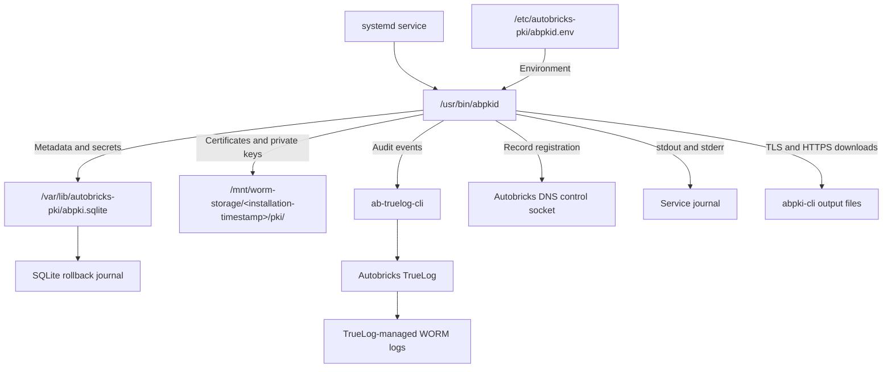

# Service files and directories

Autobricks PKI Server 1.0 separates executable files, service configuration, mutable SQLite state, and WORM artifacts. The Debian package provisions the Linux systemd service, configuration, and mutable state directories. See [package installation and removal](INSTALL.md).

## Repository build outputs

| Path | Contents |
| --- | --- |
| `bin/abpkid` | Server binary for local testing |
| `bin/abpki-cli` | Client binary for local testing |
| `build/` | Installation package output directory |

Both repository directories are ignored by Git. Service installation paths are separate from these local build outputs.

## Service deployment layout

| Path | Contents and responsibility | Ownership and permissions |
| --- | --- | --- |
| `/usr/bin/abpkid` | Server executable; started with `serve` | Root-owned, executable (`0755`) |
| `/usr/bin/abpki-cli` | Connecting client executable | Root-owned, executable (`0755`) |
| `/lib/systemd/system/abpkid.service` | Package-provided systemd unit | Root-owned (`0644`) |
| `/etc/autobricks-pki/` | Service configuration directory | Root-owned (`0750`) |
| `/etc/autobricks-pki/abpkid.env` | Environment settings supplied to the process by systemd | Root-owned (`0600`) |
| `/var/lib/autobricks-pki/` | Mutable PKI state directory | Owned by the autobricks-pki operating-system account (`0700`) |
| `/var/lib/autobricks-pki/abpki.sqlite` | Certificate/CRL metadata and WORM paths, revocation state, password hash, key encryption password, token hashes, and pending delivery records | Owned by the service account (`0600`) |
| `/var/lib/autobricks-pki/install.json` | Installation domain and DNS registration IP for reconfiguration | Service account (`0600`) |
| `/etc/autobricks-pki/account-owned` | Marks the service account as package-owned for purge | Root-owned |
| `/var/lib/autobricks-pki/abpki.sqlite-journal` | SQLite rollback journal created and removed during database transactions | Managed by SQLite in the protected state directory |
| `/mnt/worm-storage/<installation-timestamp>/pki/` | Certificate and private-key archive directory on the TrueLog-provided WORM mount | Service account needs directory traversal and file creation/append access |
| `/run/autobricks-dns/autobricks-dns.sock` | External DNS control socket | Managed by Autobricks DNS; service account needs explicit socket access |

The operating-system service account is a filesystem/process identity. The PKI application has no user accounts or user-management database.

Initialization and normal service execution use the same state paths and compatible filesystem ownership. Binary replacement does not replace the SQLite database or WORM artifacts.

## Path configuration

The reference service environment contains:

```ini
ABPKI_DATABASE=/var/lib/autobricks-pki/abpki.sqlite
ABPKI_INSTALLED_AT=1790467200
ABPKI_WORM=/mnt/worm-storage/1790467200/pki
ABPKI_ORIGIN=https://pki.example.internal
ABPKI_BIND=0.0.0.0
ABPKI_TLS_PORT=5545
ABPKI_HTTPS_PORT=5546
AUTOBRICKS_DNS_SOCKET=/run/autobricks-dns/autobricks-dns.sock
```

The DNS registration IP is supplied once through `abpkid init 192.0.2.10 example.internal`. `ABPKI_BIND` controls listening only; it is not a DNS registration address. Management uses TLS port 5545; public Root CA, CRL, and OCSP endpoints use HTTPS port 5546. Published HTTPS URLs use `ABPKI_HTTPS_PORT`.

`abpkid` reads environment variables, not the environment file directly. The service manager supplies the file's values to the process. The generated 16-character administrator password is retained as `ABPKI_ADMIN_PASSWORD` in this root-owned mode-0600 file and displayed after installation. Server authorization checks its salted hash in SQLite.

Set an absolute `ABPKI_DATABASE` path for the service. Without it, the binary uses `abpki.sqlite` relative to its working directory. `ABPKI_WORM` is required and is saved by installation as `/mnt/worm-storage/<installation-timestamp>/pki`, and the DNS socket defaults to the path shown above.

The SQLite parent directory and WORM artifact directory must exist before `init` or `serve`. Autobricks DNS and Autobricks TrueLog must be installed first, and the WORM filesystem must be mounted before PKI starts. Keep the PKI artifact directory separate from TrueLog-managed log files. Files are accessed through the mount, never through its backing storage directory.

## SQLite state

The service database path is `/var/lib/autobricks-pki/abpki.sqlite`, configured with `ABPKI_DATABASE`. Mutable database files and immutable archives occupy separate storage locations:

```text
/var/lib/autobricks-pki/              # Mutable local storage
    abpki.sqlite                    # Operational database
    abpki.sqlite-journal            # Temporary SQLite rollback journal

/mnt/worm-storage/<installation-timestamp>/pki/               # WORM certificate archives
    root/
    intermediate/
    certificate/
    crl/
```

The reference service configuration sets the absolute database path above. If `ABPKI_DATABASE` is omitted, the executable uses `abpki.sqlite` in its working directory.

The operational database and all of its working files stay on mutable storage outside WORM. The implementation uses SQLite `DELETE` journal mode, so transaction working data uses the rollback journal rather than normal WAL/SHM files. SQLite manages journal recovery; service restarts reuse the existing database.

| Database table | Contents |
| --- | --- |
| `settings` | Salted administrator password hash, private-key encryption password, base domain, installation retention/CA validity policy, and current service TLS certificate identifier |
| `certificates` | Certificate and encrypted-key WORM paths; identifiers; validity; revocation state; issuance profiles; access-token hashes |
| `crls` | Signed CRL WORM path, update deadline, and CRL number for issuer generations |
| `outbox` | CRL publication, audit, and DNS delivery records with completion state |

Certificate, private-key, and CRL PEM contents reside only on WORM. SQLite stores paths and metadata, with the encryption password in settings. TLS loads its certificate and encrypted key from WORM. The database file is created with mode `0600`; an existing file with group or other access is rejected. The package provisions the mutable parent directory as mode `0700`; the daemon does not repair its permissions.

## WORM artifacts

The installer saves the UTC Unix-second timestamp in `ABPKI_INSTALLED_AT` and the complete archive path in `ABPKI_WORM` in `/etc/autobricks-pki/abpkid.env`. Restarts and upgrades preserve this path. A fresh installation after purge uses a new timestamp namespace; retained WORM files remain untouched.

Certificate and CRL artifacts use the following installation-specific layout:

```text
/mnt/worm-storage/<installation-timestamp>/pki/
    root/
        <CN>.pem
        <CN>.key.pem
    intermediate/
        <YYYY-MM-DD>/
            <certificate-fingerprint>/
                <CN>.pem
                <CN>.key.pem
    certificate/
        <YYYY-MM-DD>/
            <certificate-fingerprint>/
                <CN>.pem
                <CN>.key.pem
    crl/
        <issuer-fingerprint>/
            <number>-<sha256>.pem
```

CRL files use `crl/<issuer-fingerprint>/<number>-<sha256>.pem`. The DB publishes the latest file for all linked CA generations; prior files remain immutable.

The Root CA public certificate is stored under `root/`. Intermediate CA public certificates use `intermediate/`; leaf certificates use `certificate/`. Each Root CA, Intermediate CA, and leaf certificate is accompanied by its matching encrypted PKCS#8 private-key PEM as `<CN>.key.pem`.

`YYYY-MM-DD` is the UTC date of the certificate validity start (`not_before`). Fingerprint directories separate multiple certificates with the same CN and issuance date. CN filename components retain ASCII letters, digits, dots, hyphens, and underscores; other UTF-8 bytes are percent-encoded to prevent path traversal. The certificate subject itself is unchanged.

PKI requests mode `0700` for archive directories and `0600` for files. TrueLog WORM exposes its configured writer ownership with directory mode `0770` and file mode `0660`; matching root owner/group permissions are accepted. World-accessible artifacts are rejected. Delivery retries accept matching bytes and append only a missing suffix. Conflicting content and symlink paths are rejected. WORM retention is enforced by the filesystem; PKI does not rotate or delete artifacts. Existing archived files are not moved or renamed.

Download archives are constructed in memory. CRL PEM files are read from their published WORM paths and served through HTTPS. OCSP responses are generated for requests without a persistent response directory.

## Logs and runtime files

Audit events are submitted through `/usr/bin/ab-truelog-cli write --service abpkid --data <event-json>`. TrueLog creates and manages its own appendable WORM log files, including rotation, retention integration, and checksum chains. PKI does not create audit JSON files or append to TrueLog-managed files. With TrueLog 0.3.55 and its standard mount, the daily log path is `/mnt/worm-storage/abpkid/truelog-YYYY-MM-DD.log`; the receiving TrueLog server controls its location and date. See the [TrueLog client interface](https://github.com/pregene/autobricks-log/blob/main/TRUELOG.md#write-records-through-the-client). Process startup and error messages use standard output and standard error; a systemd unit can capture these in the journal. `abpkid` does not create a separate `/var/log/autobricks-pki` directory, PID file, or server Unix socket. The local client service separately owns `/run/autobricks-pki-client/client.sock`.

The DNS control socket belongs to Autobricks DNS. PKI connects to it without creating, replacing, or deleting it. TrueLog owns the lifecycle of its WORM mount.

## Client download files

Downloads are saved on the machine running `abpki-cli`:

| Command | Output location and contents |
| --- | --- |
| `root` | `root.crt` in the client's current working directory; Root CA PEM |
| `chain <issuer>` | `trust-chain` in the client's current working directory; Intermediate and Root PEM blocks |
| `download <fingerprint> <target>` | `<target>.tar.gz` at the supplied target path |

The archive contains exactly `certificate.pem`, `private-key.pem`, and `trust-chain`. The server constructs it in memory without a download staging directory. The client creates output files with mode `0600` and refuses to overwrite existing files. Target parent directories must already exist. The CLI saves returned access tokens as mode-0600 files in the invoking user's mode-0700 `~/.abpki/` directory, keyed by fingerprint. Normal output omits the token.

## Backup artifacts

SQLite backup copies may be placed on WORM as separate artifacts. A database backup includes artifact paths, the private-key encryption password, and credential hashes and requires corresponding access restrictions. The server does not currently create automatic backups or manage a backup directory. The live database and rollback journal remain outside WORM even when backup artifacts are archived there.



[Runtime configuration](docs/runtime.md) · [Storage](docs/storage.md) · [Key storage](docs/key-storage.md)

## Installed client files

| Path | Purpose and permissions |
| --- | --- |
| `/etc/autobricks-pki-client/client.json` | Remote endpoint, ports, socket, and OS trust bundle; root-owned, client group-readable, mode `0640` |
| `/etc/autobricks-pki-client/ownership.json` | Owned Root checksum and installer UID; root-only mode `0600` |
| `/usr/local/share/ca-certificates/autobricks-pki-client.crt` | Enrolled public Root CA; mode `0644` |
| `/run/autobricks-pki-client/client.sock` | Local request socket; mode `0660`, client group and installer UID access |
| `~/.abpki/<fingerprint>` | Caller-owned certificate token; mode `0600` under a `0700` directory |
| `/lib/systemd/system/abpki-cli.service` | Local client service included in both packages |
