# Default Intermediate CAs

Autobricks PKI Server 1.0 initializes one Root CA and six Intermediate CAs during initial installation. The Root CA signs each Intermediate CA certificate. `abpkid` manages the resulting hierarchy.

Autobricks DNS and Autobricks TrueLog must be installed before Autobricks PKI. See the [installation prerequisites](README.md#installation-prerequisites).

## Installation domain and CA subjects

`abpkid init REGISTRATION_IP` prompts for `baseDomain`; an empty answer selects `autobricks.internal`. Unattended initialization accepts `abpkid init REGISTRATION_IP BASE_DOMAIN`. `baseDomain` is limited to 24 ASCII characters, including dots. The domain is stored in SQLite and supplies the default CA Common Names.

| Subject attribute | Value |
| --- | --- |
| Country (`C`) | `KR` |
| State (`ST`) | `Seoul` |
| Locality (`L`) | `Seoul` |
| Organization (`O`) | `Autobricks, Co.` |
| Organizational Unit (`OU`) | `Autobricks PKI Service` |
| Root CA Common Name (`CN`) | `pki.<baseDomain>` |

Intermediate CAs use the same organization attributes and their own Common Names below. The default Root CA CN is `pki.autobricks.internal`. CA subjects contain one OU and no email address. Intermediate renewal preserves the issuer's existing subject and signing key.

Intermediate names contain 1–16 ASCII letters, digits, or hyphens, excluding the `.<baseDomain>` suffix. Leading and trailing hyphens are rejected.

## Default issuers

| Intermediate CA | Purpose | Certificates issued |
| --- | --- | --- |
| `database.<baseDomain>` | Database services and their clients | Server and client certificates |
| `www.<baseDomain>` | Web services and their clients | Server and client certificates |
| `vpn.<baseDomain>` | VPN services and their clients | Server and client certificates |
| `worm.<baseDomain>` | WORM storage services and their clients | Server and client certificates |
| `app.<baseDomain>` | Application services and their clients | Server and client certificates |
| `truelog.<baseDomain>` | TrueLog services and their clients | Server and client certificates |

Each row represents one Intermediate CA that issues both certificate types, rather than separate server and client CAs.

```mermaid
flowchart TD
    Root[Root CA] --> Database[database Intermediate CA]
    Root --> WWW[www Intermediate CA]
    Root --> VPN[vpn Intermediate CA]
    Root --> WORM[worm Intermediate CA]
    Root --> Application[app Intermediate CA]
    Root --> TrueLog[truelog Intermediate CA]
    Database --> DatabaseServer[Database server certificates]
    Database --> DatabaseClient[Database client certificates]
    WWW --> WWWServer[Web server certificates]
    WWW --> WWWClient[Web client certificates]
    VPN --> VPNServer[VPN server certificates]
    VPN --> VPNClient[VPN client certificates]
    WORM --> WORMServer[WORM server certificates]
    WORM --> WORMClient[WORM client certificates]
    Application --> ApplicationServer[Application server certificates]
    Application --> ApplicationClient[Application client certificates]
    TrueLog --> TrueLogServer[TrueLog server certificates]
    TrueLog --> TrueLogClient[TrueLog client certificates]
```

## Validity and renewal

Intermediate CA validity defaults to 398 days and can be changed at creation. `abpkid` renews these CAs internally during the final seven days before expiration. Server and client certificates default to 47 days and cannot outlive their issuing Intermediate CA.

[Validity and renewal rules](VALIDATION.md)

## Issuance and management

The Intermediate CA identifies the issuing domain. A server certificate's mandatory `urn:autobricks:purpose:<purpose>` URI SAN identifies the service purpose. CA names and purpose tokens are separate fields; `database.<baseDomain>` is a default CA name, not a substitute for a purpose such as `mariadb` or `postgresql`.

`abpki-cli list-ca` lists issuing Intermediate CAs. Additional Intermediate CA creation through `abpki-cli create-ca ... --pass {password}` requires the administrator password. The initial installation creates the default hierarchy without requiring six separate client-side `create-ca` operations.

Root CA certificates are downloaded with `root`. An issued certificate's Intermediate CA and Root CA certificates form its downloadable `trust-chain`.

[Certificate fields and purposes](CERTITFICATE.md) · [CLI commands](docs/cli.md)

[Common Names, DNS naming, and uniqueness](COMMON-NAME.md)
