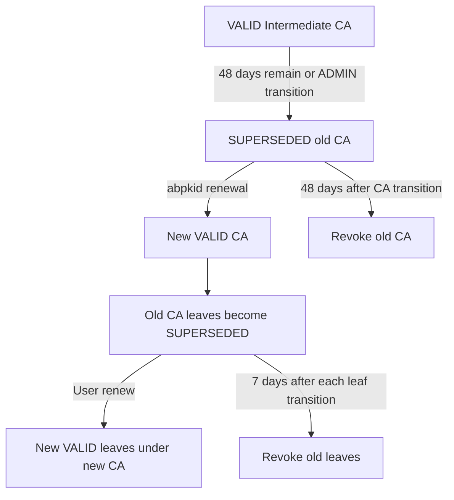

# Default Intermediate CAs

Autobricks PKI Server 1.0 initializes one Root CA and six Intermediate CAs during initial installation. The Root CA signs each Intermediate CA certificate. `abpkid` manages the resulting hierarchy.

Autobricks DNS and Autobricks TrueLog must be installed before Autobricks PKI. See the [installation prerequisites](README.md#installation-prerequisites).

## Installation domain and CA subjects

`abpkid init REGISTRATION_IP` prompts for `baseDomain`; an empty answer selects `autobricks.internal`. Unattended initialization accepts `abpkid init REGISTRATION_IP BASE_DOMAIN`. `baseDomain` is limited to 24 ASCII characters, including dots. The domain is stored in SQLite and supplies the default CA Common Names.

| Subject attribute | Value |
| --- | --- |
| Country (`C`) | `KR` |
| State (`ST`) | `Seoul` |
| Locality (`L`) | `Seoul` |
| Organization (`O`) | `Autobricks, Co.` |
| Organizational Unit (`OU`) | `Autobricks PKI Service` |
| Root CA Common Name (`CN`) | `pki.<baseDomain>` |

Intermediate CAs use the same organization attributes and their own Common Names below. The default Root CA CN is `pki.autobricks.internal`. CA subjects contain one OU and no email address. Intermediate renewal preserves the issuer's existing subject and signing key.

Intermediate names contain 1–16 ASCII letters, digits, or hyphens, excluding the `.<baseDomain>` suffix. Leading and trailing hyphens are rejected.

## Default issuers

| Intermediate CA | Purpose | Certificates issued |
| --- | --- | --- |
| `database.<baseDomain>` | Database services and their clients | Server and client certificates |
| `www.<baseDomain>` | Web services and their clients | Server and client certificates |
| `vpn.<baseDomain>` | VPN services and their clients | Server and client certificates |
| `worm.<baseDomain>` | WORM storage services and their clients | Server and client certificates |
| `app.<baseDomain>` | Application services and their clients | Server and client certificates |
| `truelog.<baseDomain>` | TrueLog services and their clients | Server and client certificates |

Each row represents one Intermediate CA that issues both certificate types, rather than separate server and client CAs.

```mermaid
flowchart TD
    Root[Root CA] --> Database[database Intermediate CA]
    Root --> WWW[www Intermediate CA]
    Root --> VPN[vpn Intermediate CA]
    Root --> WORM[worm Intermediate CA]
    Root --> Application[app Intermediate CA]
    Root --> TrueLog[truelog Intermediate CA]
    Database --> DatabaseServer[Database server certificates]
    Database --> DatabaseClient[Database client certificates]
    WWW --> WWWServer[Web server certificates]
    WWW --> WWWClient[Web client certificates]
    VPN --> VPNServer[VPN server certificates]
    VPN --> VPNClient[VPN client certificates]
    WORM --> WORMServer[WORM server certificates]
    WORM --> WORMClient[WORM client certificates]
    Application --> ApplicationServer[Application server certificates]
    Application --> ApplicationClient[Application client certificates]
    TrueLog --> TrueLogServer[TrueLog server certificates]
    TrueLog --> TrueLogClient[TrueLog client certificates]
```



## Validity and renewal

Intermediate CA default and maximum validity are calculated during installation as `min(398, TrueLog retention days - 7)`. A shorter duration can be requested at creation. `abpkid` renews these CAs internally during the final 48 days before expiration. Server and client certificates default to 47 days and cannot outlive their issuing Intermediate CA.

[Validity and renewal rules](VALIDATION.md)

## Issuance and management

The Intermediate CA identifies the issuing domain. A server certificate's mandatory `urn:autobricks:purpose:<purpose>` URI SAN identifies the service purpose. CA names and purpose tokens are separate fields; `database.<baseDomain>` is a default CA name, not a substitute for a purpose such as `mariadb` or `postgresql`.

`abpki-cli list-ca` lists issuing Intermediate CAs. Additional Intermediate CA creation through `abpki-cli create-ca` is unavailable in 1.0 and returns `Not implemented`; the management endpoint returns `501 Not Implemented`. This operation is reserved for version 1.1. The initial installation creates the default hierarchy without requiring six separate client-side `create-ca` operations.

Root CA certificates are downloaded with `root`. An issued certificate's Intermediate CA and Root CA certificates form its downloadable `trust-chain`.

[Certificate fields and purposes](CERTITFICATE.md) · [CLI commands](docs/cli.md)

[Common Names, DNS naming, and uniqueness](COMMON-NAME.md)

## Administrator-triggered renewal

```sh
abpki-cli renew <intermediate-fingerprint> --pass
```

The CLI prompts for the installation administrator password, or accepts an explicit `--pass PASSWORD`. The password travels in the Unix socket credential field and over management TLS. The command changes VALID to SUPERSEDED and records `superseded_at`; it does not issue a new CA. Repeated requests retain the original transition time. Root, expired, and not-yet-valid targets are rejected; REVOKED returns result 409.

## Operator procedure

1. Inspect the current generations with `abpki-cli list-ca`. Use `abpki-cli list-ca all` to include old generations and `abpki-cli list-ca renew` to show SUPERSEDED generations.
2. For an early transition, run `abpki-cli renew <intermediate-fingerprint> --pass` and enter the administrator password. Select the exact CA fingerprint, since old and new generations share a CN.
3. A successful response reports `renewed: false`, `status: "SUPERSEDED"`, the old fingerprint, and its transition and retirement timestamps. It does not contain a replacement CA or a download token. For a CA, `revoke_at - superseded_at` is 4147200 seconds, or 48 days.
4. `abpkid` creates the replacement during its internal renewal run. These runs occur hourly; the ADMIN command does not synchronously perform this step. Inspect `list-ca` for the new VALID generation and `info <new-intermediate-fingerprint>` for its signed validity.
5. Leaf holders obtain their replacements with ordinary `renew`. They download and deploy the new leaf, matching key, and trust chain using the [leaf renewal procedure](LEAF-RENEW.md#user-procedure).

Automatic renewal follows the same server-managed process without step 2 when 48 days remain. Administrators do not have to issue each replacement leaf manually. The PKI server handles its own TLS certificate internally; other applications must deploy their own replacements.

## Intermediate CA renewal handover

At 48 days before expiry, or following an ADMIN transition, abpkid processes the SUPERSEDED CA and creates a new VALID CA. The replacement preserves subject, CN, signing key, and the original validity duration in seconds. SQLite records the predecessor; linked generations share CRL numbering and revocation history.

After CA replacement, all non-revoked leaf certificates linked to the old generation through `intermediate_leaf` become SUPERSEDED. Their first transition timestamps are retained. Leaf holders poll `renew` with their certificate tokens to obtain new VALID leaves under the new VALID CA. The PKI service replaces its own TLS leaf internally when its issuer changes.

The replacement has a new fingerprint even though the CN and signing key are preserved. Existing leaf records retain their original issuer relationship; new leaves reference the replacement CA. Renewal does not rewrite existing signed certificates or require replacement of the Root CA. Use the trust chain returned with each new leaf archive when deploying it.

Issuer-fingerprint CRL URLs embedded in old leaves continue to identify their issuer generation. The CA lineage shares revocation history and increasing CRL numbers across renewal. See [CRL publication](CRL.md).

## Example timeline

| Time | Old Intermediate CA | Old dependent leaf | Holder action |
| --- | --- | --- | --- |
| T: CA enters renewal | SUPERSEDED; its 48-day retirement period starts. | Unchanged until CA replacement. | Continue periodic renewal polling. |
| R: server issues the replacement CA | Remains SUPERSEDED; replacement CA is VALID. | Becomes SUPERSEDED; its seven-day period starts unless it was already pending. | Renew, download, and deploy the replacement leaf. |
| R + 7 days | Still SUPERSEDED unless its own deadline or signed expiration has arrived. | Forcibly revoked even if never renewed or downloaded. | The application must already use its replacement. |
| T + 48 days | Forcibly revoked without inspecting leaf completion. | No extension is granted to old leaves. | Use the replacement generation. |

If a leaf was already SUPERSEDED before R, its earlier transition time remains in effect. The CA's 48-day period does not give leaf holders 48 days: each old leaf always has its own seven-day retirement period, limited further by its signed expiration.

## Retirement deadlines

| Certificate | Fixed retirement deadline |
| --- | --- |
| Old Intermediate CA | `superseded_at + 48 * 86400` |
| Old leaf | `superseded_at + 7 * 86400` |

CA retirement does not inspect leaf renewal or download completion, does not happen early when leaves finish, and is never extended by unfinished leaves. Leaf retirement always uses seven days. Existing signed expiration is never extended. A replacement and its predecessor have independent records; only the old generation enters retirement.

Revocation commits before CRL publication and audit delivery. Root-signed CRLs contain retired Intermediate CAs; Intermediate-signed CRLs contain revoked leaves. PEM artifacts remain on WORM, with paths and metadata in SQLite.


