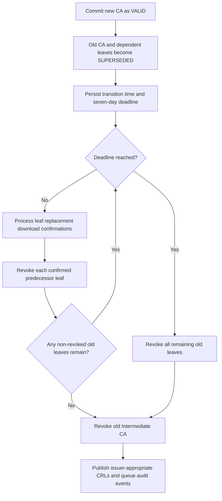

# Default Intermediate CAs

Autobricks PKI Server 1.0 initializes one Root CA and six Intermediate CAs during initial installation. The Root CA signs each Intermediate CA certificate. `abpkid` manages the resulting hierarchy.

Autobricks DNS and Autobricks TrueLog must be installed before Autobricks PKI. See the [installation prerequisites](README.md#installation-prerequisites).

## Installation domain and CA subjects

`abpkid init REGISTRATION_IP` prompts for `baseDomain`; an empty answer selects `autobricks.internal`. Unattended initialization accepts `abpkid init REGISTRATION_IP BASE_DOMAIN`. `baseDomain` is limited to 24 ASCII characters, including dots. The domain is stored in SQLite and supplies the default CA Common Names.

| Subject attribute | Value |
| --- | --- |
| Country (`C`) | `KR` |
| State (`ST`) | `Seoul` |
| Locality (`L`) | `Seoul` |
| Organization (`O`) | `Autobricks, Co.` |
| Organizational Unit (`OU`) | `Autobricks PKI Service` |
| Root CA Common Name (`CN`) | `pki.<baseDomain>` |

Intermediate CAs use the same organization attributes and their own Common Names below. The default Root CA CN is `pki.autobricks.internal`. CA subjects contain one OU and no email address. Intermediate renewal preserves the issuer's existing subject and signing key.

Intermediate names contain 1–16 ASCII letters, digits, or hyphens, excluding the `.<baseDomain>` suffix. Leading and trailing hyphens are rejected.

## Default issuers

| Intermediate CA | Purpose | Certificates issued |
| --- | --- | --- |
| `database.<baseDomain>` | Database services and their clients | Server and client certificates |
| `www.<baseDomain>` | Web services and their clients | Server and client certificates |
| `vpn.<baseDomain>` | VPN services and their clients | Server and client certificates |
| `worm.<baseDomain>` | WORM storage services and their clients | Server and client certificates |
| `app.<baseDomain>` | Application services and their clients | Server and client certificates |
| `truelog.<baseDomain>` | TrueLog services and their clients | Server and client certificates |

Each row represents one Intermediate CA that issues both certificate types, rather than separate server and client CAs.

```mermaid
flowchart TD
    Root[Root CA] --> Database[database Intermediate CA]
    Root --> WWW[www Intermediate CA]
    Root --> VPN[vpn Intermediate CA]
    Root --> WORM[worm Intermediate CA]
    Root --> Application[app Intermediate CA]
    Root --> TrueLog[truelog Intermediate CA]
    Database --> DatabaseServer[Database server certificates]
    Database --> DatabaseClient[Database client certificates]
    WWW --> WWWServer[Web server certificates]
    WWW --> WWWClient[Web client certificates]
    VPN --> VPNServer[VPN server certificates]
    VPN --> VPNClient[VPN client certificates]
    WORM --> WORMServer[WORM server certificates]
    WORM --> WORMClient[WORM client certificates]
    Application --> ApplicationServer[Application server certificates]
    Application --> ApplicationClient[Application client certificates]
    TrueLog --> TrueLogServer[TrueLog server certificates]
    TrueLog --> TrueLogClient[TrueLog client certificates]
```



## Validity and renewal

Intermediate CA default and maximum validity are calculated during installation as `min(398, TrueLog retention days - 7)`. A shorter duration can be requested at creation. `abpkid` renews these CAs internally during the final seven days before expiration. Server and client certificates default to 47 days and cannot outlive their issuing Intermediate CA.

[Validity and renewal rules](VALIDATION.md)

## Issuance and management

The Intermediate CA identifies the issuing domain. A server certificate's mandatory `urn:autobricks:purpose:<purpose>` URI SAN identifies the service purpose. CA names and purpose tokens are separate fields; `database.<baseDomain>` is a default CA name, not a substitute for a purpose such as `mariadb` or `postgresql`.

`abpki-cli list-ca` lists issuing Intermediate CAs. Additional Intermediate CA creation through `abpki-cli create-ca` is unavailable in 1.0 and returns `Not implemented`; the management endpoint returns `501 Not Implemented`. This operation is reserved for version 1.1. The initial installation creates the default hierarchy without requiring six separate client-side `create-ca` operations.

Root CA certificates are downloaded with `root`. An issued certificate's Intermediate CA and Root CA certificates form its downloadable `trust-chain`.

[Certificate fields and purposes](CERTITFICATE.md) · [CLI commands](docs/cli.md)

[Common Names, DNS naming, and uniqueness](COMMON-NAME.md)

## Intermediate CA renewal handover

This section specifies coordinated CA and leaf handover. Runtime renewal records the replacement CA predecessor and maintains CRL continuity across the linked generations. It does not yet persist handover state, track leaf completion, or enforce the seven-day retirement deadline.

An Intermediate CA renewal affects the exact old certificate generation and all leaf certificates issued by that generation. Determine membership through `intermediate_leaf.intermediate_idx` and join its `leaf_idx` to `certificates.idx`. The new Intermediate CA is `VALID`; the old CA and its non-revoked leaves become `SUPERSEDED`. Already revoked leaves remain `REVOKED`.

New issuance uses the new `VALID` Intermediate CA. Explicit selection of the old `SUPERSEDED` CA cannot create additional leaves under that generation. This keeps the dependent leaf set stable during handover. Certificates under unrelated CAs or a different generation do not change state.

### Start time and deadline

The CA transition records `superseded_at` as the UTC time when the replacement CA and handover state commit. Its fixed deadline is:

```text
handover_deadline = old_intermediate.superseded_at + 7 * 86400
```

This timestamp is persisted and is not reset by restart, repeated maintenance, a leaf renewal, or a failed download. Seven days is the maximum waiting period for download completion, not an extension of any certificate's signed validity. Each old CA/leaf remains usable only while its own validity interval also permits it. A late start cannot extend the old CA's `not_after`.

At `now >= handover_deadline`, outstanding downloads no longer delay revocation. Maintenance after an outage processes overdue transitions before accepting new issuance or handover work. A database or signing failure cannot be reported as completed revocation; it requires recovery and retry.

### Leaf and CA transitions

| Event | Old leaf | Old Intermediate CA | Replacement |
| --- | --- | --- | --- |
| CA handover starts | Non-revoked leaves become `SUPERSEDED`. | Becomes `SUPERSEDED`. | New CA is `VALID`. |
| Holder renews a leaf | Remains temporarily `SUPERSEDED`. | Remains `SUPERSEDED`. | New leaf is issued by the new CA as `VALID`. |
| New leaf download is confirmed | Corresponding old leaf becomes `REVOKED`. | Waits for remaining leaves. | New leaf and new CA remain `VALID`. |
| Every dependent leaf is retired | All old dependent leaves are `REVOKED`. | Becomes `REVOKED` without waiting for day seven. | New hierarchy remains `VALID`. |
| Seven-day deadline is reached | Every remaining non-revoked old leaf becomes `REVOKED`, including leaves whose holders never downloaded replacements. | Becomes `REVOKED`. | Already issued replacement certificates remain independent. |

An administrator's independent revocation also retires that leaf for the CA completion condition. A CA with no non-revoked dependent leaves does not need to wait for a download. No Root or Intermediate CA private key is downloaded as part of this handover; the leaf archive supplies its new trust chain.

During the waiting period, failed or interrupted downloads leave the old leaf temporarily usable within its existing validity. At the deadline, lack of replacement deployment does not extend the waiting period. A holder that has not obtained a usable replacement can lose service access.

### Processing and persistence

1. Within the CA renewal transaction, create the replacement CA with its numeric predecessor reference, mark the old CA and non-revoked dependent leaves `SUPERSEDED`, and record the original CA transition time. Write the CA artifacts directly to WORM and queue the CA renewal audit event.
2. Leaf holders request renewal with their existing token. Resolve the replacement CA and issue a leaf whose `previous_certificate_idx` points to the exact old leaf. Existing leaf validity bounds still apply. Because a leaf cannot outlive its old issuer, an unexpired leaf is already within its final seven days when its issuer enters scheduled renewal.
3. On authenticated replacement download confirmation, revoke the old leaf and refresh the applicable leaf CRLs. In the same serialized state evaluation, query `intermediate_leaf` for the old CA and check whether any linked leaf remains non-revoked.
4. If none remain, revoke the old CA. Otherwise retain it until the fixed deadline.
5. At the deadline, revoke remaining old leaves and the old CA, refresh applicable CRLs, and queue revocation audit events. Preserve certificates, keys, and WORM history; revocation is not deletion.

Confirmation and deadline processing must be idempotent and serialized through SQLite transactions. A confirmation arriving after forced retirement cannot restore an old certificate to `VALID`. A late confirmation for an already issued replacement can succeed without duplicating the old certificate's revocation event. Requesting a new renewal against a forcibly revoked old leaf remains prohibited.

The server's own TLS leaf also participates if issued by the retiring CA. Its internal replacement installation needs an explicit completion path; it cannot depend on a human running `abpki-cli download`. The current runtime does not connect that installation to CA handover accounting.



### Revocation publication

Leaf revocations appear in the Intermediate CA's signed CRLs. Revocation of the Intermediate CA itself belongs in a CRL signed by its Root CA. The existing leaf CRL endpoint and OCSP responder do not implement Root-issued CA revocation distribution. Root CRL generation, distribution, and the Intermediate certificate's revocation-information extension are required to make this retirement visible to external validators.

Changing `valid` in SQLite alone does not make external validators reject an old CA. Existing CA renewal preserves the subject and signing key, so validators can sometimes construct a path using another CA generation. Explicitly revoking the old leaves, including outstanding ones at the deadline, is necessary; relying only on revoking the old CA certificate does not express that leaf policy.

CRL refresh and publication do not invalidate already cached CRLs immediately. Validators apply their normal freshness and revocation checking rules. The seven-day handover deadline is independent of the fixed seven-day CRL validity period.

[Certificate lifecycle state](DDL.md#certificate-lifecycle-state) · [Leaf handover](LEAF-RENEW.md#download-completion-and-automatic-revocation) · [Result codes](ERROR.md)
