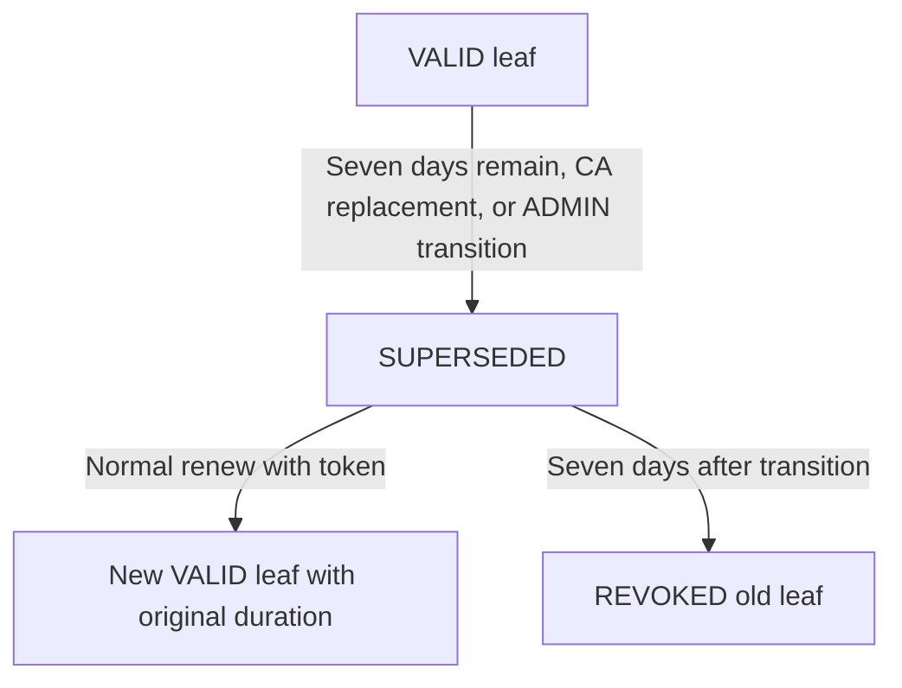

# Leaf renewal

`abpki-cli renew <fingerprint>` polls a certificate using its saved access token. `check` remains the GOOD/REVOKED/UNKNOWN revocation-status interface.

## Before starting

Use the installed `abpki-cli` from the operating-system account that created or previously renewed the certificate. Installation configures the server connection and trust. The CLI reads the certificate's access token from `~/.abpki/<fingerprint>` and passes it through the local client service. Normal renewal does not require the ADMIN password.

A fingerprint identifies one certificate generation. Renewal keeps the Common Name but produces a different fingerprint. Replace the angle-bracket placeholders in the commands below with the actual fingerprint; fingerprints are contiguous hexadecimal strings.

```sh
abpki-cli list
abpki-cli list renew
abpki-cli list all
abpki-cli info <fingerprint>
```

`list` shows VALID leaves. `list renew` shows SUPERSEDED leaves awaiting retirement, including old certificates whose replacements have already been issued. `list all` includes every state. These lists expose metadata, not the private token needed to renew or download a certificate.

## User procedure

1. Call `abpki-cli renew <current-fingerprint>` periodically. The command can be called before renewal is needed; a VALID certificate returns `renewed: false` without creating anything.
2. When the response contains `renewed: true`, record its new `fingerprint`. The CLI saves the new access token automatically. The response's `previous_fingerprint` identifies the old certificate.
3. Download the replacement using the **new** fingerprint and a new output target:

   ```sh
   abpki-cli download <new-fingerprint> renewed-certificate
   ```

   This creates `renewed-certificate.tar.gz`. The target argument omits `.tar.gz`. Use an unused target name when a file already exists.
4. Extract the archive into a private directory:

   ```sh
   mkdir -m 700 renewed-certificate-files
   tar -xzf renewed-certificate.tar.gz -C renewed-certificate-files
   ```

   The archive contains exactly `certificate.pem`, `private-key.pem`, and `trust-chain`. The chain contains the issuing Intermediate CA and Root CA in PEM. The downloaded leaf private key is decrypted PEM; keep the directory and archive private.
5. Configure the application to use the replacement certificate, its matching key, and its trust chain together. Reload or restart the application according to its own certificate-loading procedure. Downloading files alone does not change the certificate an application serves or presents.
6. Confirm the application uses the replacement, then use the **new fingerprint** for subsequent renewal polling. `abpki-cli info <new-fingerprint>` shows the issued X.509 information; application-side verification is also necessary to confirm deployment.

If downloading fails after a successful renewal response, retry `download` with that same new fingerprint. Do not request another renewal of the old fingerprint just to retry the download.

## When renewal becomes available

A leaf becomes SUPERSEDED in any of these cases:

| Trigger | Effect |
| --- | --- |
| Seven days remain before the leaf's signed expiration | The server marks the leaf SUPERSEDED without creating a replacement. |
| Its Intermediate CA is replaced | The server marks the old CA's non-revoked leaves SUPERSEDED, even when their own expiration is more than seven days away. |
| ADMIN requests early renewal | The server marks the selected leaf SUPERSEDED without creating a replacement. |

Ordinary `renew` creates a replacement only for a SUPERSEDED leaf. The old certificate and new certificate are separate records: the new record is VALID, while the old record remains SUPERSEDED until its retirement deadline. A state change does not modify the signed contents of the old certificate.

`check` continues to report GOOD, REVOKED, or UNKNOWN. A still-usable SUPERSEDED certificate can report GOOD. Use the `renew` response to determine whether a replacement was issued; do not wait for `check` to report REVOKED before renewing.

## States and authorization

| Operation | State | Result |
| --- | --- | --- |
| Normal renew | VALID | Successful no-op; no certificate or token is created. |
| Normal renew | SUPERSEDED | Issue a new VALID leaf under the current VALID Intermediate CA. |
| Normal renew | REVOKED | Reject with result 409. |
| ADMIN renew --pass | VALID | Verify the administrator password and transition to SUPERSEDED; do not issue a replacement. |
| ADMIN renew --pass | SUPERSEDED | Return the existing transition and deadline without resetting them. |

The scheduler marks a leaf SUPERSEDED when its remaining lifetime enters the final seven days. CA replacement also marks that CA's non-revoked dependent leaves SUPERSEDED. Such leaves can renew even if more than seven days remain. ADMIN may initiate the same transition earlier. Normal renewal always requires the certificate-specific token; administrator credentials are sent explicitly through the Unix socket, never inherited from the daemon environment.

```sh
abpki-cli renew <fingerprint>
abpki-cli renew <fingerprint> --pass
```

## Renewal responses

### No renewal needed

A VALID leaf returns the current fingerprint. Continue using it and poll again later:

```json
{
  "result": 200,
  "renewed": false,
  "status": "VALID",
  "fingerprint": "<current-fingerprint>"
}
```

### Replacement issued

A SUPERSEDED leaf returns the new fingerprint. Download and deploy this replacement:

```json
{
  "result": 200,
  "renewed": true,
  "status": "VALID",
  "previous_fingerprint": "<old-fingerprint>",
  "fingerprint": "<new-fingerprint>"
}
```

### Certificate already revoked

Renewal is rejected. The error response contains:

```json
{
  "result": 409,
  "renewed": false,
  "status": "REVOKED",
  "fingerprint": "<requested-fingerprint>"
}
```

The CLI reports a failed request with a nonzero exit status; error details may be printed on standard error rather than as a successful JSON response on standard output. Revoked or expired certificates cannot be renewed through this workflow.

### ADMIN starts early renewal

ADMIN can move a currently VALID leaf into SUPERSEDED before the automatic window:

```sh
abpki-cli renew <current-fingerprint> --pass
```

The CLI prompts for the single installation administrator password. This response means renewal is pending, **not** that a replacement was issued:

```json
{
  "result": 200,
  "renewed": false,
  "status": "SUPERSEDED",
  "fingerprint": "<current-fingerprint>",
  "superseded_at": 1790553600,
  "revoke_at": 1791158400
}
```

`superseded_at` and `revoke_at` are UTC Unix timestamps in seconds. In this leaf example, they differ by 604800 seconds, or seven days. The certificate holder then runs ordinary `renew` without `--pass` to obtain the replacement. Repeating the ADMIN command preserves the first transition time and retirement deadline.

| Response field | Meaning |
| --- | --- |
| `result` | Operation result code. |
| `renewed` | Whether this request issued a replacement certificate. |
| `status` | State of the certificate identified by the response's `fingerprint`. |
| `fingerprint` | Current fingerprint for a no-op or ADMIN transition; replacement fingerprint after issuance. |
| `previous_fingerprint` | Old fingerprint, present after successful replacement issuance. |
| `superseded_at` | Start of the old certificate's retirement period, returned by the ADMIN transition. |
| `revoke_at` | Fixed retirement deadline, returned by the ADMIN transition. |

The successful issuance wire response additionally contains `download_token`. The CLI saves it as `~/.abpki/<new-fingerprint>` with mode 0600 and omits it from normal output. No-op and ADMIN transition responses have no token and do not create a credential file. Subsequent polling and downloads use the new fingerprint. The old token cannot download the replacement.

Normal requests use `/api/renew`; ADMIN transitions use `/api/renew-admin`. The JSON request body contains only `fingerprint`; the socket credential field carries the token or administrator password. Revoked responses use HTTP/management status 409. Invalid credentials and malformed requests return a rejected-request error; see [operation results](ERROR.md).

## Duration preservation on renewal

```text
original_duration = old.not_after - old.not_before
new.not_before = issuance_time_utc
new.not_after = new.not_before + original_duration
```

The full original duration is preserved exactly in seconds: seven days remain seven days and 47 days remain 47 days. The original profile fields, including CN, SANs, usages, extension values and critical flags, are preserved. The request accepts no duration or profile overrides. New keys, serials, fingerprints, and tokens are generated. The new interval must fit within its issuer; it is never silently shortened.

| Original certificate duration | Remaining lifetime at renewal | Replacement duration |
| --- | --- | --- |
| 47 days | 7 days | 47 days |
| 47 days | 30 days, after CA replacement or ADMIN transition | 47 days |
| 7 days | 3 days | 7 days |

The new duration starts at replacement issuance. Time spent waiting to download does not move its `notBefore` or `notAfter` timestamps. Changing the duration requires separate issuance; renewal has no duration parameter.

The replacement certificate and encrypted key are stored on WORM. Failed DNS or audit delivery remains pending after issuance. Failed issuance does not reset the old certificate's transition time. A lost response may follow committed issuance; repeating an old-fingerprint request can create another replacement and does not recover its previous token.

## Retry and failure handling

| Situation | Action |
| --- | --- |
| VALID response with `renewed: false` | Keep using the current certificate and poll later. |
| Successful response with `renewed: true`, followed by a download failure | Retry download with the returned new fingerprint and its saved token. |
| Missing local token | Use the Linux account and credential file associated with this certificate. A public fingerprint or ADMIN password does not replace its download token. |
| CA replacement has not completed, or issuance fails | Retry after the server can issue under a VALID CA. The old certificate's retirement deadline continues to run. |
| Replacement duration would exceed issuer validity | Issuance fails; it does not shorten the requested lifetime. |
| Connection lost before the renewal response arrives | Issuance may already have committed. Repeating the old request can create another replacement; it does not recover the token from the lost response. |
| Old certificate is revoked or expired | Renewal fails; a new issuance and application deployment are required. Normal new-issuance name constraints still apply. |

## Retirement

The old leaf stays SUPERSEDED after renewal and download. It is forcibly revoked at `superseded_at + 7 * 86400`, irrespective of renewal or download completion. Existing signed expiration still applies. Repeated ADMIN commands, downloads, and renewal requests do not extend the deadline.

For an early ADMIN transition at time T, an old 47-day leaf still retires at T + 7 days even if its signed expiration is later. If the holder renews at T + 1 day and downloads at T + 2 days, neither operation changes the old leaf's T + 7-day retirement deadline. The new leaf receives its own full 47-day duration from issuance at T + 1 day.

A shorter signed lifetime remains decisive: if the old certificate expires before T + 7 days, it is no longer usable from that expiration time. Complete application deployment before the earlier of signed expiration and forced retirement.

The scheduler checks retirement at startup and each 30-second maintenance pass. Revocation and audit/CRL tasks commit before CRL signing; delivery failures cannot undo revocation. Intermediate CAs instead retire after 48 days, without checking dependent leaf completion.



[Validity](VALIDATION.md) · [Intermediate CAs](INTERMEDIATE.md) · [Stored certificate information](DDL.md)
