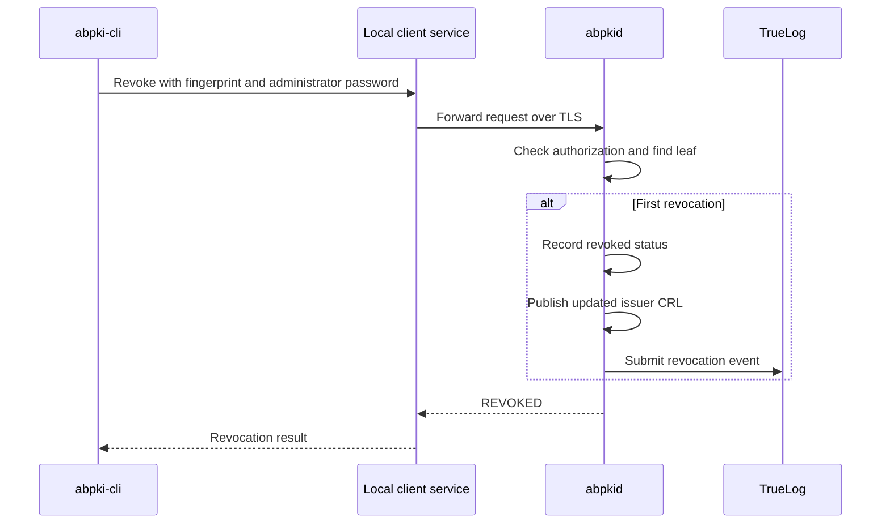

# Leaf certificate revocation

Autobricks PKI Server 1.0 revokes a specific leaf certificate by fingerprint. Revocation requires the single administrator password. Possession of a certificate, its private key, or its download token does not authorize the standalone revocation command. During [renewal handover](LEAF-RENEW.md#retirement), the service automatically revokes an old leaf seven days after its SUPERSEDED transition, independently of replacement download. The service has no user accounts or per-user revocation roles.

Revocation records distrust of the certificate; it does not delete certificate records, private keys, WORM artifacts, or TrueLog audit records.

## Request interface

```sh
abpki-cli revoke <fingerprint> --pass
```

`--pass` without a value prompts for the password on the CLI's terminal with echo disabled. `--pass PASSWORD` accepts a value directly. The CLI sends `method=POST`, `path=/api/revoke`, the target fingerprint in the JSON body, and the password in `credential` through the local Unix socket. The daemon forwards this operation over TLS using its installed connection settings. The running service does not read the caller's environment or prompt for a password.

The JSON payload is:

```json
{"fingerprint":"<leaf-certificate-sha256-fingerprint>"}
```

The operation accepts a leaf fingerprint rather than CN, because renewal generations share a CN. There is no revocation reason, scheduled revocation, temporary hold, or reversal parameter in this interface.

## Revocation processing

1. Check the administrator password and resolve the leaf fingerprint. Unknown fingerprints and CA targets are rejected.
2. If the leaf is already revoked, return success without changing its original revocation time.
3. Record the revocation. `check` and OCSP immediately observe the revoked status.
4. Attempt immediate publication of the issuer CRL with a new number and seven-day validity. A failed publication remains pending and does not undo revocation.
5. Return `{"status":"REVOKED"}`. Submit the revocation audit event to TrueLog; failed delivery is retried.



## Certificate status and operational effects

| Component | Effect |
| --- | --- |
| SQLite | Retains the leaf and records its revocation timestamp. |
| CRL | CRL publication is attempted immediately after revocation commits; failed publication remains pending for retry. Previously cached CRLs remain subject to client refresh behavior. |
| OCSP and `check` | Queries observe the committed revoked status. |
| Renewal | The revoked fingerprint cannot be renewed. |
| Other renewal generations | Remain independent; revoking one fingerprint does not revoke every certificate sharing its CN. |
| DNS | Records remain registered. Revocation does not delete DNS records. |
| Downloads | The existing token remains usable for archive download; revocation does not erase or invalidate the stored download credential. |
| Active connections | PKI does not terminate connections in consuming applications. Their certificate validation and revocation policies determine enforcement. |
| Audit | TrueLog receives `certificate-revoked` with the fingerprint and timestamp. Passwords and private keys are excluded. |

Revocation can target an expired leaf. New issuance still cannot reuse its reserved CN. There is no unrevocation operation.

## Failure and retry behavior

Invalid credentials, unknown targets, and CA targets are rejected. A failure to save revocation prevents a successful response. CRL generation or WORM publication failure occurs after that commit and cannot reverse revocation. OCSP continues reporting the committed revoked status.

Audit delivery failure does not undo committed revocation. The current success response does not include an audit-delivery flag. Repeating an authorized request for an already revoked certificate is safe and returns `REVOKED`, including after a lost response.

[Creation](LEAF-CREATE.md) · [Renewal](LEAF-RENEW.md) · [CRLs](CRL.md) · [OCSP](OCSP.md) · [Stored certificate information](DDL.md)

[Operation results and errors](ERROR.md)
