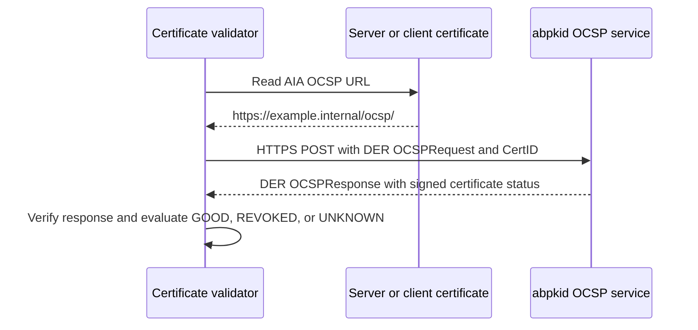

# OCSP service

Autobricks PKI Server 1.0 provides leaf certificate status through a simple HTTPS POST service in `abpkid`.

## Endpoint

| Method | URL | Request content type | Response content type |
| --- | --- | --- | --- |
| POST | `https://example.internal/ocsp/` | `application/ocsp-request` | `application/ocsp-response` |

`example.internal` represents the DNS record name registered through `autobricks-dns` during PKI installation. All leaf status requests use this endpoint, with no CN or fingerprint in the URL. Clients can connect without a client certificate and validate the HTTPS server's identity and trust chain. Status queries do not grant revocation permission.

The request body is a DER-encoded `OCSPRequest`. Its `CertID` identifies the certificate using the issuer name hash, issuer key hash, serial number, and hash algorithm. The response is a DER-encoded `OCSPResponse`. [RFC 6960, Section 4.1 and Appendix A](https://www.rfc-editor.org/rfc/rfc6960.html#section-4.1).

## POST protocol requirements

The OCSP implementation MUST conform to the POST request and response rules in [RFC 6960, Appendix A.1 and A.2](https://www.rfc-editor.org/rfc/rfc6960.html#appendix-A), carried over HTTPS at `/ocsp/`.

- Requests MUST use `Content-Type: application/ocsp-request` and carry the binary DER-encoded `OCSPRequest` directly in the POST body.
- OCSP responses MUST use `Content-Type: application/ocsp-response` and carry the binary DER-encoded `OCSPResponse` directly in the response body.
- The POST body MUST preserve the standard ASN.1 message structure, including `CertID`. JSON, form fields, PEM, and Base64 wrappers are not OCSP POST message formats.
- Certificate status and protocol errors MUST use the RFC 6960 response structures and semantics.

## Leaf certificate extension

Every issued or renewed server and client certificate contains the deployed OCSP URL in its non-critical Authority Information Access (AIA) extension.

| Field | Value |
| --- | --- |
| Extension | Authority Information Access (`1.3.6.1.5.5.7.1.1`) |
| Access method | `id-ad-ocsp` (`1.3.6.1.5.5.7.48.1`) |
| Access location | URI: `https://example.internal/ocsp/` |

AIA supplies the responder address; the POST body identifies the leaf. [RFC 5280, Section 4.2.2.1](https://www.rfc-editor.org/rfc/rfc5280.html#section-4.2.2.1).

## Certificate status

| Display name | OCSP certificate status | Meaning |
| --- | --- | --- |
| `GOOD` | `good` | A positive revocation-status result; it does not establish complete certificate validity. |
| `REVOKED` | `revoked` | The certificate is revoked. |
| `UNKNOWN` | `unknown` | The responder cannot determine the certificate's status. |

These values are encoded inside the signed OCSP response, not returned as plain text or JSON. Protocol errors are separate from certificate status. [RFC 6960, Sections 2.2, 2.3, and 4.2](https://www.rfc-editor.org/rfc/rfc6960.html#section-2.2).

Clients verify response signatures, signer authorization, certificate matching, and freshness, including `thisUpdate` and any `nextUpdate`. `UNKNOWN` and failed requests do not establish validity. [RFC 6960, Section 3.2](https://www.rfc-editor.org/rfc/rfc6960.html#section-3.2).

## Request flow

[Certificate fields](CERTITFICATE.md) · [CRL distribution](CRL.md) · [Certificate services](docs/certificate-services.md)

## Response generation

The issuing Intermediate CA signs status responses with ECDSA and SHA-256. `CertID` issuer hashes support SHA-1 and SHA-256. Requests can query up to 32 certificates sharing an issuer signing identity. Recognized request nonces are echoed in signed responses. Unknown critical request extensions and malformed messages receive OCSP protocol errors.

Responses contain current `producedAt` and `thisUpdate` timestamps and omit optional `nextUpdate`. HTTP responses disable caching. The fixed seven-day CRL lifetime does not apply to OCSP responses.
