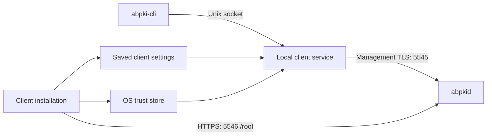

# Package composition and installation

Autobricks PKI Server 1.0 supports Linux. The server package is `autobricks-pki`; the client-only package is `autobricks-pki-cli`. Each package runs its own curses configuration flow. The packages conflict because they both own the client executable and service.

## Package composition

| Package type | Components | Installation configuration |
| --- | --- | --- |
| Server and client | `abpkid`, `abpki-cli`, the local client service, service configuration, and documentation | Server settings also configure the included client; no separate client connection questions |
| Client only | `abpki-cli`, the local client service, client configuration, and documentation | Server address, management TLS port, and public HTTPS port collected during installation |

The installed package determines the setup flow; the installer does not ask users to select a package type.

The server package includes a usable local client service, not only the CLI executable. The client-only package does not initialize a CA hierarchy, host a PKI database, or create a PKI WORM namespace.

Users invoke `abpki-cli` through a local Unix socket. The local client service reads its saved JSON connection settings and connects to `abpkid` over TLS. Server certificate validation is required; client certificates and mTLS enrollment are not required.



## Server and client installation

### Prerequisites

Install Autobricks DNS, Autobricks TrueLog, and the TrueLog client on the PKI server host before installing PKI. TrueLog provides the WORM mount at `/mnt/worm-storage` with retention of at least 365 days. The PKI service account needs group access to the DNS control socket, TrueLog client socket, and WORM storage so normal operations do not require sudo.

### Installation inputs

| Input | Meaning | Default |
| --- | --- | --- |
| Base domain | Domain for the Root CA, Intermediate CAs, and generated server names; up to 24 characters | `autobricks.internal` |
| DNS registration IP | Reachable server IP registered with Autobricks DNS | Required |
| Bind address | Server listen address, separate from the DNS registration IP | `0.0.0.0` |
| Management TLS port | Certificate management connection port | `5545` |
| Public HTTPS port | Root CA, CRL, and OCSP endpoint port | `5546` |

The ports must differ. There is no PKI user-account creation step.

### Installation flow

1. Collect and validate server installation inputs and check the prerequisite services and WORM retention.
2. Provision service permissions and mutable configuration and database directories.
3. Reserve `/mnt/worm-storage/<installation-timestamp>/pki/`, using UTC Unix seconds. Save `ABPKI_INSTALLED_AT` and the full `ABPKI_WORM` path in `/etc/autobricks-pki/abpkid.env`.
4. Initialize the Root CA, the six default Intermediate CAs (`database`, `www`, `vpn`, `worm`, `app`, and `truelog`), and the server TLS certificate. Set the Intermediate CA lifetime to `min(398, TrueLog retention days - 7)` days.
5. Register the PKI server DNS name and configure and start the server listeners.
6. Configure the included client from the server installation values. Use the DNS registration IP covered by the server certificate IP SAN and the configured ports. A wildcard bind address such as `0.0.0.0` is not a client destination.
7. Register the initialized Root CA certificate in the local OS trust store and save the client connection settings. No separate client server-address, port, or CA-file questions are needed.
8. Verify a server connection using normal certificate and hostname/IP validation, then enable the local client service and its Unix socket access.

## Initial administrator password

A fresh server installation generates a random 16-character ADMIN password using a cryptographically secure random generator. The password uses ASCII letters and digits. The installation completion screen displays the password without masking and identifies its saved configuration location.

The server installer records the same password as `ABPKI_ADMIN_PASSWORD` in `/etc/autobricks-pki/abpkid.env`. This file is owned by root with mode `0600`. The password is not a permanent client connection setting and is not included in ordinary installation logs. Reconfiguration and upgrades preserve the existing credential rather than generating a replacement. Client-only installation does not generate a server ADMIN password.

The screen test generates and displays an in-memory sample password only. It does not write the configuration file or set a server credential.

## Client-only installation

The client host requires a reachable PKI server. It does not require its own PKI server, DNS service, or TrueLog/WORM service merely to call the remote PKI service.

### Installation inputs

| Input | Meaning | Default |
| --- | --- | --- |
| Server address | Reachable server DNS name or IP matching the server certificate | Required |
| Management TLS port | Remote certificate management port | `5545` |
| Public HTTPS port | Remote Root CA download port | `5546` |

Client-only installation does not ask for a base domain, server bind address, or WORM retention setting.

### Installation flow

1. Collect the remote server address and both ports.
2. Retrieve the public Root CA certificate through `GET https://<server>:<https-port>/root`.
3. Validate the returned CA certificate and register it in the OS trust store. On Debian/Ubuntu, install an owned PEM certificate file under `/usr/local/share/ca-certificates/` and refresh the trust store with `update-ca-certificates`.
4. Verify a new connection using OS trust and normal server identity validation. Initial Root retrieval is first-use trust enrollment; downloading a self-signed Root alone does not independently authenticate the server.
5. Save the server address and ports in the local client configuration.
6. Provision local Unix socket access and enable the client service using the saved configuration.

Normal client connections use OS trust and do not disable certificate verification. Users do not supply a trust-chain file, server address, or connection ports with every CLI operation.

## Operation after installation

Both package types provide the same local command interface. For example, `abpki-cli list-ca` passes a request through the Unix socket; the client service supplies the saved remote connection settings. Certificate creation input is described in [LEAF-CREATE.md](LEAF-CREATE.md).

Certificate operation requests travel through the local Unix socket. Caller environment changes are not a method of configuring a running client service.

## Reinstallation and removal

| Operation | Server and client | Client only |
| --- | --- | --- |
| Restart or upgrade | Reuse server state, the saved WORM namespace, and client settings | Reuse connection settings and enrolled server trust |
| Remove | Stop installed services and remove package software; preserve mutable configuration and state | Stop the client service and remove package software; preserve client configuration |
| Purge | Remove PKI-owned mutable configuration, SQLite secrets, and package-owned service resources; retain WORM artifacts under retention rules | Remove package-owned client configuration, service resources, and installed Root trust entry; refresh OS trust |
| Fresh installation after purge | Collect server inputs and reserve a new WORM timestamp namespace | Collect remote connection inputs and enroll server trust again |

Package cleanup affects only owned resources. It does not remove shared DNS or TrueLog installations or unrelated trust entries. Server purge respects WORM retention, including certificate and encrypted-key archives and TrueLog-managed audit logs. Retained encrypted keys cannot be recovered without their separately protected encryption secrets or database backup.

[File layout](FILES.md) · [Certificate creation](LEAF-CREATE.md) · [Certificate validity](VALIDATION.md)

## Interactive screen preview

```sh
# Server package (includes client):
python3 scripts/installer/preview.py server

# Client-only package:
python3 scripts/installer/preview.py client
```

The Python 3 curses preview runs in an interactive terminal of at least 80 columns and 25 rows. Each command starts directly at the settings for its package. There is no package selection screen. It provides editable settings, validation messages, an Install button, installation progress, and a completion screen. Tab, Shift-Tab, and arrow keys move between controls; Enter selects; Ctrl-U clears the selected field; Escape cancels. The active field shows a text cursor. Left/Right and Home/End move the cursor; typing inserts at that position, Backspace deletes the preceding character, and Delete removes the following character. Length hints appear on the input row when space permits; validation errors use the form status line.

All input remains in memory. The preview performs no installation, file writes, network checks, service changes, or trust enrollment. The server completion screen displays a generated 16-character sample ADMIN password; no password input is required. Progress labels and completion messages simulate the installation UI; they do not report real service checks or installation results.

Input controls enforce length limits while typing or pasting: base domain 24 ASCII characters, IP addresses 45 characters, ports 5 digits, and client server address 253 characters. Excess characters are blocked with an inline message. Ports accept digits only; domain and IP controls restrict input to their respective character sets. Complete address syntax, port range, and distinct-port checks run before advancing.

## Package artifacts and services

The build produces exactly two package types: `autobricks-pki-VERSION-OS-OS_VERSION-ARCH.deb` and `autobricks-pki-cli-VERSION-OS-OS_VERSION-ARCH.deb`. Both include the same `abpki-cli` binary, `abpki-cli.service`, and curses screen implementation. Only the server package includes `abpkid` and `abpkid.service` and depends on local DNS and TrueLog packages. Package installation executes real provisioning callbacks; the standalone screen command retains simulated progress without changing the system.

Client settings are saved in `/etc/autobricks-pki-client/client.json`. The default socket is `/run/autobricks-pki-client/client.sock`. System trust uses `/etc/ssl/certs/ca-certificates.crt`, with the owned Root at `/usr/local/share/ca-certificates/autobricks-pki-client.crt`. Caller-owned certificate tokens remain in `~/.abpki/` and are not purged from home directories by package scripts.
