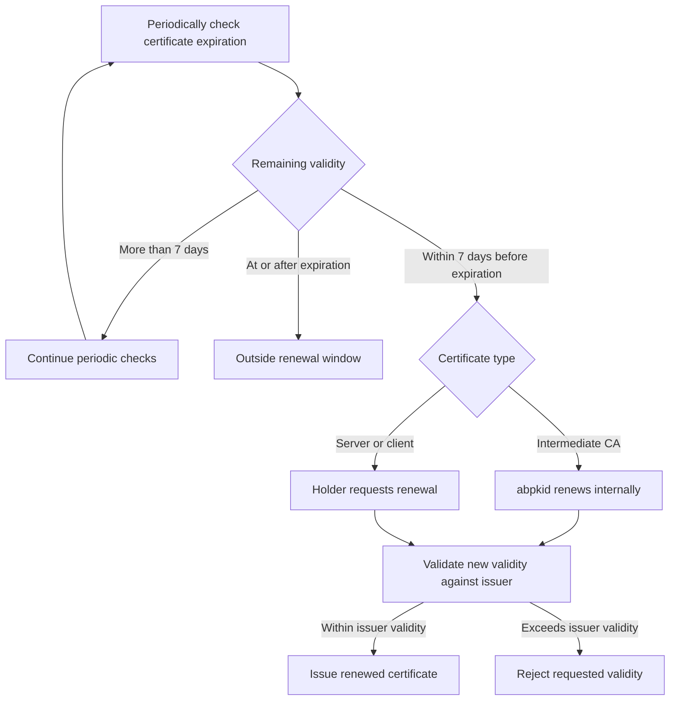

# Certificate validity and renewal

## Default validity

| Certificate type | Default validity | Renewal responsibility |
| --- | --- | --- |
| Root CA | No defined expiration | Root CA management |
| Intermediate CA | `min(398, TrueLog retention days - 7)` days | Internal renewal by `abpkid` |
| Server certificate | 47 days | Periodic checks and renewal by the certificate holder |
| Client certificate | 47 days | Periodic checks and renewal by the certificate holder |

Intermediate CA validity may be shortened at creation but cannot exceed its installation-derived maximum. Leaf validity periods can be changed at creation. Server and client certificates are leaf certificates. Their validity must remain within the issuing Intermediate CA certificate's validity, including when a custom duration is requested.

## Installation retention boundary

During installation initialization, `abpkid init` reads `AB_WORM_RETAIN_DAYS` from the installed TrueLog configuration (`/etc/default/autobricks-log` by default). It calculates:

```text
intermediate_max_days = min(398, truelog_retention_days - 7)
```

A 365-day retention setting yields 358 days. This value is calculated from installation settings, not fixed at 358. The seven-day margin is measured in elapsed 24-hour days. Missing, unreadable, invalid, or duplicate retention settings prevent CA initialization; retention must exceed seven days.

SQLite stores the observed retention and resulting limit in `settings.ca_validity_policy`. Initial default CAs, additional CA creation, and internal CA renewal use this limit. Explicit validity requests above the limit are rejected. A later TrueLog setting change does not automatically alter this stored policy or the signed contents of existing certificates.

The setting describes the protection period assigned to newly created WORM files. Existing WORM files keep their original retention deadlines. This policy does not change TrueLog configuration or extend existing files' protection.

## Root CA expiration encoding

The Root CA has no defined expiration under the product policy. X.509 still requires a `notAfter` value. The certificate uses GeneralizedTime `99991231235959Z` (9999-12-31 23:59:59 UTC), the representation specified for an undefined expiration date in [RFC 5280, Section 4.1.2.5](https://www.rfc-editor.org/rfc/rfc5280.html#section-4.1.2.5).

This does not remove signature, trust, or other certificate validation requirements.

## Issuer validity boundary

Validity is evaluated using actual UTC timestamps, not duration labels alone. A requested leaf validity interval must satisfy:

```text
intermediate.notBefore <= leaf.notBefore
leaf.notBefore < leaf.notAfter
leaf.notAfter <= intermediate.notAfter
```

An Intermediate CA's validity must likewise fit within its Root CA certificate's encoded validity interval.

For example, if an Intermediate CA has 20 days remaining, a leaf starting now cannot receive the default 47-day lifetime under that issuer certificate. Its requested expiration must fit within those 20 days. A 47-day request that exceeds the issuer boundary fails validity validation; the default does not override the boundary.

The same boundary applies to renewed certificates. Intermediate CA renewal does not change the signed expiration of previously issued leaf certificates.

## Renewal window

Renewal is available only during the final seven days before expiration:

```text
remaining = certificate.notAfter - current_time_utc
0 < remaining <= 7 days
```

| Remaining validity | Time eligibility for renewal |
| --- | --- |
| More than 7 days | Not yet eligible |
| Exactly 7 days | Eligible |
| Less than 7 days, before expiration | Eligible |
| At or after expiration | Outside the renewal window |

The seven-day window uses elapsed time: 7 × 24 hours. It applies to Intermediate CA and leaf renewal. Time eligibility alone does not grant operation permissions.

## Intermediate CA renewal

`abpkid` checks Intermediate CA expiration and performs renewal internally within the renewal window. This includes the six [default issuers](INTERMEDIATE.md): `database`, `www`, `vpn`, `worm`, `app`, and `truelog`.

Renewal produces a newly signed Intermediate CA certificate. Previously issued certificates retain their original signed contents and validity. Certificate validation uses the applicable issuer chain; renewing a CA does not rewrite existing leaf certificates.

## Server and client renewal

The system holding a server or client certificate periodically checks its `notAfter` value and requests renewal with `abpki-cli renew ...` during the renewal window. `abpkid` does not replace deployed leaf certificates on behalf of their holders.

The holder retrieves the renewed certificate and applicable chain and updates the consuming service's certificate configuration. Leaf renewal remains bounded by the issuing Intermediate CA's expiration.

The `check` command's `GOOD`, `REVOKED`, and `UNKNOWN` labels do not replace checking the certificate's expiration timestamp.



[Certificate fields](CERTITFICATE.md) · [CLI commands](docs/cli.md)

## Intermediate CA handover limit

Intermediate CA renewal starts a fixed seven-day handover measured from its persisted `superseded_at`. The old CA and non-revoked dependent leaves use `SUPERSEDED` during the transition. Individual leaf download confirmations revoke their predecessors. Once all old leaves are retired, the old CA is revoked; at the deadline, remaining old leaves and the old CA are revoked without waiting for downloads. Existing `not_after` values are never extended by this handover. See [Intermediate CA handover](INTERMEDIATE.md#intermediate-ca-renewal-handover).

## Duration preservation on renewal

Renewal retains `old.not_after - old.not_before` exactly in seconds and applies that duration from the new issuance time. It does not reset a custom lifetime to the default or accept a new duration. A seven-day leaf renews for seven days; shorter-lived Intermediate CAs likewise retain their original lifetime. If the new interval exceeds the issuer boundary, renewal fails rather than reducing the duration. Changing a duration requires a separate issuance request and remains subject to CN uniqueness rules.
