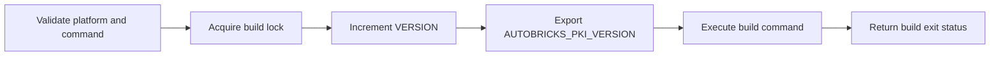

# Build version

Server binary name: `abpkid`.

Client binary name: `abpki-cli`.

The Linux build runner executes a supplied build command from the repository root:

```sh
./scripts/build/run.sh COMMAND [ARG ...]
```

The runner requires Bash, Python 3, and `flock`. A project lock serializes builds. `VERSION` contains `1.0.NNN`; the build field starts at `000`, uses at least three digits, and expands beyond `999` without wrapping.

Before executing the build command, the runner increments `VERSION` and exports the result as `AUTOBRICKS_PKI_VERSION`. The command can use this value in artifact metadata. A failed build retains its allocated number. Missing commands and invalid version values fail before a number is allocated. The runner returns the build command's exit status.

The Rust build produces `abpkid` and `abpki-cli`. Cargo's build script requires the allocated version from the runner and embeds it in both binaries. `Cargo.lock` fixes dependency versions. The Cargo package version is `1.0.0`; the product build identifier is the value in `VERSION`.

```sh
./scripts/build/run.sh ./scripts/build/release.sh
./scripts/build/run.sh cargo test --locked
./scripts/build/run.sh cargo clippy --locked --all-targets -- -D warnings
cargo fmt --check
```

Build prerequisites include a Rust toolchain supporting edition 2024, a C compiler for bundled SQLite, `pkg-config`, and OpenSSL development libraries. Tests use the OpenSSL CLI for OCSP interoperability checks. The release build copies the executables to `bin/abpkid` and `bin/abpki-cli`. Cargo intermediate artifacts remain under `target/`. Installation package output belongs in `build/`; the Debian package builder is `./scripts/build/run.sh ./scripts/package/build.sh`. Both `/bin/` and `/build/` are ignored by Git. The system OpenSSL libraries used during compilation must also be available at runtime.

`abpkid --version` and `abpki-cli --version` display the allocated product build identifier.



## Panic gate

Run the local gate with:

```sh
./scripts/check/panic-gate.sh
```

The gate checks formatting, runs Clippy against production library/binary code with warnings and explicit panic-producing constructs treated as errors, then runs the complete test suite. Each compiling command goes through the common build runner and allocates its own build version. Test assertions are not prohibited by the production-code lint gate.

Clippy rejects `unwrap`, `expect`, explicit `panic`, `todo`, `unimplemented`, and `unreachable` usage. Regression tests exercise truncated and mutated HTTP/management/OCSP inputs, deterministic byte corpora, frame-size overflow, text handling, and validity arithmetic boundaries. This checks the covered paths; it is not a proof that every dependency or every possible input is panic-free.

Integration tests use temporary storage and a mock TrueLog CLI; they do not install packages or write to the production WORM mount.

The package builder emits both `autobricks-pki` (server plus client) and `autobricks-pki-cli` (client only). Package file names follow the TrueLog product convention `NAME-VERSION-OS-OS_VERSION-ARCH.deb`. The server package owns the complete local client service; it does not depend on installing the client-only package. Both packages share the curses screen code and carry the build VERSION.

Installer tests use temporary directories and mocked OS service/trust operations:

```sh
PYTHONDONTWRITEBYTECODE=1 python3 tests/package_namespace.py
PYTHONDONTWRITEBYTECODE=1 python3 tests/package_setup.py
```

Release builds and the panic gate use `scripts/build/distribution.sh` to stage distribution OpenSSL headers together with their multiarch configuration headers. This avoids mixing `/usr/local` OpenSSL headers with distribution shared libraries. The temporary header tree is removed after the command.

## Docker package matrix

The Docker build produces server-plus-client and client-only packages for each platform:

| Ubuntu | Architecture | Packages |
| --- | --- | --- |
| 22.04 | amd64 | Server plus client; client only |
| 22.04 | arm64 | Server plus client; client only |
| 24.04 | amd64 | Server plus client; client only |
| 24.04 | arm64 | Server plus client; client only |

Use Docker Engine on an amd64 host. Both architectures build in temporary amd64 Ubuntu containers. ARM64 uses the GNU AArch64 cross compiler and Rust target libraries. The invoking account must have access to Docker.

```sh
./scripts/build/run.sh ./scripts/package/docker/build.sh
```

One invocation allocates one product version for the complete eight-package matrix. Each target uses its Ubuntu distribution's OpenSSL headers and shared libraries with Rust 1.98.1 and locked Cargo dependencies. Container builds do not increment the version individually or replace installed host services.

Each package is extracted to verify its name, version, architecture, binary contents, and required libraries. amd64 executables run version/help checks. ARM64 binaries receive ELF architecture, interpreter, and target-library checks; runtime verification requires an ARM64 machine. These checks do not run package installation hooks or verify systemd and DNS/TrueLog integration inside containers.

Packages are copied to `build/` only after all four targets succeed. `build/SHA256SUMS-VERSION.txt` covers all eight files. Temporary containers, toolchains, and compilation output are removed after each target; no build images are created.
