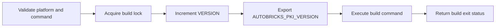

# Build version

Server binary name: `abpkid`.

Client binary name: `abpki-cli`.

The Linux build runner executes a supplied build command from the repository root:

```sh
./scripts/build/run.sh COMMAND [ARG ...]
```

The runner requires Bash, Python 3, and `flock`. A project lock serializes builds. `VERSION` contains `1.0.NNN`; the build field starts at `000`, uses at least three digits, and expands beyond `999` without wrapping.

Before executing the build command, the runner increments `VERSION` and exports the result as `AUTOBRICKS_PKI_VERSION`. The command can use this value in artifact metadata. A failed build retains its allocated number. Missing commands and invalid version values fail before a number is allocated. The runner returns the build command's exit status.

The Rust build produces `abpkid` and `abpki-cli`. Cargo's build script requires the allocated version from the runner and embeds it in both binaries. `Cargo.lock` fixes dependency versions. The Cargo package version is `1.0.0`; the product build identifier is the value in `VERSION`.

```sh
./scripts/build/run.sh ./scripts/build/release.sh
./scripts/build/run.sh cargo test --locked
./scripts/build/run.sh cargo clippy --locked --all-targets -- -D warnings
cargo fmt --check
```

Build prerequisites include a Rust toolchain supporting edition 2024, a C compiler for bundled SQLite, `pkg-config`, and OpenSSL development libraries. Tests use the OpenSSL CLI for OCSP interoperability checks. The release build copies the executables to `bin/abpkid` and `bin/abpki-cli`. Cargo intermediate artifacts remain under `target/`. Installation package output belongs in `build/`; no package builder is currently supplied. Both `/bin/` and `/build/` are ignored by Git. The system OpenSSL libraries used during compilation must also be available at runtime.

`abpkid --version` and `abpki-cli --version` display the allocated product build identifier.


