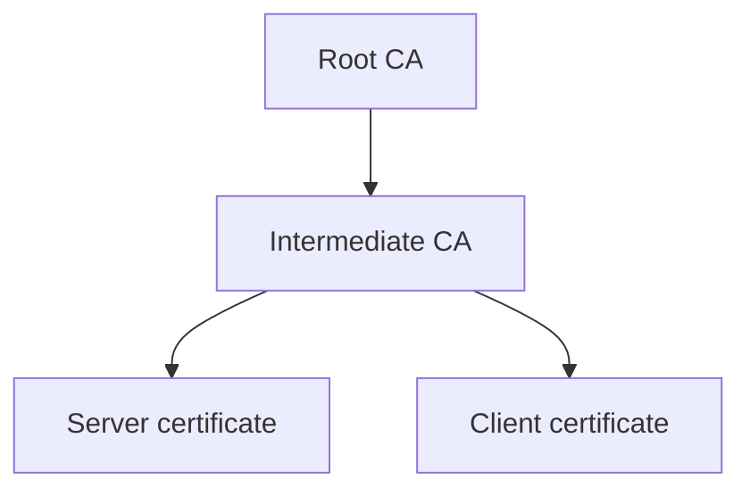
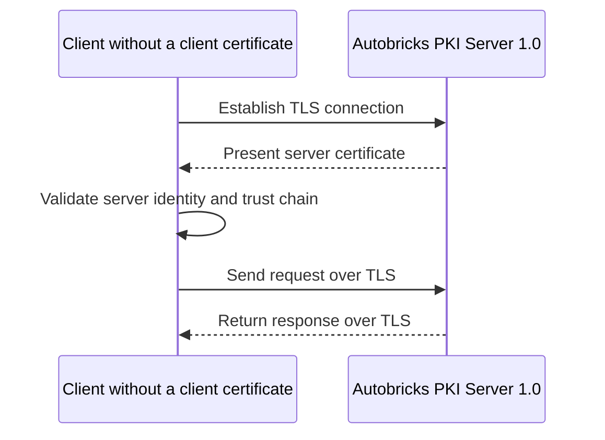
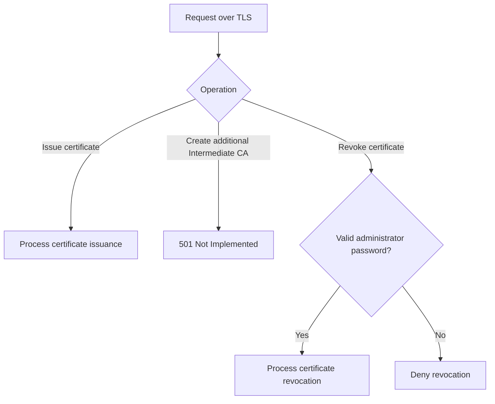

# Certificate services

Autobricks PKI Server 1.0 provides Root CA and Intermediate CA management and certificate lifecycle services for the Autobricks product family on Linux.

## Certificate authority hierarchy

A Root CA anchors a certificate hierarchy. Intermediate CAs operate under that hierarchy and issue end-entity certificates for servers and clients. Initial installation creates one Root CA and the six [default Intermediate CAs](../INTERMEDIATE.md): `database`, `www`, `vpn`, `worm`, `app`, and `truelog`. Each issues both server and client certificates. Additional Intermediate CA creation is unavailable in version 1.0.

## Certificate lifecycle

PKI creates certificates from the [supported profile fields](../LEAF-CREATE.md#certificate-field-support), renews them, revokes them and reports their status. Input length and encoding limits apply. The consuming server or client interprets and enforces purposes, policies and permissions carried by those fields.

[Validity and renewal](../VALIDATION.md) describes default lifetimes, issuer limits and the CA/leaf renewal lifecycle.

## Server DNS registration

When `abpkid` issues a server certificate, it automatically registers the corresponding server in `autobricks-dns`. DNS registration is part of the server certificate issuance workflow.

## CRL access

The [HTTPS CRL service](../CRL.md) accepts the Intermediate CA Common Name or certificate fingerprint at `/crl/<identifier>`. Issued server and client certificates contain the corresponding HTTPS URL in CRL Distribution Points.

## OCSP access

The [HTTPS OCSP service](../OCSP.md) accepts POST requests at `/ocsp/`. The request body identifies the target certificate using OCSP `CertID`; the URL contains no CN or fingerprint. Issued and renewed server and client certificates contain the responder URL in AIA. Signed OCSP responses report `GOOD`, `REVOKED`, or `UNKNOWN`.

## TLS access

The service accepts TLS connections from clients without client certificates. A client certificate is not a prerequisite for connecting to the certificate service.

The service presents its server certificate during TLS establishment. Clients validate that certificate against a trusted CA. Any connected client can request server or client certificate issuance. Certificate revocation requires the administrator password; obtaining a certificate does not grant that permission.

## Issuance and revocation access

| Operation | Access |
| --- | --- |
| Server or client certificate issuance | Available to any connected client, including clients without a client certificate |
| Additional Intermediate CA creation | 501 Not Implemented in version 1.0 |
| Certificate revocation | Requires the administrator password |

A client without revocation permission cannot revoke certificates, including certificates it obtained itself. Revocation requests with an invalid administrator password are denied.

