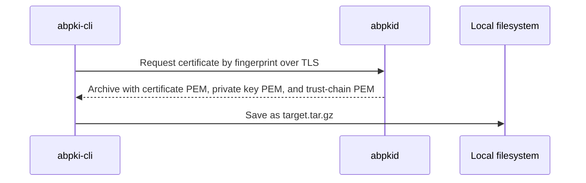

# Command-line client

`abpki-cli` connects to `abpkid` over the management TLS port (default 5545) on Linux. A client certificate is not required to connect.

[Executable usage and request examples](runtime.md)

## Commands

| Command | Function |
| --- | --- |
| `abpki-cli create-ca ... --pass {password}` | Create an Intermediate CA; requires the administrator password. |
| `abpki-cli revoke ... --pass` | Revoke a certificate; requires the administrator password. |
| `abpki-cli chain ...` | Download the Intermediate CA and Root CA certificates as `trust-chain`. |
| `abpki-cli root ...` | Download the Root CA certificate as `root.crt`. |
| `abpki-cli renew ...` | Renew a leaf certificate during the final seven days before expiration. |
| `abpki-cli create ...` | Create a server or client certificate for its intended use. |
| `abpki-cli check ...` | Query certificate status: `GOOD`, `REVOKED`, or `UNKNOWN`. |
| `abpki-cli list-ca ...` | List issuing Intermediate CAs. |
| `abpki-cli list ...` | List issued certificates. |
| `abpki-cli download {fingerprint} {target}` | Download the certificate, its private key, and its trust chain as `{target}.tar.gz`, identified by the certificate fingerprint. |

Server and client certificate creation is available to any connected client. Server certificate creation requires a `urn:autobricks:purpose:<purpose>` URI SAN; a missing, empty, or unrecognized purpose is rejected. See the [purpose catalog](../CERTITFICATE.md#server-purpose-uri-san) for accepted values. Intermediate CA creation requires the administrator password. Certificate revocation requires the administrator password. `abpkid` enforces these permissions when processing requests.

## Validity and renewal

Leaf certificates default to 47 days; Intermediate CAs default to 398 days. Creation supports custom validity within the issuer boundary. Leaf holders periodically check expiration and request renewal when no more than seven days remain and the certificate has not expired. `abpkid` handles Intermediate CA renewal internally.

[Validity and renewal rules](../VALIDATION.md)

## Certificate status

`check` reports one of the certificate status values `GOOD`, `REVOKED`, or `UNKNOWN` returned by the service.

## Download encoding

All downloaded certificates, private keys, and trust chains use PEM encoding, including files contained in `.tar.gz` archives.

## Root CA certificate download

`GET https://<dns record name>:5546/root` returns the Root CA certificate in PEM with `Content-Type: application/x-pem-file`. No administrator password or client certificate is required.

`abpki-cli root` uses this endpoint on `ABPKI_HTTPS_PORT` (default 5546) and saves the PEM certificate as `root.crt`.

## CA chain download

`abpki-cli chain ...` downloads the Intermediate CA certificate and its Root CA certificate together as PEM certificate blocks in a file named `trust-chain`.

## Certificate download

`fingerprint` identifies the certificate to download. `target` supplies the output base path. The output is a gzip-compressed tar archive named `{target}.tar.gz` containing exactly three PEM files:

| Archive member | Contents |
| --- | --- |
| Certificate | The server or client certificate identified by `fingerprint` |
| Private key | The private key matching that certificate |
| Trust chain | The Intermediate CA and Root CA certificates together in one PEM file |

For example, a target of `certificates/server` produces `certificates/server.tar.gz`.

Private-key downloads and leaf renewal require the certificate-specific access token returned by issuance. Set `ABPKI_ACCESS_TOKEN` for these commands. The service has no user accounts; `create-ca` and `revoke` verify the single administrator password.

[Common Names, DNS naming, and uniqueness](../COMMON-NAME.md)
