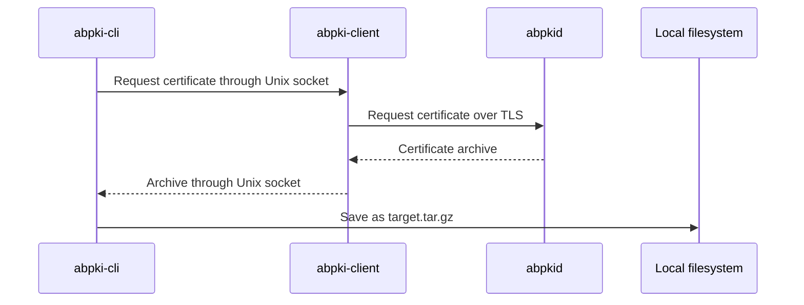

# Command-line client

`abpki-cli` submits requests to the local `abpki-client` service through a Unix domain socket. The service connects to `abpkid` over management TLS (default port 5545), using settings saved during client installation. No client certificate or client private key is used for this TLS connection.

`abpki-cli.service` runs the local daemon with `/etc/autobricks-pki-client/client.json`. CLI operations use `/run/autobricks-pki-client/client.sock`; only the daemon opens remote TLS connections. Both package types include this service.

[Executable usage and request examples](runtime.md)

## Commands

| Command | Function |
| --- | --- |
| `abpki-cli create-ca ... --pass {password}` | Not implemented in 1.0; reserved for 1.1. |
| `abpki-cli revoke ... --pass` | Revoke a certificate; requires the administrator password. |
| `abpki-cli chain ...` | Download the Intermediate CA and Root CA certificates as `trust-chain`. |
| `abpki-cli root ...` | Download the Root CA certificate as `root.crt`. |
| `abpki-cli renew ...` | Renew a leaf certificate during the final seven days before expiration. |
| `abpki-cli create ...` | Create a server or client certificate for its intended use. |
| `abpki-cli check ...` | Query certificate status: `GOOD`, `REVOKED`, or `UNKNOWN`. |
| `abpki-cli info <fingerprint>` | Display X.509 certificate information. |
| `abpki-cli list-ca ...` | List issuing Intermediate CAs. |
| `abpki-cli list ...` | List issued certificates. |
| `abpki-cli download {fingerprint} {target}` | Download the certificate, its private key, and its trust chain as `{target}.tar.gz`, identified by the certificate fingerprint. |

Server and client certificate creation is available to any connected client. Server certificate creation requires exactly one `urn:autobricks:purpose:<purpose>` URI SAN; a missing, empty, unrecognized, or additional purpose is rejected. See the [purpose catalog](../CERTITFICATE.md#server-purpose-uri-san) for accepted values. Additional Intermediate CA creation returns `501 Not Implemented` in 1.0. Certificate revocation requires the administrator password. `abpkid` enforces these permissions when processing requests.

## Validity and renewal

Leaf certificates default to 47 days; Intermediate CAs use the installation-derived `min(398, TrueLog retention days - 7)` default and maximum. Creation supports shorter CA validity and custom leaf validity within the issuer boundary. Leaf holders periodically check expiration and request renewal when no more than seven days remain and the certificate has not expired. `abpkid` handles Intermediate CA renewal internally.

[Validity and renewal rules](../VALIDATION.md)

## Certificate status

`check` reports one of the certificate status values `GOOD`, `REVOKED`, or `UNKNOWN` returned by the service.

## Download encoding

All downloaded certificates, private keys, and trust chains use PEM encoding, including files contained in `.tar.gz` archives.

## Root CA certificate download

`GET https://<dns record name>:5546/root` returns the Root CA certificate in PEM with `Content-Type: application/x-pem-file`. No administrator password or client certificate is required.

`abpki-cli root` uses this endpoint on the client configuration's `https_port` (default 5546) and saves the PEM certificate as `root.crt`.

## CA chain download

`abpki-cli chain ...` downloads the Intermediate CA certificate and its Root CA certificate together as PEM certificate blocks in a file named `trust-chain`.

## Certificate download

`fingerprint` identifies the certificate to download. `target` supplies the output base path. The output is a gzip-compressed tar archive named `{target}.tar.gz` containing exactly three PEM files:

| Archive member | Contents |
| --- | --- |
| Certificate | The server or client certificate identified by `fingerprint` |
| Private key | The private key matching that certificate |
| Trust chain | The Intermediate CA and Root CA certificates together in one PEM file |

For example, a target of `certificates/server` produces `certificates/server.tar.gz`.

Private-key downloads and leaf renewal require the certificate-specific access token returned by issuance. The CLI saves issuance tokens in caller-owned credential records and includes the selected token in the Unix socket request for these commands. The service has no application user accounts; `revoke` receives the single administrator password through the Unix socket credential field and verifies it on the server. Bare `--pass` prompts in the calling CLI; per-command credentials are not service environment variables.

[Common Names, DNS naming, and uniqueness](../COMMON-NAME.md)
