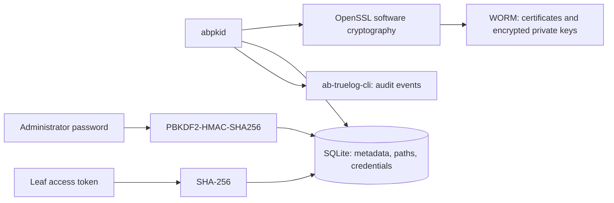

# Key storage

Autobricks PKI Server 1.0 performs software cryptography using OpenSSL. Root CA, Intermediate CA, and leaf certificates use P-256 keys and SHA-256 signatures.

Root CA, Intermediate CA, and leaf private keys are stored as encrypted PKCS#8 PEM files on WORM. SQLite stores their paths and the encryption password, not the PEM contents. OpenSSL performs encryption using AES-256-CBC. The random 256-bit password, represented as 64 hexadecimal characters, resides in `settings.private_key_password`, separately from the administrator password.

The database requires owner-only permissions (`0600`) outside WORM. Access to the database password together with WORM key files permits decryption. WORM files do not contain the password. TrueLog WORM exposes its configured protected writer group; PKI file access must honor that mount's permissions and retention.

Signing and TLS load the referenced encrypted key from WORM and decrypt it in memory. Authorized leaf downloads contain a decrypted key; CA private keys are not downloadable. The referenced certificate and key must match. This source-storage contract is not yet implemented: current code still duplicates encrypted keys in SQLite and WORM.

The administrator password is stored as a salted PBKDF2-HMAC-SHA256 hash with 600,000 iterations and a random 32-byte salt. There are no user accounts, user lists, or role assignments. Standalone certificate revocation validates this password on the server. Additional Intermediate CA creation is unavailable in 1.0.

Each leaf issuance returns a random 256-bit access token. SQLite stores its SHA-256 hash. The token authorizes downloading that leaf's private key and requesting renewal; it does not authorize revocation. Renewed certificates receive new keys and tokens. CA private keys are never available through the download endpoint.

Intermediate CA renewal retains its signing key and subject while producing a new certificate and fingerprint. Existing issuer certificates remain stored with their original leaf associations.

[Third-party licenses and notices](../THIRD_PARTY_NOTICES.md)
