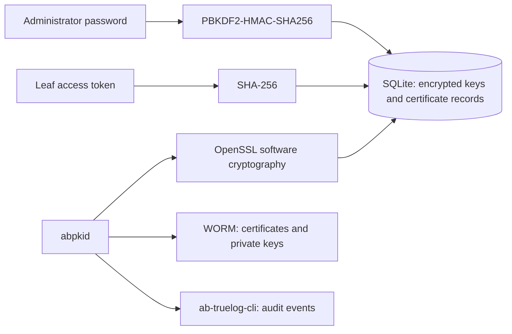

# Key storage

Autobricks PKI Server 1.0 performs software cryptography using OpenSSL. Root CA, Intermediate CA, and leaf certificates use P-256 keys and SHA-256 signatures.

Root CA, Intermediate CA, and leaf private keys are stored as encrypted PKCS#8 PEM in SQLite and as matching encrypted PEM archives on WORM. OpenSSL performs PKCS#8 encryption using AES-256-CBC. A cryptographically random 256-bit password, represented as 64 hexadecimal characters, is generated for the database and stored in SQLite `settings.private_key_password`. It is separate from the administrator password.

The database file requires owner-only permissions (`0600`) in a protected directory outside WORM. The database itself is not encrypted: access to both its encrypted keys and stored password permits decryption. WORM receives encrypted keys only, without the password. Archive subdirectories use `0700` and key files use `0600`.

The service decrypts keys in memory for signing and TLS. Authorized leaf downloads contain a decrypted private-key PEM for client use. CA private keys are not exposed by download endpoints. WORM retries reuse the exact encrypted PEM held in SQLite.

Schema version 2 encrypts legacy plaintext SQLite key columns during database opening, using a transaction and secure deletion followed by database compaction. Existing WORM artifacts and external database backups are not rewritten by this migration.

The administrator password is stored as a salted PBKDF2-HMAC-SHA256 hash with 600,000 iterations and a random 32-byte salt. There are no user accounts, user lists, or role assignments. Intermediate CA creation and certificate revocation validate this single password on the server.

Each leaf issuance returns a random 256-bit access token. SQLite stores its SHA-256 hash. The token authorizes downloading that leaf's private key and requesting renewal; it does not authorize revocation. Renewed certificates receive new keys and tokens. CA private keys are never available through the download endpoint.

Intermediate CA renewal retains its signing key and subject while producing a new certificate and fingerprint. Existing issuer certificates remain stored with their original leaf associations.

[Third-party licenses and notices](../THIRD_PARTY_NOTICES.md)
