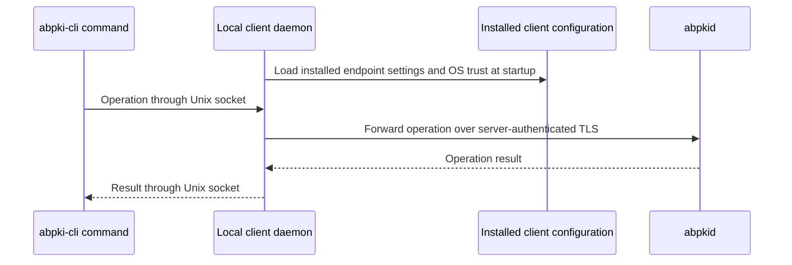

# Runtime configuration

Autobricks PKI Server 1.0 runs on Linux. Install Autobricks DNS and Autobricks TrueLog first. The PKI process requires access to the DNS control socket and a dedicated directory on the TrueLog-provided WORM mount.

Install and configure `autobricks-truelog-cli` on the PKI host, with the PKI service account authorized to access its client socket. TrueLog manages audit storage; PKI does not specify an audit filename.

[Service files, directory ownership, and permissions](../FILES.md)

## Server configuration

| Environment variable | Function | Default |
| --- | --- | --- |
| `ABPKI_DATABASE` | SQLite database file on mutable storage | `abpki.sqlite` |
| `ABPKI_INSTALLED_AT` | Installation UTC Unix timestamp in seconds, retained by the installer | Generated on fresh installation |
| `ABPKI_WORM` | Existing directory on the WORM mount for certificates and private-key archives | Required; saved by the installer |
| `ABPKI_TRUELOG_CLI` | TrueLog client executable for audit submission as service `abpkid` | `/usr/bin/ab-truelog-cli` |
| `ABPKI_ORIGIN` | Public HTTPS origin using the registered DNS name; published URLs use `ABPKI_HTTPS_PORT` | `https://pki.<baseDomain>` from initialization or SQLite |
| `ABPKI_BIND` | Listen IP address shared by both listeners, without a port | `0.0.0.0` |
| `ABPKI_TLS_PORT` | Certificate management TLS port | `5545` |
| `ABPKI_HTTPS_PORT` | Public HTTPS port | `5546` |
| `AUTOBRICKS_DNS_SOCKET` | Autobricks DNS Unix control socket | `/run/autobricks-dns/autobricks-dns.sock` |
| `ABPKI_TRUELOG_CONFIG` | Installed TrueLog environment file read for `AB_WORM_RETAIN_DAYS` during initialization | `/etc/default/autobricks-log` |
| `ABPKI_ADMIN_PASSWORD` | Single administrator password used by `init` | Required for initialization |

The SQLite parent directory and WORM artifact directory must already exist. Protect the SQLite directory from other operating-system users. The database requires mode `0600`. `ABPKI_WORM` must designate actual WORM storage; the filesystem supplies immutability and retention enforcement.

## Initialization and service operation

The path below illustrates an installation-generated namespace. Packaged installations read the saved values from `/etc/autobricks-pki/abpkid.env`; do not reuse this example timestamp for another installation.

```sh
export ABPKI_DATABASE=/var/lib/autobricks-pki/abpki.sqlite
export ABPKI_INSTALLED_AT=1790467200
export ABPKI_WORM=/mnt/worm-storage/1790467200/pki
export ABPKI_ORIGIN=https://pki.example.internal
export ABPKI_BIND=0.0.0.0
export ABPKI_TLS_PORT=5545
export ABPKI_HTTPS_PORT=5546

read -rsp 'Administrator password: ' ABPKI_ADMIN_PASSWORD
export ABPKI_ADMIN_PASSWORD
abpkid init 192.0.2.10 example.internal
unset ABPKI_ADMIN_PASSWORD

abpkid root > root-trust.pem
abpkid serve
```

`init REGISTRATION_IP [BASE_DOMAIN]` prompts for `baseDomain` when the argument is omitted. Press Enter to use `autobricks.internal`; unattended installation supplies the domain argument explicitly. `baseDomain` is limited to 24 ASCII characters, including dots. The domain is stored in SQLite. Root and Intermediate CA names and subjects are described in [CA initialization](../INTERMEDIATE.md#installation-domain-and-ca-subjects).

`init` takes the DNS registration address as an installation argument, separate from the listener bind address. Wildcard and multicast registration addresses are rejected. Normal service operation does not require this argument.

`init` reads TrueLog retention and stores `min(398, retention days - 7)` as the default and maximum Intermediate CA lifetime. The TrueLog configuration must be readable by the initialization account; invalid or unavailable retention prevents CA creation.

`init` requires a password of at least 12 bytes and creates the Root CA, six Intermediate CAs, empty signed CRLs, and the PKI service's TLS certificate. It writes certificates and encrypted keys to WORM before committing their metadata and queues DNS registration for the service hostname and audit submission through TrueLog. Reinitializing an existing hierarchy is rejected.

If external delivery fails after initialization commits, the CA hierarchy remains in SQLite. `serve` retries pending delivery; reinitialization does not replace the hierarchy. The local `root` command exports only the public Root CA certificate as PEM. Distribute this trust anchor through a trusted channel before connecting with `abpki-cli`.

The scheduler polls every 30 seconds and runs renewal maintenance once per hour: Intermediate CAs within 48 days of expiration and the service TLS leaf within seven days. CRL maintenance retries pending publication and refreshes expiring CRLs independently. New TLS connections use the current service certificate. Other deployed leaf certificates remain the responsibility of their holders. HTTPS CRL retrieval reads the published WORM file without signing; pending, expired, or unavailable publications return an error.

## Client connection

The local PKI client service owns remote connections. Users invoke `abpki-cli` commands, which send operation data through the local Unix domain socket. Only the daemon reads installation settings and connects to `abpkid`.

### Installation settings

Linux client installation collects the PKI server IP address or DNS name and management TLS port, downloads the Root CA from the configured public HTTPS endpoint, registers it in the OS trust store, and writes `/etc/autobricks-pki-client/client.json`. It starts the local client service after configuration succeeds. The remote endpoint is explicit; the CLI does not guess an address from the certificate request.

macOS clients use launchd, `/Library/Application Support/Autobricks PKI/client.json`, `/var/run/autobricks-pki-client/client.sock`, and native macOS certificate trust. See [macOS client installation and usage](macos-client.md). The local request and remote TLS protocols are shared across platforms.

The Linux connection section has this form:

```json
{
  "server": "192.0.2.10",
  "port": 5545,
  "https_port": 5546,
  "unix_socket": "/run/autobricks-pki-client/client.sock",
  "ca": "/etc/ssl/certs/ca-certificates.crt"
}
```

`server` and `port` identify the actual management endpoint; `https_port` identifies the public HTTPS endpoint. Installation retrieves the Root CA from `https://192.0.2.10:5546/root` and registers it with the OS. The daemon uses OS trust rather than a caller-supplied CA path. A direct IP connection requires the matching server IP SAN. A configured DNS name instead requires name resolution and a matching DNS SAN.

The configuration belongs to the daemon. A command invocation does not read this file, open CA files, export TLS environment variables, or supply server address/port. TLS does not use a client certificate, client private key, or pairing enrollment. Public Root retrieval uses the configured server and public HTTPS port, default 5546.

[Root CA enrollment and OS trust registration](../INSTALL.md#client-installation-and-operating-system-trust)

### Per-operation data through the Unix socket

Each command supplies its complete operation data through the Unix socket. The service does not read command-specific secrets from its environment. The local request uses the existing management message fields: `method`, `path`, `content_type`, `credential`, and `body`. ABP1 frames carry JSON metadata and a separate raw body. The daemon validates and forwards the request over its configured TLS connection.

| Command | Request body | Local request `credential` | Value source |
| --- | --- | --- | --- |
| `create` | Issuer and complete certificate profile. | null | CLI arguments/JSON input. |
| `renew` (leaf) | Existing fingerprint only; original duration is preserved. | Certificate access token. | CLI reads its calling user's protected certificate credential record. |
| `renew --pass` (CA or leaf) | Existing fingerprint only; mark SUPERSEDED without issuance. | Administrator password. | Explicit argument or hidden CLI prompt; sent through the Unix socket. |
| `revoke` | Target fingerprint. | Administrator password. | `--pass PASSWORD`, or an interactive hidden prompt when `--pass` has no value. |
| `download` | Fingerprint in the existing path selector. | Certificate access token. | CLI reads its calling user's protected certificate credential record. |
| `create-ca` | Unavailable in version 1.0. | Not used. | Returns Not implemented without performing issuance. |

The CLI receives the issuance response through the socket and saves the returned fingerprint/token association before reporting successful credential capture. The credential record belongs to the invoking operating-system user, requires mode `0600` under a protected directory, and is not an application user account. Renewed tokens are saved against their new fingerprints; the old association is not overwritten with the new token. The daemon does not choose another caller's token based only on a supplied fingerprint.

Normal command output excludes the token. A failed local credential save is reported explicitly: remote issuance may already have committed, so the CLI must not silently repeat issuance. No certificate-specific credential is stored in the daemon's global installation configuration. Missing local credentials prevent normal token-authorized renewal/download from being forwarded; they do not cause a fallback to the administrator password or another user's token.

Unix sockets carry the credentials under local filesystem access controls; they are not themselves TLS-encrypted. The remote hop is TLS-encrypted. Do not put credentials in audit payloads, diagnostic output, or process-wide daemon environment variables. A noninteractive invocation of `--pass` without a supplied value and without a terminal fails rather than reading a service environment variable.

Tokens are stored at `~/.abpki/<fingerprint>` in the invoking user's mode-0700 directory, with mode-0600 files. If local credential saving fails after issuance, the command returns the original issuance response for recovery and exits with an error. It does not repeat issuance.

### Local calls and service responsibilities

| Component | Responsibility |
| --- | --- |
| Installer | Collect address and ports, retrieve/register the Root CA in OS trust, save client configuration, grant local socket access, and enable the daemon. |
| Local daemon | Load configuration, bind the Unix socket, validate incoming operations, establish TLS connections, and forward server responses. |
| `abpki-cli` | Parse command arguments or request JSON, call the local socket, print results, and save downloaded files. |
| `abpkid` | Validate certificate operation inputs and enforce administrator/token authorization. |

The command and daemon share `abpki-cli`; on Linux, `abpki-cli.service` invokes `daemon --config /etc/autobricks-pki-client/client.json`. `abpki-client` denotes the local client service; its executable is `abpki-cli`.

```text
Installation:
    server address = 192.0.2.10
    management TLS port = 5545
    trust = OS trust store containing the installed PKI Root CA

Operation:
    abpki-cli create < request.json
        -> local Unix socket
        -> client daemon reads its installed connection settings
        -> TLS to 192.0.2.10:5545
        -> abpkid
```

Local callers receive socket access through an installation-managed group and permissions. A service account needs that group in its running process; routine commands do not invoke sudo. Socket access does not confer administrator revocation permission or access to another certificate's token.



Each management connection carries one request and response. Lost responses to state-changing requests are not automatically replayed; an operation may already have completed.

The daemon owns TLS connections and loads the Linux OS trust bundle or macOS native trust. CLI commands use the installed socket; `ABPKI_SOCKET` selects an alternate local client socket. `ABPKI_SERVER`, `ABPKI_TRUST_FILE`, and `ABPKI_ACCESS_TOKEN` are not per-command connection or credential inputs.

## Certificate creation

`create` reads a JSON request from standard input. `issuer` accepts an Intermediate CA CN or its SHA-256 fingerprint. The CN selects its newest certificate generation. `extended_key_usage` accepts EKU names or OIDs. Legacy `kind` remains `server`, `client`, or `server-and-client`; use one selector, not both.

```sh
abpki-cli create <<'JSON'
{
  "issuer": "www.example.internal",
  "profile": {
    "kind": "server",
    "common_name": "web01",
    "ip_addresses": ["192.0.2.20"],
    "uri_sans": ["urn:autobricks:purpose:www"]
  }
}
JSON
```

Omitting `validity` uses the current UTC time and a 47-day lifetime. A custom `validity` object contains `not_before` and `not_after` as Unix timestamps in seconds, subject to the issuer boundary. Server profiles require at least one address for automatic DNS registration. URI contents are encoded without checking their application meaning. Leaf CNs contain 1–24 ASCII letters, digits, or hyphens, without leading or trailing hyphens, and are normalized to lowercase. New leaf issuance rejects existing CNs across all issuers and certificate kinds; renewal preserves the existing CN. Server DNS names are generated as `<intermediate>-<cn>.<baseDomain>` and inserted into DNS SAN. Omit `dns_names` or supply exactly that generated name. Autobricks DNS receives the corresponding A/AAAA records. Existing external records with different addresses remain delivery conflicts. See [CN and DNS rules](../COMMON-NAME.md).

Client-only profiles do not trigger DNS registration. Leaf profiles accept the documented DN attributes, seven SAN forms, usage and extension fields; field lengths and ASN.1 representation are checked. See [complete profile and input limits](../LEAF-CREATE.md#certificate-field-support). Issued leaf certificates include AIA OCSP and CRL Distribution Points URLs derived from `ABPKI_ORIGIN`.

The JSON response contains `certificate`, `download_token`, and `integrations_pending`. The CLI stores the fingerprint/token association in the invoking user's protected local credential record; list and status endpoints never return it or private keys. A pending integration is retried from SQLite and does not require issuing another certificate.

```sh
abpki-cli download <fingerprint> server
abpki-cli check <fingerprint>
abpki-cli renew <fingerprint>
```

`download` creates `server.tar.gz` containing `certificate.pem`, `private-key.pem`, and `trust-chain`. Normal `renew` uses the existing leaf token. VALID returns `result=200, renewed=false`; SUPERSEDED returns `result=200, renewed=true` with the new fingerprint and token; REVOKED returns `result=409`. The CLI saves a new token only for renewed=true and hides it from output. The original validity duration is preserved exactly in seconds. [Response examples](../LEAF-RENEW.md#renewal-responses).

## Administrator operations

There are no user accounts or user management. One administrator password authorizes leaf revocation, ADMIN renewal-state transitions. Additional Intermediate CA creation is not implemented in version 1.0. Intermediate names accept at most 16 ASCII letters, digits, or hyphens, excluding the optional `.<baseDomain>` suffix.

```sh
abpki-cli revoke <fingerprint> --pass
abpki-cli renew <intermediate-fingerprint> --pass
```

`--pass PASSWORD` accepts the password directly. With `--pass` and no value, the CLI prompts on its own terminal without echo. It sends the supplied password as the Unix socket request credential; the daemon forwards it through TLS. Revocation and its pending CRL task commit before CRL signing. CRL publication failure does not reverse revocation. OCSP queries read the committed certificate status.

ADMIN `/api/renew-admin` marks either CA or leaf SUPERSEDED and returns its fingerprint, transition time, and retirement deadline without issuing a certificate or token. `/api/renew-ca` restricts that transition to Intermediate CAs. Repeated requests retain the original deadline. The server processes pending CAs internally; leaf holders use normal renewal. Standalone check/OCSP statuses remain GOOD/REVOKED/UNKNOWN.

## Public HTTPS interfaces (5546)

| Method | Path | Function |
| --- | --- | --- |
| GET | `/` | Product and build version |
| GET | `/crl/<cn-or-intermediate-fingerprint>` | Signed issuer CRL in PEM |
| POST | `/ocsp/` | RFC 6960 DER request and response |
| GET | `/root` | Root CA PEM |

The public listener exposes only the product information, Root CA, CRL, and OCSP endpoints. It does not expose management operations. HTTP/1.0 and HTTP/1.1 are supported, including chunked request bodies. Headers are limited to 16 KiB and bodies to 1 MiB. OCSP uses standard binary DER bodies and media types.

## Management TLS interface (5545)

| Operation | Path selector | Function |
| --- | --- | --- |
| GET | `/api/chain/<issuer>` | Intermediate and Root PEM chain |
| GET | `/api/list-ca` | Intermediate CA records without private keys |
| GET | `/api/list` | Leaf records without private keys |
| GET | `/api/check/<fingerprint>` | GOOD, REVOKED, or UNKNOWN revocation status |
| GET | `/api/download/<fingerprint>` | Token-protected three-file archive |
| POST | `/api/create` | JSON certificate creation request |
| POST | `/api/create-ca` | `501 Not Implemented` in version 1.0 |
| POST | `/api/revoke` | Administrator-protected leaf revocation |
| POST | `/api/renew-admin` | Administrator-authorized CA or leaf renewal |
| POST | `/api/renew-ca` | Administrator-authorized Intermediate CA renewal |
| POST | `/api/renew` | Token-protected leaf renewal |

Management uses one request and response per TLS connection. New clients use `ABP1` framing: four magic bytes, a big-endian 32-bit JSON-header length, a big-endian 32-bit body length, the JSON header, and the raw body. The header contains the existing method/path/content-type/credential or status/content-type fields, without a body field. Header size is limited to 16 KiB. Total frames remain limited to 1 MiB for requests and 16 MiB for responses. Private credentials remain inside TLS.

The server and local relay also accept legacy newline JSON frames and return legacy JSON to those callers. New clients require a server supporting binary frames; no credential-bearing operation is automatically replayed for protocol fallback.

Current CLI list commands request `/api/list?after=0` or `/api/list-ca?after=0`. Responses contain `entries`, `next_after`, and `through`. Subsequent pages send both `after` and `through`. The CLI prints each page immediately and prints the header once. Legacy selectors without query parameters return an array only when the complete result fits one page; larger results fail rather than silently truncate.

Both listeners validate requests independently and close connections after one response. Both use the service TLS certificate without requiring client certificates. The combined connection limit is 32, with a 15-second connection deadline. Certificate fingerprints are lowercase hexadecimal SHA-256 digests of the complete DER certificate.

[CLI functions](cli.md) · [Key storage](key-storage.md) · [CRL](../CRL.md) · [OCSP](../OCSP.md)

## Connection limits and pending delivery

The server permits up to 32 combined connections with a 15-second connection deadline. The local client permits up to 16 concurrent requests; additional connections are closed while all slots are occupied. Restart the client service after changing its trust configuration.

Certificate issuance and renewal can return `integrations_pending=true` while DNS or TrueLog delivery remains outstanding. Failed external delivery is retried. CRL publication retries proceed independently of DNS and TrueLog availability.

## List filters

Leaf and Intermediate CA list pages accept `status=valid|revoked|renew|all` with `after` and optional `through`. Omitted status defaults to `valid`; `renew` selects SUPERSEDED certificates. Unknown or duplicate status parameters are rejected. Each page preserves the selected filter and the initial upper index boundary.

## Automatic retirement

The service checks retirement at startup and every 30 seconds. Leaves retire seven days after their SUPERSEDED transition; Intermediate CAs retire after 48 days. Downloading or renewing does not extend those deadlines. Revocation remains effective even if CRL publication or audit delivery needs retrying.

Root-signed CRLs report retired Intermediate CAs through `/crl/<root-fingerprint>` or the Root CN. See [CRL publication](../CRL.md).
