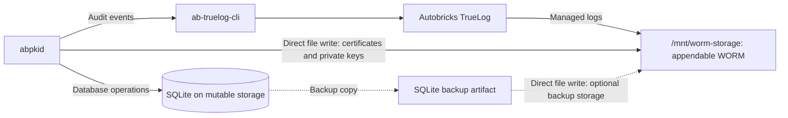

# Storage

`abpkid` uses SQLite as its database on mutable storage outside `autobricks-worm`. The live SQLite database and its working files are not stored in WORM storage.

`autobricks-worm` provides appendable WORM storage for audit logs and generated certificates. SQLite backup copies can also be stored in `autobricks-worm` as backup artifacts.

## Mounted filesystem access

`/mnt/worm-storage` supports direct file I/O for generated certificates and SQLite backup artifacts. Autobricks TrueLog is a prerequisite for Autobricks PKI installation and provides this mount. `autobricks-truelog` builds on `autobricks-worm`, adding True Log functionality while retaining its WORM filesystem capabilities. Writes through the mount remain subject to appendable WORM rules and filesystem permissions.

True Log record submission provides checksum-chain records and write receipts. Direct artifact file writes use the mounted filesystem interface.

| Data | Storage |
| --- | --- |
| Live SQLite database, encrypted keys, key encryption password, administrator password hash, and working files | Mutable storage outside WORM |
| Audit logs | TrueLog-managed appendable WORM logs |
| Generated certificates and encrypted private-key PEM copies | autobricks-worm certificate archive |
| SQLite backup copies | autobricks-worm can store backup artifacts |

## Durable delivery

Certificate issuance and revocation commit certificate state and pending delivery records in one SQLite transaction. Pending records deliver certificates and their encrypted private-key copies through file I/O to the configured WORM directory. Audit events are submitted through `ab-truelog-cli` using service name `abpkid`. TrueLog owns audit file creation, append operations, daily rotation, and checksum-chain management. Server issuance also queues DNS registration through the Autobricks DNS control socket.

Delivery retries run every 30 seconds and after certificate operations. Successful delivery marks the corresponding record complete. Identical existing artifacts are accepted, and a partial artifact can be completed by appending its missing suffix; conflicting bytes are never overwritten. Root CA, Intermediate CA, and leaf private keys are archived as encrypted PKCS#8 PEM alongside their certificates. Operational keys remain in SQLite; download archives are not written to WORM. See [artifact paths and permissions](../FILES.md#worm-artifacts).

Issuance responses include `integrations_pending` when external delivery remains incomplete. A pending DNS or WORM operation does not undo the already committed certificate. SQLite delivery records provide retry state; they do not make SQLite and external services one atomic transaction.

## TrueLog audit delivery

Install and configure `autobricks-truelog-cli` on the PKI host and grant the PKI operating-system account access to its client socket. The TrueLog client/server connection settings belong to TrueLog. Audit service `abpkid` is separate from the PKI certificate archive directory.

PKI submits event type, certificate fingerprint, timestamp, and a stable event ID through the CLI and validates the returned write receipt before completing the pending delivery record. PKI does not maintain a local audit log file or a checksum chain. Failed submissions remain pending. A committed TrueLog write followed by a lost response can produce a duplicate on retry; the stable event ID identifies the same event across attempts. This interface does not provide exactly-once delivery.
